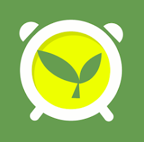

  <h1>Universidad Peruana de Ciencias Aplicadas</h1>
   
  
  

     
    <strong>Carrera:</strong> Ingeniería de Software
      
    <strong>Ciclo:</strong> 5° Ciclo
      
    <strong>Nombre del curso:</strong> Desarrollo de Aplicaciones Open Source
      
    <strong>Sección:</strong> SV54
      
    <strong>Nobre del profesor:</strong> Hugo Allan Mori Paiva
  

  <h3>"Informe de Trabajo Final"</h3>
  

     
    <strong>Nombre del Startup:</strong> AgriCorp
      
    <strong>Nombre del Producto:</strong> GreenCare
      
    <strong>Integrantes:</strong>
      
    Huamani Sánchez, José Diego - U202110458
      
    Llamccaya Arone, Juan Paul - U201923571
      
    Vargas Quispe, Manuel Alexis - U202113256
      
    Lagos Aguilar, Luis Eduardo - U202121975
      
    Quispe Erasmo, Raul Ronaldo - U20211b682
      
  

  <h3>Agosto, 2024</h3>

 

## Registro de Versiones del Informe

<table border="1" cellpadding="5" cellspacing="0">
    <thead>
        <tr>
            <th>Versión</th>
            <th>Fecha</th>
            <th>Autor</th>
            <th>Descripción</th>
        </tr>
    </thead>
    <tbody>
        <tr>
            <td rowspan="10">TB1</td>
            <td>14/08/2024</td>
            <td>José Huamani</td>
            <td>Desarrollo de la carátula</td>
        </tr>
        <tr>
            <td rowspan="10">TB1</td>
            <td>17/08/2024</td>
            <td>José Huamani</td>
            <td>Desarrollo de la tabla de contenido</td>
        </tr>
    </tbody>
</table>

## Contenido

<a href="">CAPÍTULO 1: INTRODUCCIÓN</a>

<a href="">1.1. Startup Profile</a>

<a href="">&nbsp; &nbsp; 1.1.1. Descripción de la Startup</a>

<a href="">&nbsp; &nbsp; 1.1.2. Perfiles de Integrantes del equipo</a>

<a href="">1.2. Solution Profile</a>

<a href="">&nbsp; &nbsp; 1.2.1. Antecedentes y problemática</a>

<a href="">&nbsp; &nbsp; 1.2.2. Lean UX Process</a>

<a href="">&nbsp; &nbsp; &nbsp; &nbsp; 1.2.2.1. Lean UX Problem Statement</a>

<a href="">&nbsp; &nbsp; &nbsp; &nbsp; 1.2.2.2. Lean UX Assumptions</a>

<a href="">&nbsp; &nbsp; &nbsp; &nbsp; 1.2.2.3. Lean UX Hypothesis Statements</a>

<a href="">&nbsp; &nbsp; &nbsp; &nbsp; 1.2.2.4. Lean UX Canvas</a>

<a href="">1.3. Segmentos objetivos</a>

<a href="">CAPÍTULO 2: REQUIREMENTS ELICITATION & ANALYSIS</a>

<a href="">2.1. Competidores</a>

<a href="">&nbsp; &nbsp; 2.1.1. Análisis Competitivo</a>

<a href="">&nbsp; &nbsp; 2.1.2. Estrategias y tácticas frente a competidores</a>

<a href="">2.2. Entrevistas</a>

<a href="">&nbsp; &nbsp; 2.2.1. Diseño de enetrevistas</a>

<a href="">&nbsp; &nbsp; 2.2.2. Registro de entrevistas</a>

<a href="">&nbsp; &nbsp; 2.2.3. Análisis de entrevistas</a>

<a href="">2.3. Needfinding</a>

<a href="">&nbsp; &nbsp; 2.3.1. User Personas</a>

<a href="">&nbsp; &nbsp; 2.3.2. User Task Matrix</a>

<a href="">&nbsp; &nbsp; 2.3.3. User Journey Mapping</a>

<a href="">&nbsp; &nbsp; 2.3.4. Empathy Mapping</a>

<a href="">&nbsp; &nbsp; 2.3.5. As-is Scenario Mapping</a>

<a href="">CAPÍTULO 3: REQUIREMENTS SPECIFICATION</a>

<a href="">3.1. To-Be Scenario Mapping</a>

<a href="">3.2. User Stories</a>

<a href="">3.3. Impact Mapping</a>

<a href="">3.4. Product Backlog</a>

<a href="">CAPÍTULO 4: PRODUCT DESIGN</a>

<a href="">4.1. Style Guidelines</a>

<a href="">&nbsp; &nbsp; 4.1.1. General Style Guidelines</a>

<a href="">&nbsp; &nbsp; 4.1.2. Web Style Guidelines</a>

<a href="">4.2. Information Architecture</a>

<a href="">&nbsp; &nbsp; 4.2.1. Organization Systems</a>

<a href="">&nbsp; &nbsp; 4.2.2. Labeling Systems</a>

<a href="">&nbsp; &nbsp; 4.2.3. SEO Tags and Meta Tags</a>

<a href="">&nbsp; &nbsp; 4.2.4. Searching Systems</a>

<a href="">&nbsp; &nbsp; 4.2.5. Navigation System</a>

<a href="">4.3. Landing Page UI Design</a>

<a href="">&nbsp; &nbsp; 4.3.1. Landing Page Wireframe</a>

<a href="">&nbsp; &nbsp; 4.3.2. Landing Page Mock-up</a>

<a href="">4.4. Web Applications UX/UI Design</a>

<a href="">&nbsp; &nbsp; 4.4.1. Web Applications Wireframes</a>

<a href="">&nbsp; &nbsp; 4.4.2. Web Applications Wireflow Diagrams</a>

<a href="">&nbsp; &nbsp; 4.4.3. Web Applications Mock-ups</a>

<a href="">&nbsp; &nbsp; 4.4.4. Web Applications User Flow Diagrams</a>

<a href="">4.5. Web Applications Prototyping</a>

<a href="">4.6. Domain-Driven Software Architecture</a>

<a href="">&nbsp; &nbsp; 4.6.1. Software Architecture Context Diagrams</a>

<a href="">&nbsp; &nbsp; 4.6.2. Software Architecture Container Diagrams</a>

<a href="">&nbsp; &nbsp; 4.6.3. Software Architecture Components Diagrams</a>

<a href="">4.7. Software Object-Oriented Design</a>

<a href="">&nbsp; &nbsp; 4.7.1. Class Diagrams</a>

<a href="">&nbsp; &nbsp; 4.7.2. Class Dictionary</a>

<a href="">4.8. Database Design</a>

<a href="">&nbsp; &nbsp; 4.8.1. Database Diagram</a>

<a href="">CAPÍTULO 5: PRODUCT IMPLEMENTATION, VALIDATION & DEPLOYMENT</a>

<a href="">5.1. Software Configuration Management</a>

<a href="">&nbsp; &nbsp; 5.1.1. Software Development Environment Configuration</a>

<a href="">&nbsp; &nbsp; 5.1.2. Source Code Management</a>

<a href="">&nbsp; &nbsp; 5.1.3. Source Code Style Guide & Conventions</a>

<a href="">&nbsp; &nbsp; 5.1.4. Software Deployment Configuration</a>

<a href="">5.2. Landing Page, Services & Applications Implementation</a>

<a href="">&nbsp; &nbsp; 5.2.1. Sprint 1</a>

<a href="">&nbsp; &nbsp; &nbsp; &nbsp;  5.2.2.1. Sprint Planning 1</a>

<a href="">&nbsp; &nbsp; &nbsp; &nbsp;  5.2.2.2. Sprint Backlog 1</a>

<a href="">&nbsp; &nbsp; &nbsp; &nbsp;  5.2.2.3. Development Evidence for Sprint Review</a>

<a href="">&nbsp; &nbsp; &nbsp; &nbsp;  5.2.2.4. Testing Suite Evidence for Sprint Review</a>

<a href="">&nbsp; &nbsp; &nbsp; &nbsp;  5.2.2.5. Execution Evidence for Sprint Review</a>

<a href="">&nbsp; &nbsp; &nbsp; &nbsp;  5.2.2.6. Services Documentation Evidence for Sprint Review</a>

<a href="">&nbsp; &nbsp; &nbsp; &nbsp;  5.2.2.7. Software Deployment Evidence for Sprint Review</a>

<a href="">&nbsp; &nbsp; &nbsp; &nbsp;  5.2.2.8. Team Collaboration Insights during Sprint</a>

<a href="">CONCLUSIONES</a>

<a href="">Conclusiones y recomendaciones</a>

<a href="">Video About-the-Team</a>

<a href="">BIBLIOGRAFÍA</a>

<a href="">ANEXOS</a>

## Student Outcome

<table>
    <tr>
        <th>
            Criterio específico
        </th>
        <th>
            Acciones realizadas
        </th>
        <th>
            Conclusiones
        </th>
    </tr>
    <tr>
        <td>
            Comunica oralmente sus ideas y/o resultados con objetividad a público de diferentes
            especialidades y niveles jerarquicos, en el marco del desarrollo de un proyecto en
            ingeniería.
        </td>
        <td>
            TB1:
        </td>
        <td>
            TB1:
        </td>
    </tr>
    <tr>
        <td>
            Comunica en forma escrita ideas y/o resultados con objetividad a público de diferentes
            especialidades y niveles jerarquicos, en el marco del desarrollo de un proyecto en
            ingeniería.
        </td>
        <td>
            TB1:
        </td>
        <td>
            TB1:
        </td>
    </tr>
</table>

<h2 id="introduction">CAPÍTULO 1: INTRODUCCIÓN</h2>

<h3 id="startupProfile">1.1. Startup Profile</h3>

<h4 id="descriptionStartup">1.1.1. Descripción de la Startup</h4>

<h4 id="teamProfile">1.1.2. Perfiles de integrantes del equipo</h4>

<h3 id="solutionProfile">1.2. Solution Profile</h4>

<h4 id="Antecedents">1.2.1. Antecedentes y problemática</h4>

<h4 id="leanUXProcess">1.2.2. Lean UX Process</h4>

<h4 id="problemStatement">1.2.2.1. Lean UX Problem Statements<h4>

<h4 id="assumptions">1.2.2.2. Lean UX Assumptions<h4>

<h4 id="hypohesisStatements">1.2.2.3. Lean UX Hypothesis Statements<h4>

<h4 id="UXCanvas">1.2.2.4. Lean UX Canvas<h4>

<h4 id="objectiveSegment">1.3. Segmentos objetivo</h4>

<h2 id="requirementsElicitation">CAPÍTULO 2: REQUIREMENTS ELICITATION & ANALYSIS</h2>

<h3 id="competitors">2.1. Competidores</h3>

|EMPRESA|DESCRIPCIÓN|IMAGEN|
|-----|-----|----|
|**Plantix**| Plantix ofrece a los agricultores una herramienta eficaz para diagnosticar y tratar problemas en sus cultivos, optimizar la productividad y adquirir valiosos conocimientos agrícolas. Con la ayuda de Plantix, los agricultores pueden superar desafíos y alcanzar sus metas con mayor facilidad, mejorando significativamente su experiencia y éxito en la agricultura. ||
|**Gardening**| Garden Manager está diseñado para maximizar la producción de alimentos al optimizar su plan de cultivo. Esta herramienta le notifica sobre los momentos ideales para trasplantar, adelgazar y cosechar, asegurando que cada etapa del crecimiento de sus plantas se maneje de manera eficiente. Además, Garden Manager le avisa sobre condiciones climáticas inusuales o la falta de lluvia que podrían afectar el desarrollo de sus cultivos. Le ofrece recomendaciones específicas sobre cómo ajustar su cuidado para enfrentar estos desafíos, garantizando así el mejor resultado posible para sus cosechas. ||
|**Info Jardin**| Info Jardín es una aplicación completa diseñada para ofrecer toda la información necesaria para el cuidado de tus plantas y jardín. Brinda detalles sobre los requerimientos específicos de cada planta, incluyendo luz, riego, abonado y prevención de enfermedades. Además, proporciona guías sobre cómo preparar el suelo, cuidar el césped y realizar la poda o tala de árboles de manera adecuada. Una característica destacada de Info Jardín es la posibilidad de configurar alertas para riego, poda y abonado, ayudándote a mantener un seguimiento organizado sin necesidad de estar constantemente pendiente de las tareas de jardinería. ||

<h4 id="competitiveAnalysis">2.1.1. Análisis Competitivo</h4>

<table>
<tr>
<th colspan="7">Competitive Analysis Landscape</th>
</tr>
<tr>
<td colspan="2" rowspan="2">¿Por qué llevar a cabo este análisis?</td>
<td colspan="5">Escriba en el recuadro la pregunta que busca responder o el objetivo de este análisis.</td>
</tr>
<tr>
<td colspan="5"></td>
</tr>
<tr>
<td colspan="3">(En la cabecera colocar por cada competidor nombre y logo)</td>
<td>GreenCare  </td>
<td>Plantix  </td>
<td>Gardening  </td>
<td>Info Jardin  </td>
</tr>
<tr>
<td rowspan="2">PERFIL</td>
<td colspan="2">Overview</td>
<td>Es una aplicación que ayuda a las personas a que puedan tener una manera práctica y dinámica al gestionar el cuidado de sus plantas en su día a día.</td>
<td>Es una app que ayuda a los agricultores para resolver dudas y poder cuidar bien sus agriculturas, optimizando la productividad y adquiri valiosos conocimientos agrícolas.</td>
<td>Es una aplicación donde notifica momentos ideales para trasplantar, adelgazar y cosechar. También avisa sobre condiciones climáticas inusuales o la falta de lluvia que podrían afectar el desarrollo de sus cultivos. </td>
<td>Es una app donde brinda detalles sobre los requerimientos específicos de cada planta, incluyendo luz, riego, abonado y prevención de enfermedades. </td>
</tr>
<tr>
<td colspan="2">Ventaja competitiva ¿Qué valor ofrece a los clientes?</td>
<td>Ofrece consejos de agricultores y jardineros con experiencias en esta área, también tutoriales de casos muy ocurrente en el mundo de la agricultura.</td>
<td>Ofrece ayudas de los agricultores pueden superar desafíos y alcanzar sus metas con mayor facilidad, mejorando significativamente su experiencia y éxito en la agricultura. </td>
<td>Brinda recomendaciones específicas sobre cómo ajustar su cuidado para enfrentar estos desafíos, garantizando así el mejor resultado posible para sus cosechas.</td>
<td>Brinda guías sobre cómo preparar el suelo, cuidar el césped y realizar la poda o tala de árboles de manera adecuada.</td>
</tr>
<tr>
<td rowspan="2">PERFIL DE MARKETING</td>
<td colspan="2">Mercado objetivo</td>
<td>Usuarios en busca de soluciones para el cuidado de sus plantas, también para los jardineros nuevos.</td>
<td>Usuarios que tienen un gran terreno de agricultura quienes buscan solucionas a escala mayoristas.</td>
<td>Propietarios de muchas plantas quienes desean consejos para prevenir problemas.</td>
<td>Usuarios que necesitan tutoriales, comunicar con una comunidad y que buscan profesionales competentes que los recomienden.</td>
</tr>
<tr>
<td colspan="2">Estrategias de marketing</td>
<td>Marketing digital a través de redes sociales y blogs especializados.</td>
<td>Campañas dirigidas a grandes superficies agrícolas y ferias del sector.</td>
<td>Publicidad en medios especializados en jardinería y redes sociales.</td>
<td>Colaboraciones con expertos en jardinería y presencia en foros y comunidades en línea.</td>
</tr>
<tr>
<td rowspan="3">PERFIL DE PRODUCTO</td>
<td colspan="2">Productos & Servicios</td>
<td>Gestión del cuidado de plantas mediante consejos y tutoriales.</td>
<td>Asesoramiento y diagnósticos para la optimización de cultivos.</td>
<td>Recomendaciones para el cuidado de cultivos y alertas climáticas.</td>
<td>Guías completas para el cuidado de plantas y mantenimiento del jardín.</td>
</tr>
<tr>
<td colspan="2">Precios & Costos</td>
<td>Suscripción gratuita y Premium, éste último te da accesibilidad por ejemplo de cómo cultivar y mantener todas especies de plantas, ajustes de riego automático sincronizados a tiempo real, etc.</td>
<td>Suscripción basada en el tamaño del terreno o el número de usuarios, con tarifas adicionales por consultas.</td>
<td>Suscripción mensual/anual para acceso a alertas climáticas y asesoramiento especializado.</td>
<td>Suscripción gratuita con publicidad; opción de pago para eliminar anuncios y acceso a contenido exclusivo.</td>
</tr>
<tr>
<td colspan="2">Canales de distribución (Web y/o Móvil)</td>
<td>Plataforma web y aplicación móvil.</td>
<td>Plataforma web y aplicación móvil.</td>
<td>Plataforma web y aplicación móvil.</td>
<td>Sitio web y aplicación móvil.</td>
</tr>
<tr>
<td rowspan="5">ANÁLISIS SWOT</td>
<td colspan="6">Realice esto para su startup y sus competidores. Sus fortalezas deberían apoyar sus oportunidades y contribuir a lo que ustedes definen como su posible ventaja competitiva.</td>
</tr>
<tr>
<td colspan="2">Fortalezas</td>
<td>Interfaz amigable y fácil de usar.</td>
<td>Amplia base de conocimientos agrícolas y diagnóstico preciso.</td>
<td>Alertas en tiempo real y recomendaciones personalizadas.</td>
<td>Guías exhaustivas y alertas personalizadas.</td>
</tr>
<tr>
<td colspan="2">Debilidades</td>
<td>Falta de integración con otras herramientas agrícolas.</td>
<td>Dependencia de datos precisos y actualizados.</td>
<td>Puede ser complejo para usuarios novatos.</td>
<td>Puede tener una curva de aprendizaje para nuevos usuarios.</td>
</tr>
<tr>
<td colspan="2">Oportunidades</td>
<td>Expandir funcionalidades y alianzas con otras plataformas.</td>
<td>Desarrollar nuevas características basadas en la retroalimentación de los usuarios.</td>
<td>Incorporar tecnologías emergentes como IA para mejorar las recomendaciones.</td>
<td>Ampliar la base de usuarios mediante marketing y promociones.</td>
</tr>
<tr>
<td colspan="2">Amenazas</td>
<td>Competencia creciente en el mercado de aplicaciones de jardinería.</td>
<td>Desafíos en la actualización y mantenimiento de datos agrícolas.</td>
<td>Riesgo de desactualización de las alertas climáticas.</td>
<td>Competencia de aplicaciones con características similares o mejoradas.</td>
</tr>
</table>

<h4 id="competitiveStrategies">2.1.2. Estrategias y tácticas frente a competidores</h4>

<h3 id="interviews">2.2. Entrevistas</h4>

En esta sección se aborda la investigación tomando como base la recolección de información en base a entrevistas a representantes de los segmentos objetivo. Es decir, entrevistaremos a nuestro público objetivo para asi tener más de cerca algunos testimonios y poder trabajar en base a ellos.

<h4 id="interviewDesign">2.2.1. Diseño de entrevistas</h4>

A continuación, encontrarás un diseño de una lista de preguntas principales y adicionales para las entrevistas, adaptadas a cada grupo identificado. Estas preguntas nos ayudarán a recopilar datos importantes sobre las características y comportamientos de las personas:

<strong>Preguntas Principales para Expertos en el cuidado de plantas:</strong>

<ul>
    <li><strong>Preguntas personales:</strong> 
        <ul>
            <li>¿Cuál es su nombre completo?</li>
            <li>¿Cuál es su edad?</li>
            <li>¿Dónde reside actualmente?</li>
            <li>¿Cuál es su estado civil?</li>
            <li>¿Tiene algún miembro de la familia que viva con usted? ¿Cuántos?</li>
            <li>¿A qué se dedica profesionalmente?</li>
        </ul>
    </li>
    <li><strong>Preguntas centrada al tema:</strong> 
        <ul>
            <li>¿Cómo describiría su personalidad en términos de habilidades y preferencias?</li>
            <li>¿Cuáles son los mayores desafíos que ha enfrentado en el cuidado de plantas y cómo los ha superado?</li>
            <li>¿Puede compartir alguna experiencia significativa que haya moldeado su enfoque en el cuidado de plantas?</li>
            <li>¿Qué marcas o productos de cuidado de plantas prefiere y por qué?</li>
            <li>¿Cuáles son sus principales objetivos para el cuidado de sus plantas o jardín?</li>
            <li>¿Qué molestias has experimentado al momento de mantener el cuidado de sus plantas o jardín?</li>
            <li>¿Cuáles son las técnicas más efectivas que utiliza para el cuidado de diferentes tipos de plantas?</li>
        </ul>
    </li>
</ul>

<strong>Preguntas Principales para Personas interesadas en la agricultura:</strong>

<ul>
    <li><strong>Preguntas personales:</strong> 
        <ul>
            <li>¿Cuál es su nombre completo?</li>
            <li>¿Cuál es su edad?</li>
            <li>¿Dónde reside actualmente?</li>
            <li>¿Cuál es su estado civil?</li>
            <li>¿Tiene algún miembro de la familia que viva con usted? ¿Cuántos?</li>
            <li>¿A qué se dedica profesionalmente?</li>
        </ul>
    </li>
    <li><strong>Preguntas centrada al tema:</strong> 
        <ul>
            <li>¿Qué le motivó a interesarse en la agricultura y qué objetivos tiene en mente al respecto?</li>
            <li>¿Qué tipo de agricultura le interesa más? ejemplo orgánica, convencional, urbana, etc.</li>
            <li>¿Qué conocimientos previos tiene sobre la agricultura y qué áreas le gustaría aprender más?</li>
            <li>¿Qué recursos ha utilizado o planea utilizar para aprender más sobre agricultura?</li>
            <li>¿Qué plataformas digitales sigue para mantenerse informado sobre agricultura?</li>
            <li>¿Qué molestias has experimentado al momento de mantener el cuidado de sus plantas o jardín?</li>
            <li>¿Está interesado en técnicas avanzadas para la agricultura como cultivo hidropónico o algo similar?</li>
        </ul>
    </li>
</ul>

<h4 id="registerInterview">2.2.2. Registro de entrevistas</h4>

Para cada segmento objetivo, se realizó 3 entrevistas, A continuación verás resúmenes de las entrevistas en cuadros:

<ul><strong>Entrevistado 1:</strong>
    <li><strong>Información del Entrevistado:</strong>
        <ul>
            <li>Nombre completo: José Luis Huamani</li>
            <li>Edad: 57 años</li>
            <li>Distrito de residencia: Chorrillos</li>
        </ul>
    </li>
    <li><strong>Registro en Video:</strong> 
        <ul>
            
            <a href="https://upcedupe-my.sharepoint.com/personal/u202113256_upc_edu_pe/_layouts/15/stream.aspx?id=%2Fpersonal%2Fu202113256%5Fupc%5Fedu%5Fpe%2FDocuments%2FOpenSource%2Fupc%2Dpre%2D202402%2Dsi729%2Dsv54%2DAgriCorp%2Dneedfinding%2Dsprint%2D1%2Emp4&referrer=StreamWebApp%2EWeb&referrerScenario=AddressBarCopied%2Eview%2E911637ae%2D9c5a%2D4f50%2D98d3%2Dcada9a0112ee">https://upcedupe-my.sharepoint.com/personal/u202113256_upc_edu_pe/_layouts/15/stream.aspx?id=%2Fpersonal%2Fu202113256%5Fupc%5Fedu%5Fpe%2FDocuments%2FOpenSource%2Fupc%2Dpre%2D202402%2Dsi729%2Dsv54%2DAgriCorp%2Dneedfinding%2Dsprint%2D1%2Emp4&referrer=StreamWebApp%2EWeb&referrerScenario=AddressBarCopied%2Eview%2E911637ae%2D9c5a%2D4f50%2D98d3%2Dcada9a0112ee</a>
            <li>00:00 minutos hasta 10:44 minutos.</li>
        </ul>
    </li>
    <li><strong>Resumen de la Entrevista:</strong> 
        <ul>
            <li>José Luis Huamani, de 57 años, se describe como cauteloso y alegre. Valora pasar tiempo con su familia y se dedica con esmero al cuidado de sus plantas, enfrentando desafíos con soluciones prácticas y creativas. Su paciencia y optimismo son evidentes en su enfoque hacia el cuidado de las plantas y su disfrute personal en esta actividad.</li>
            <li>José Luis no tiene preferencia por marcas específicas de productos para plantas, enfocándose en que sean de buena calidad y libres de químicos. Usa recursos en línea, como navegadores comunes, para buscar información sobre jardinería, dado su enfoque reflexivo. Interactúa con sus plantas principalmente a través de métodos manuales, como el uso de jabón y abono, en lugar de herramientas tecnológicas. Utiliza dispositivos estándar como computadoras y teléfonos móviles para gestionar el cuidado de sus plantas.</li>
        </ul>
    </li>
</ul>

<ul><strong>Entrevistado 2:</strong>
    <li><strong>Información del Entrevistado:</strong>
        <ul>
            <li>Nombre completo: Luis Alberto Martínez Gutiérrez</li>
            <li>Edad: 28 años</li>
            <li>Distrito de residencia: Pequeño pueblo en la sierra de Apurímac, en la comunidad de San Pedro</li>
        </ul>
    </li>
    <li><strong>Registro en Video:</strong> 
        <ul>
            
            <a href="https://upcedupe-my.sharepoint.com/personal/u202113256_upc_edu_pe/_layouts/15/stream.aspx?id=%2Fpersonal%2Fu202113256%5Fupc%5Fedu%5Fpe%2FDocuments%2FOpenSource%2Fupc%2Dpre%2D202402%2Dsi729%2Dsv54%2DAgriCorp%2Dneedfinding%2Dsprint%2D1%2Emp4&referrer=StreamWebApp%2EWeb&referrerScenario=AddressBarCopied%2Eview%2E911637ae%2D9c5a%2D4f50%2D98d3%2Dcada9a0112ee">https://upcedupe-my.sharepoint.com/personal/u202113256_upc_edu_pe/_layouts/15/stream.aspx?id=%2Fpersonal%2Fu202113256%5Fupc%5Fedu%5Fpe%2FDocuments%2FOpenSource%2Fupc%2Dpre%2D202402%2Dsi729%2Dsv54%2DAgriCorp%2Dneedfinding%2Dsprint%2D1%2Emp4&referrer=StreamWebApp%2EWeb&referrerScenario=AddressBarCopied%2Eview%2E911637ae%2D9c5a%2D4f50%2D98d3%2Dcada9a0112ee</a>
            <li>10:45 minutos hasta 14:01 minutos.</li>
        </ul>
    </li>
    <li><strong>Resumen de la Entrevista:</strong> 
        <ul>
            <li>Luis Alberto está profundamente motivado por el esfuerzo y dedicación de sus padres en el campo. Vive en un pequeño pueblo en la sierra de Apurímac y trabaja en el campo familiar. Su interés en la agricultura está impulsado por el deseo de mejorar los métodos de cultivo y aplicar tecnología para hacerlo de manera más sostenible.</li>
            <li>Luis se basa en la influencia de su experiencia familiar y educativa, enfocándose en la agricultura orgánica y urbana y buscando integrar técnicas modernas como el cultivo hidropónico para optimizar la producción. Aunque no menciona marcas específicas, su interés en soluciones innovadoras y sostenibles es evidente. Utiliza libros de texto, materiales en línea, y participa en seminarios y talleres para aprender sobre agricultura, además de seguir plataformas digitales y aplicaciones móviles para mantenerse actualizado. Interactúa con la agricultura a través de la experiencia práctica en el campo familiar y enfrenta desafíos como el control de plagas y la falta de agua, respaldado por su formación académica. Es probable que use navegadores comunes como Google Chrome o Mozilla Firefox y dispositivos estándar como computadoras y teléfonos móviles para acceder a recursos digitales y mejorar la eficiencia en la agricultura.</li>
        </ul>
    </li>
</ul>

<ul><strong>Entrevistado 3:</strong>
    <li><strong>Información del Entrevistado:</strong>
        <ul>
            <li>Nombre completo: Ricardo Torres Quispe</li>
            <li>Edad: 24 años</li>
            <li>Distrito de residencia: Andahuaylas, en la sierra de Apurímac</li>
        </ul>
    </li>
    <li><strong>Registro en Video:</strong> 
        <ul>
            
            <a href="https://upcedupe-my.sharepoint.com/personal/u202113256_upc_edu_pe/_layouts/15/stream.aspx?id=%2Fpersonal%2Fu202113256%5Fupc%5Fedu%5Fpe%2FDocuments%2FOpenSource%2Fupc%2Dpre%2D202402%2Dsi729%2Dsv54%2DAgriCorp%2Dneedfinding%2Dsprint%2D1%2Emp4&referrer=StreamWebApp%2EWeb&referrerScenario=AddressBarCopied%2Eview%2E911637ae%2D9c5a%2D4f50%2D98d3%2Dcada9a0112ee">https://upcedupe-my.sharepoint.com/personal/u202113256_upc_edu_pe/_layouts/15/stream.aspx?id=%2Fpersonal%2Fu202113256%5Fupc%5Fedu%5Fpe%2FDocuments%2FOpenSource%2Fupc%2Dpre%2D202402%2Dsi729%2Dsv54%2DAgriCorp%2Dneedfinding%2Dsprint%2D1%2Emp4&referrer=StreamWebApp%2EWeb&referrerScenario=AddressBarCopied%2Eview%2E911637ae%2D9c5a%2D4f50%2D98d3%2Dcada9a0112ee</a>
            <li>14:02 minutos hasta 16:59 minutos.</li>
        </ul>
    </li>
    <li><strong>Resumen de la Entrevista:</strong> 
        <ul>
            <li>Ricardo Torres Quispe está motivado por la idea de que la agricultura puede ser una fuente de ingresos sostenible para su familia y comunidad. Vive en Andahuaylas con sus padres y hermana menor, y trabaja medio tiempo en una tienda de insumos agrícolas. Su objetivo es aplicar nuevas tecnologías para hacer la agricultura más eficiente y rentable, reflejando una actitud proactiva y orientada a la innovación.</li>
            <li>Ricardo Torres no menciona marcas específicas, pero está enfocado en la agricultura convencional con un énfasis en mejorar la productividad y la eficiencia mediante tecnología. Su motivación proviene del deseo de optimizar la calidad de los cultivos en su región sin necesidad de expandir el área cultivada. Su aprendizaje se basa en libros, videos educativos, talleres y conferencias, y utiliza aplicaciones móviles y plataformas digitales como Facebook, Instagram y YouTube para mantenerse actualizado sobre técnicas avanzadas y modernas. Interactúa con la agricultura a través de su trabajo en el campo familiar y enfrenta desafíos como la falta de agua y plagas resistentes. Es probable que use navegadores comunes y dispositivos estándar como computadoras y teléfonos móviles para acceder a información sobre tecnología agrícola.</li>
        </ul>
    </li>
</ul>

<ul><strong>Entrevistado 4:</strong>
    <li><strong>Información del Entrevistado:</strong>
        <ul>
            <li>Nombre completo: Lucia Melendez</li>
            <li>Edad: 20 años</li>
            <li>Distrito de residencia: Villa María</li>
        </ul>
    </li>
    <li><strong>Registro en Video:</strong> 
        <ul>
            
            <a href="https://upcedupe-my.sharepoint.com/personal/u202113256_upc_edu_pe/_layouts/15/stream.aspx?id=%2Fpersonal%2Fu202113256%5Fupc%5Fedu%5Fpe%2FDocuments%2FOpenSource%2Fupc%2Dpre%2D202402%2Dsi729%2Dsv54%2DAgriCorp%2Dneedfinding%2Dsprint%2D1%2Emp4&referrer=StreamWebApp%2EWeb&referrerScenario=AddressBarCopied%2Eview%2E911637ae%2D9c5a%2D4f50%2D98d3%2Dcada9a0112ee">https://upcedupe-my.sharepoint.com/personal/u202113256_upc_edu_pe/_layouts/15/stream.aspx?id=%2Fpersonal%2Fu202113256%5Fupc%5Fedu%5Fpe%2FDocuments%2FOpenSource%2Fupc%2Dpre%2D202402%2Dsi729%2Dsv54%2DAgriCorp%2Dneedfinding%2Dsprint%2D1%2Emp4&referrer=StreamWebApp%2EWeb&referrerScenario=AddressBarCopied%2Eview%2E911637ae%2D9c5a%2D4f50%2D98d3%2Dcada9a0112ee</a>
            <li>17:00 minutos hasta 21:09 minutos.</li>
        </ul>
    </li>
    <li><strong>Resumen de la Entrevista:</strong> 
        <ul>
            <li>Lucia Melendez, de 20 años, es una estudiante de diseño de interiores que vive con sus padres y su hermano en Villa María. Se muestra interesada en la agricultura principalmente debido a su carrera, ya que aprecia la decoración con plantas y desea incorporarlas en su hogar. Su falta de experiencia en el cuidado de plantas se evidencia en los problemas que ha tenido, pero su curiosidad por aprender más es notable.</li>
            <li>Lucia Melendez está comenzando a aprender sobre agricultura sin experiencia previa en marcas o recursos específicos. Su interés principal es la agricultura orgánica y está abierta a técnicas avanzadas como el cultivo hidropónico, aunque aún no utiliza plataformas digitales para informarse. Actualmente, cuida las plantas de manera básica y enfrenta dificultades como el riego excesivo. Se infiere que, si empieza a buscar información en línea, usará navegadores comunes y dispositivos estándar como computadoras o teléfonos móviles.</li>
        </ul>
    </li>
</ul>

<ul><strong>Entrevistado 5:</strong>
    <li><strong>Información del Entrevistado:</strong>
        <ul>
            <li>Nombre completo: Marcelo Sebastian Ramirez Ramirez</li>
            <li>Edad: 19 años</li>
            <li>Distrito de residencia: Chorrillos</li>
        </ul>
    </li>
    <li><strong>Registro en Video:</strong> 
        <ul>
            
            <a href="https://upcedupe-my.sharepoint.com/personal/u202113256_upc_edu_pe/_layouts/15/stream.aspx?id=%2Fpersonal%2Fu202113256%5Fupc%5Fedu%5Fpe%2FDocuments%2FOpenSource%2Fupc%2Dpre%2D202402%2Dsi729%2Dsv54%2DAgriCorp%2Dneedfinding%2Dsprint%2D1%2Emp4&referrer=StreamWebApp%2EWeb&referrerScenario=AddressBarCopied%2Eview%2E911637ae%2D9c5a%2D4f50%2D98d3%2Dcada9a0112ee">https://upcedupe-my.sharepoint.com/personal/u202113256_upc_edu_pe/_layouts/15/stream.aspx?id=%2Fpersonal%2Fu202113256%5Fupc%5Fedu%5Fpe%2FDocuments%2FOpenSource%2Fupc%2Dpre%2D202402%2Dsi729%2Dsv54%2DAgriCorp%2Dneedfinding%2Dsprint%2D1%2Emp4&referrer=StreamWebApp%2EWeb&referrerScenario=AddressBarCopied%2Eview%2E911637ae%2D9c5a%2D4f50%2D98d3%2Dcada9a0112ee</a>
            <li>21:10 minutos hasta 25:02 minutos.</li>
        </ul>
    </li>
    <li><strong>Resumen de la Entrevista:</strong> 
        <ul>
            <li>Marcelo Sebastian Ramirez, de 19 años y estudiante de ingeniería de software, se muestra motivado por un deseo de llevar un estilo de vida más sostenible y saludable. Vive con su madre y hermana en Chorrillos y está soltero. Su interés en la agricultura surge del deseo de cultivar sus propios alimentos y contribuir al medio ambiente, reflejando una actitud proactiva y consciente.</li>
            <li>Marcelo está interesado en la agricultura urbana y orgánica, buscando integrar prácticas sostenibles en su hogar. Aunque tiene conocimientos básicos en el cuidado de plantas, planea expandir su aprendizaje a través de tutoriales en línea y libros, siguiendo canales de YouTube y redes sociales de expertos en agricultura. Utiliza plataformas digitales para informarse sobre técnicas avanzadas como la hidroponía y enfrenta desafíos como el riego y el control de plagas. Se infiere que usa navegadores comunes y dispositivos estándar como computadoras y teléfonos móviles para acceder a información sobre agricultura.</li>
        </ul>
    </li>
</ul>

<ul><strong>Entrevistado 6:</strong>
    <li><strong>Información del Entrevistado:</strong>
        <ul>
            <li>Nombre completo: Giovanni Ramos</li>
            <li>Edad: 20 años</li>
            <li>Distrito de residencia: Santa Anita</li>
        </ul>
    </li>
    <li><strong>Registro en Video:</strong> 
        <ul>
            
            <a href="https://upcedupe-my.sharepoint.com/personal/u202113256_upc_edu_pe/_layouts/15/stream.aspx?id=%2Fpersonal%2Fu202113256%5Fupc%5Fedu%5Fpe%2FDocuments%2FOpenSource%2Fupc%2Dpre%2D202402%2Dsi729%2Dsv54%2DAgriCorp%2Dneedfinding%2Dsprint%2D1%2Emp4&referrer=StreamWebApp%2EWeb&referrerScenario=AddressBarCopied%2Eview%2E911637ae%2D9c5a%2D4f50%2D98d3%2Dcada9a0112ee">https://upcedupe-my.sharepoint.com/personal/u202113256_upc_edu_pe/_layouts/15/stream.aspx?id=%2Fpersonal%2Fu202113256%5Fupc%5Fedu%5Fpe%2FDocuments%2FOpenSource%2Fupc%2Dpre%2D202402%2Dsi729%2Dsv54%2DAgriCorp%2Dneedfinding%2Dsprint%2D1%2Emp4&referrer=StreamWebApp%2EWeb&referrerScenario=AddressBarCopied%2Eview%2E911637ae%2D9c5a%2D4f50%2D98d3%2Dcada9a0112ee</a>
            <li>25:03 minutos hasta 32:46 minutos.</li>
        </ul>
    </li>
    <li><strong>Resumen de la Entrevista:</strong> 
        <ul>
            <li>Giovani Ramos es una persona inexperta en agricultura pero con un interés genuino en crear huertos en las áreas verdes de su casa. Su motivación proviene de la influencia de sus padres, lo que refleja una actitud positiva hacia el cultivo casero. Sin embargo, enfrenta dificultades con el labrado de la tierra y se siente frustrado por la falta de información clara y accesible sobre cómo hacer germinar plantas específicas.</li>
            <li>Giovani enfrenta dificultades como la búsqueda de información sobre plantas, lo cual considera tedioso. No menciona marcas específicas para huertos, pero su principal influencia es familiar. Está interesado en una aplicación que facilite la gestión de huertos y proporcione información concisa sobre el cuidado de plantas, lo que refleja su disposición a utilizar tecnología para mejorar su experiencia. Aunque no se especifica el navegador o los dispositivos que usa, es probable que utilice herramientas estándar como navegadores comunes y dispositivos móviles para acceder a información sobre agricultura.</li>
        </ul>
    </li>
</ul>

<h4 id="analysisInterview">2.2.3. Análisis de entrevistas</h4>

<h3 id="needfinding">2.3. Needfinding<h4>

En esta sección el equipo explica y presenta los artefactos resultantes del proceso de análisis de la información recolectada. Aquí se incluye secciones internas para User Personas, User Task Matrix, User Journey Maps, Empathy Mapping y As-Is Scenario Mapping:

<h4 id="userPersonas">2.3.1. User Personas<h4>

Esta sección del informe presenta perfiles ficticios basados en grupos de interés entrevistados. Contienen información demográfica, personalidad, motivaciones, preferencias, objetivos, desafíos y patrones de comportamiento, respaldados por entrevistas previas y elaborados con UxPressia.

|**`USER PERSONA: Jorge Samir Condor Vera`**|
|---|
||

|**`USER PERSONA: Ana Paola Diaz Benavides`**|
|---|
||

<h4 id="userTaskMatrix">2.3.2. User Task Matrix<h4>

En User Task Matrix, hemos identificado las acciones realizadas por nuestros dos grupos y hemos analizado la importancia de cada una de estas actividades para cada grupo:

<table>
    <thead>
        <tr>
            <th>Segmento objetivo</th>
            <th colspan="2">Jorge Samir Condor Vera - Experto en el cuidado de plantas</th>
            <th colspan="2">Ana Paola Diaz Benavides - Persona interesada en la agricultura</th>
        </tr>
    </thead>
    <tbody>
        <tr>
            <th>Tareas</th>
            <th>Frecuencia</th>
            <th>Importancia</th>
            <th>Frecuencia</th>
            <th>Importancia</th>
        </tr>
        <tr>
            <td>Investigación de Nuevas Tecnologías Agrícolas.</td>
            <td>Siempre</td>
            <td>Alta</td>
            <td>A veces</td>
            <td>Media</td>
        </tr>
        <tr>
            <td>Leer consejos de un agricultor o jardinero confiable.</td>
            <td>A veces</td>
            <td>Media</td>
            <td>Siempre</td>
            <td>Alta</td>
        </tr>   
        <tr>
            <td>Aplicación de Técnicas de Riego</td>
            <td>Siempre</td>
            <td>Alta</td>
            <td>Rara vez</td>
            <td>Baja</td>
        </tr>  
        <tr>
            <td>Monitoreo de Condiciones Climáticas</td>
            <td>A menudo</td>
            <td>Alta</td>
            <td>A veces</td>
            <td>Media</td>
        </tr>  
        <tr>
            <td>Revisión de Nuevas Técnicas</td>
            <td>Siempre</td>
            <td>Alta</td>
            <td>A veces</td>
            <td>Media</td>
        </tr>  
        <tr>
            <td>Supervisión del Crecimiento</td>
            <td>Siempre</td>
            <td>Alta</td>
            <td>A menudo</td>
            <td>Alta</td>
        </tr>  
        <tr>
            <td>Diagnóstico de Enfermedades y Plagas</td>
            <td>Siempre</td>
            <td>Alta</td>
            <td>A veces</td>
            <td>Media</td>
        </tr>  
        <tr>
            <td>Almacenamiento y Conservación de Productos</td>
            <td>A menudo</td>
            <td>Media</td>
            <td>Rara vez</td>
            <td>Baja</td>
        </tr>  
        <tr>
            <td>Conocimiento sobre el manejo de Cosecha</td>
            <td>A menudo</td>
            <td>Alta</td>
            <td>Rara vez</td>
            <td>Baja</td>
        </tr>      
    </tbody>
</table>

<h4 id="userJourneyMapping">2.3.3. User Journey Mapping<h4>

En esta sección, se detallan los mapas de viaje del usuario para cada persona del usuario, personas interesadas en agricultura y persona con experiencia en cuidado de plantas.

|**`USER JOURNEY MAPPING: Personas interesadas en agricultura`**|
|---|
||

|**`USER JOURNEY MAPPING: Persona con experiencia en cuidado de plantas`**|
|---|
||

<h4 id="empathyMap">2.3.4. Empathy Mapping</h4>

Esta sección presenta el mapeo de empatía para los segmentos de personas interesadas en agricultura y persona con experiencia en cuidado de plantas, ofreciendo una visión detallada de las necesidades, preocupaciones y beneficios desde la perspectiva del usuario.

|**`EMPATHY MAPPING: Personas interesadas en agricultura`**|
|---|
||

|**`EMPATHY MAPPING: Persona con experiencia en cuidado de plantas`**|
|---|
||

<h4 id="asIsScenario">2.3.5. As-is Scenario Mapping</h4>

En esta sección, el equipo presenta los As-Is Scenario Mapping para cada User Persona, destacando el proceso de preparación, lluvia de ideas individual, revisión y identificación de fases. Se incluyen las filas Phases, Doing, Thinking y Feeling, con áreas positivas, negativas y blank areas para usuarios. El objetivo es proporcionar una visualización detallada del proceso actual y áreas de mejora para cada persona del usuario.

|**`AS-IS SCENARIO MAPPING: Personas interesadas en agricultura`**|
|---|
||

|**`AS-IS SCENARIO MAPPING: Persona con experiencia en cuidado de plantas`**|
|---|
||
