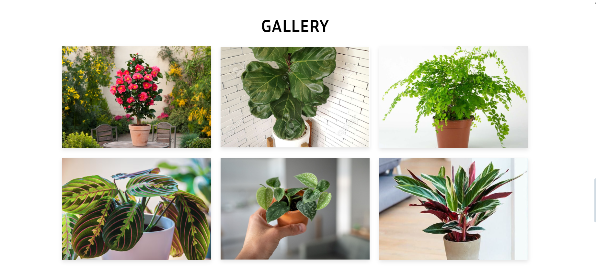

  <h1>Universidad Peruana de Ciencias Aplicadas</h1>
   
  
  

     
    <strong>Carrera:</strong> Ingeniería de Software
      
    <strong>Ciclo:</strong> 5° Ciclo
      
    <strong>Nombre del curso:</strong> Desarrollo de Aplicaciones Open Source
      
    <strong>Sección:</strong> SV54
      
    <strong>Nobre del profesor:</strong> Hugo Allan Mori Paiva
  

  <h3>"Informe de Trabajo Final"</h3>
  

     
    <strong>Nombre del Startup:</strong> AgriCorp
      
    <strong>Nombre del Producto:</strong> GreenCare
      
    <strong>Integrantes:</strong>
      
    Huamani Sánchez, José Diego - U202110458
      
    Llamccaya Arone, Juan Paul - U201923571
      
    Vargas Quispe, Manuel Alexis - U202113256
      
    Lagos Aguilar, Luis Eduardo - U202121975
      
    Quispe Erasmo, Raul Ronaldo - U20211b682
      
  

  <h3>Agosto, 2024</h3>

 

## Registro de Versiones del Informe

<table border="1" cellpadding="5" cellspacing="0">
    <thead>
        <tr>
            <th>Versión</th>
            <th>Fecha</th>
            <th>Autor</th>
            <th>Descripción</th>
        </tr>
    </thead>
    <tbody>
        <tr>
            <td rowspan="14">TB1</td>
            <td>14/08/2024</td>
            <td>José Huamani</td>
            <td>Desarrollo de la carátula</td>
        </tr>
        <tr>
            <td>17/08/2024</td>
            <td>José Huamani</td>
            <td>Desarrollo de la tabla de contenido</td>
        </tr>
        <tr>
            <td>22/08/2024</td>
            <td>José Huamani</td>
            <td>Desarrollo del Capitulo I: Introducción</td>
        </tr>
        <tr>
            <td>26/08/2024</td>
            <td>Raúl Quispe</td>
            <td>Desarrollo del Capitulo II: Competidores</td>
        </tr>
        <tr>
            <td>28/08/2024</td>
            <td>Alexis Vargas / Luis Lagos</td>
            <td>Desarrollo del Capitulo IV: Style Guidelines, Landing Page UI Design, Web Application UX/UI Design, Web Application Prototyping y Domain Driven Software Architecture</td>
        </tr>
        <tr>
            <td>30/08/2024</td>
            <td>Juan Llamcaya</td>
            <td>Desarrollo del Capítulo III:</td>
        </tr>
        <tr>
            <td>01/09/2024</td>
            <td>José Huamani</td>
            <td>Desarrollo del Capítulo V: Software Configuration Management</td>
        </tr>
        <tr>
            <td>03/08/2024</td>
            <td>José Huamani</td>
            <td>Desarrollo del Capítulo V: Sprint Planning 1</td>
        </tr>
        <tr>
            <td>03/09/2024</td>
            <td>José Huamani</td>
            <td>Desarrollo del Capítulo IV: Database Design</td>
        </tr>
        <tr>
            <td>04/08/2024</td>
            <td>Juan Llamcaya</td>
            <td>Desarrollo del Capítulo IV: To Be-Scenario Mapping y Product Backlog</td>
        </tr>
    </tbody>
</table>

## Contenido

<a href="">CAPÍTULO 1: INTRODUCCIÓN</a>

<a href="">1.1. Startup Profile</a>

&nbsp; &nbsp;<a href="">1.1.1. Descripción de la Startup</a>

&nbsp; &nbsp;<a href="">1.1.2. Perfiles de Integrantes del equipo</a>

<a href="">1.2. Solution Profile</a>

&nbsp; &nbsp;<a href="">1.2.1. Antecedentes y problemática</a>

&nbsp; &nbsp;<a href="">1.2.2. Lean UX Process</a>

&nbsp; &nbsp; &nbsp; &nbsp;<a href="">1.2.2.1. Lean UX Problem Statement</a>

&nbsp; &nbsp; &nbsp; &nbsp;<a href="">1.2.2.2. Lean UX Assumptions</a>

&nbsp; &nbsp; &nbsp; &nbsp;<a href="">1.2.2.3. Lean UX Hypothesis Statements</a>

&nbsp; &nbsp; &nbsp; &nbsp;<a href="">1.2.2.4. Lean UX Canvas</a>

<a href="">1.3. Segmentos objetivos</a>

<a href="">CAPÍTULO 2: REQUIREMENTS ELICITATION & ANALYSIS</a>

<a href="">2.1. Competidores</a>

&nbsp; &nbsp;<a href="">2.1.1. Análisis Competitivo</a>

&nbsp; &nbsp;<a href="">2.1.2. Estrategias y tácticas frente a competidores</a>

<a href="">2.2. Entrevistas</a>

&nbsp; &nbsp;<a href="">2.2.1. Diseño de enetrevistas</a>

&nbsp; &nbsp;<a href="">2.2.2. Registro de entrevistas</a>

&nbsp; &nbsp;<a href="">2.2.3. Análisis de entrevistas</a>

<a href="">2.3. Needfinding</a>

&nbsp; &nbsp;<a href="">2.3.1. User Personas</a>

&nbsp; &nbsp;<a href="">2.3.2. User Task Matrix</a>

&nbsp; &nbsp;<a href="">2.3.3. User Journey Mapping</a>

&nbsp; &nbsp;<a href="">2.3.4. Empathy Mapping</a>

&nbsp; &nbsp;<a href="">2.3.5. As-is Scenario Mapping</a>

<a href="">CAPÍTULO 3: REQUIREMENTS SPECIFICATION</a>

<a href="">3.1. To-Be Scenario Mapping</a>

<a href="">3.2. User Stories</a>

<a href="">3.3. Impact Mapping</a>

<a href="">3.4. Product Backlog</a>

<a href="">CAPÍTULO 4: PRODUCT DESIGN</a>

<a href="">4.1. Style Guidelines</a>

&nbsp; &nbsp;<a href="">4.1.1. General Style Guidelines</a>

&nbsp; &nbsp;<a href="">4.1.2. Web Style Guidelines</a>

<a href="">4.2. Information Architecture</a>

&nbsp; &nbsp;<a href="">4.2.1. Organization Systems</a>

&nbsp; &nbsp;<a href="">4.2.2. Labeling Systems</a>

&nbsp; &nbsp;<a href="">4.2.3. SEO Tags and Meta Tags</a>

&nbsp; &nbsp;<a href="">4.2.4. Searching Systems</a>

&nbsp; &nbsp;<a href="">4.2.5. Navigation System</a>

<a href="">4.3. Landing Page UI Design</a>

&nbsp; &nbsp;<a href="">4.3.1. Landing Page Wireframe</a>

&nbsp; &nbsp;<a href="">4.3.2. Landing Page Mock-up</a>

<a href="">4.4. Web Applications UX/UI Design</a>

&nbsp; &nbsp;<a href="">4.4.1. Web Applications Wireframes</a>

&nbsp; &nbsp;<a href="">4.4.2. Web Applications Wireflow Diagrams</a>

&nbsp; &nbsp;<a href="">4.4.3. Web Applications Mock-ups</a>

&nbsp; &nbsp;<a href="">4.4.4. Web Applications User Flow Diagrams</a>

<a href="">4.5. Web Applications Prototyping</a>

<a href="">4.6. Domain-Driven Software Architecture</a>

&nbsp; &nbsp;<a href="">4.6.1. Software Architecture Context Diagrams</a>

&nbsp; &nbsp;<a href="">4.6.2. Software Architecture Container Diagrams</a>

&nbsp; &nbsp;<a href="">4.6.3. Software Architecture Components Diagrams</a>

<a href="">4.7. Software Object-Oriented Design</a>

&nbsp; &nbsp;<a href="">4.7.1. Class Diagrams</a>

&nbsp; &nbsp;<a href="">4.7.2. Class Dictionary</a>

<a href="">4.8. Database Design</a>

&nbsp; &nbsp;<a href="">4.8.1. Database Diagram</a>

<a href="">CAPÍTULO 5: PRODUCT IMPLEMENTATION, VALIDATION & DEPLOYMENT</a>

<a href="">5.1. Software Configuration Management</a>

&nbsp; &nbsp;<a href="">5.1.1. Software Development Environment Configuration</a>

&nbsp; &nbsp;<a href="">5.1.2. Source Code Management</a>

&nbsp; &nbsp;<a href="">5.1.3. Source Code Style Guide & Conventions</a>

&nbsp; &nbsp;<a href="">5.1.4. Software Deployment Configuration</a>

<a href="">5.2. Landing Page, Services & Applications Implementation</a>

&nbsp; &nbsp;<a href="">5.2.1. Sprint 1</a>

&nbsp; &nbsp; &nbsp; &nbsp;<a href="">5.2.2.1. Sprint Planning 1</a>

&nbsp; &nbsp; &nbsp; &nbsp;<a href="">5.2.2.2. Sprint Backlog 1</a>

&nbsp; &nbsp; &nbsp; &nbsp;<a href="">5.2.2.3. Development Evidence for Sprint Review</a>

&nbsp; &nbsp; &nbsp; &nbsp;<a href="">5.2.2.4. Testing Suite Evidence for Sprint Review</a>

&nbsp; &nbsp; &nbsp; &nbsp;<a href="">5.2.2.5. Execution Evidence for Sprint Review</a>

&nbsp; &nbsp; &nbsp; &nbsp;<a href="">5.2.2.6. Services Documentation Evidence for Sprint Review</a>

&nbsp; &nbsp; &nbsp; &nbsp;<a href="">5.2.2.7. Software Deployment Evidence for Sprint Review</a>

&nbsp; &nbsp; &nbsp; &nbsp;<a href="">5.2.2.8. Team Collaboration Insights during Sprint</a>

<a href="">CONCLUSIONES</a>

<a href="">Conclusiones y recomendaciones</a>

<a href="">Video About-the-Team</a>

<a href="">BIBLIOGRAFÍA</a>

<a href="">ANEXOS</a>

## Student Outcome

<table>
    <tr>
        <th>
            Criterio específico
        </th>
        <th>
            Acciones realizadas
        </th>
        <th>
            Conclusiones
        </th>
    </tr>
    <tr>
        <td>
            Comunica oralmente sus ideas y/o resultados con objetividad a público de diferentes
            especialidades y niveles jerarquicos, en el marco del desarrollo de un proyecto en
            ingeniería.
        </td>
        <td>
            <strong>Huamani Sánchez, José Diego TB1: </strong>
            Al momento de indagar información acerca de la importancia de las áreas verdes en nuestro hogares, expandió mi concepto en cómo se puede llevar a cabo una aplicación que brinde orientación y gestión al cuidado de las plantas. Ligando con los labores que realicé, me permitió elaborar la misión y visión del proyecto, elaborar el Lean UX Process, tener la capacidad analítica de pensar acerca de que datos se alojarán (implementación del diagram de Base Datos).
        </td>
        <td>
            TB1:  
            La herramienta principal para llevar proyectos de software de calidad se da atravez de una buena comunicación, ya que es el instrumento vital que nos permitirá comprender a cada uno de nuestros segmentos objetivos el cual hemos definido.  
            Es primordial conocer nuestro segmento y el objetivo que nosotros como Startup tenemos y queremos alcanzar; por lo que, tener esas sendas claras, nos ayudará a comprender mejorar las necesidades para solventar con nuestra solución y ofrecer mejores experiencia para los usuarios.  
            Gracias a la herramienta de facil uso dde diseño, el cual viene a ser Figma, nos ha permtido esquematizar de manera consistente cada uno de los componentes que tendrá tanta nuestra Landing Page como Nuestro Web Application. Además, el hecho de facilitar simulaciones de uso interactivas <em>(Prototyping)</em>, nos da un primer alcance de la funcionalidad e interactividad que este tendrá cuando pase a su fase de desarrollo.
        </td>
    </tr>
    <tr>
        <td>
            Comunica en forma escrita ideas y/o resultados con objetividad a público de diferentes
            especialidades y niveles jerarquicos, en el marco del desarrollo de un proyecto en
            ingeniería.
        </td>
        <td>
        <strong>Huamani Sánchez, José Diego TB1: </strong>
        Realicé entrevistas al segmento de jardineros que, en sí, ya cuentan con cierta experiencia en el rubro; por lo que, dicha información brindada, me sirvió para alinear al equipo en el desarrollo del Product Backlog del Proyecto así como definir de manera más clara el propósito general que nuestro se enfocará. 
        </td>
        <td>
            TB1:  
            El enfoque de recopilación de información, nos ha demostrado que podemos retroalimentarnos de un tema nuevo con la posibilidad de generar diversos puntos de vistas que nos servirán como <em>bases</em> para la construcción de un proyecto más sólido.  
            El hecho de construir diferentes plataformas y pensar en diferentes características, mapean de manera objetiva cada una de nuestras capacidades e habilidades que podemos ofrecer para el escalamiento del proyecto.
        </td>
    </tr>
</table>

<h2 id="introduction">CAPÍTULO 1: INTRODUCCIÓN</h2>

<h3 id="startupProfile">1.1. Startup Profile</h3>

<h4 id="descriptionStartup">1.1.1. Descripción de la Startup</h4>

Agricorp es una startup que busca solventar la problemática a la que se enfrentan las personas que tienen noción o alguna falta de conocimiento acerca del cuidado de las plantas en entornos hogareños. Conforme a este criterio vimos una gran oportunidad para brindar una innovadora solución de software que permita a dichas personas, por medio de una aplicación web, llevar a cabo este proceso que conlleva la realización de recordatorios y gestión de las plantas que el usuario desea cultivar.

<strong>Misión:</strong>

Ayudar a las personas a que puedan tener una manera práctica y dinámica al gestionar el cuidado de sus plantas en su día a día.

<strong>Visión:</strong>

Nos segmentamos como uno de los grandes exponentes en el cuidado medio ambiental en entornos pequeños y medianos a nivel Nacional, siendo accesibles a un precio módico en los próximos 2 años.

<h4 id="teamProfile">1.1.2. Perfiles de integrantes del equipo</h4>

<table style="width: 100%; border-collapse: collapse;">
        <tr>
            <td style="width: 30%; border: 1px solid #FFF; padding: 10px; vertical-align: top;">
            
            </td>
            <td style="width: 70%; border: 1px solid #FFF; padding: 10px; vertical-align: top;">
                <strong>José Diego Huamani Sánchez (U202110458)</strong> - Ingeniería de Software  
                Tengo 20 años y actualmente ando formandome en la Univeridad Peruana de Ciencias Aplicadas. Soy un tanto curioso en diferentes aspectos tanto tecnologicos como en la gestión y dirección de proyectos; en donde, mis principales experiencias radican en liderazgo y manejo de equipos en marcos de trabajo Ágiles, análisis de datos con Python, creación de RPA con Power Automate y ciertos conocimientos en aspectos de desarrollo con enfoque web con frameworks tales como AngularJs. Espero que mi compromiso y mis ganas de enseñar logren hacer que el proyecto tome un direccionamiento hacia el éxito.
            </td>
        </tr>
        <tr>
            <td style="width: 30%; border: 1px solid #FFF; padding: 10px; vertical-align: top;">
                
            </td>
            <td style="width: 70%; border: 1px solid #FFF; padding: 10px; vertical-align: top;">
                <strong>Manuel Alexis Vargas Quispe - (U202113256)</strong> - Ingeniería de Software  
                Tengo experiencia en C++, HTML, CSS, Angular, y Vue.js. He trabajado con Android Studio para el desarrollo de aplicaciones móviles y tengo conocimientos básicos de backend. También he usado Cisco Packet Tracer, y tengo conocimientos en Python y Java a nivel básico.
            </td>
        </tr>
        <tr>
            <td style="width: 30%; border: 1px solid #FFF; padding: 10px; vertical-align: top;">
                
            </td>
            <td style="width: 70%; border: 1px solid #FFF; padding: 10px; vertical-align: top;">
                <strong>Luis Eduardo, Lagos Aguilar - (U202121975)</strong> - Ingeniería de Software  
                Tengo 20 años, estudio ingeniería de software en la universidad Peruana de Ciencias Aplicadas. Me considero una estudiante responsable, interesado en el mundo de la redes y comunicaciones. Tengo conocimiento en lenguajes de programación como Java, c++ y Python, además se utilizar frameworks como Angular y Vue.
            </td>
        </tr>
        <tr>
            <td style="width: 30%; border: 1px solid #FFF; padding: 10px; vertical-align: top;">
                
            </td>
            <td style="width: 70%; border: 1px solid #FFF; padding: 10px; vertical-align: top;">
                <strong>Raul Ronaldo Quispe Erasmo - (U20211b682)</strong> - Ingeniería de Software  
                Me veo a mí mismo como una persona dinámica y creativa, con la habilidad de ofrecer una variedad de ideas y conocimientos valiosos al equipo. Tengo una sólida experiencia en lenguajes de programación como C++, HTML y CSS, y también poseo un alto nivel en redacción. Disfruto interactuar con los demás y siempre estoy en busca de oportunidades para crecer y desarrollarme tanto profesional como personalmente. Además, me esfuerzo por mantener una actitud positiva y abierta a nuevas perspectivas, lo que me permite adaptarme fácilmente a diferentes entornos y desafíos.
            </td>
        </tr>
        <tr>
            <td style="width: 30%; border: 1px solid #FFF; padding: 10px; vertical-align: top;">
                
            </td>
            <td style="width: 70%; border: 1px solid #FFF; padding: 10px; vertical-align: top;">
                <strong>Juan Paul Llamccaya Arone - U201923571</strong> - Ingeniería de Software  
                Tengo experiencia en programación en C++ (CLI), en programación orientada a objetos (POO), y en desarrollo web utilizando HTML, JavaScript y CSS. Además, poseo conocimientos en diseño de UX, en el uso de Packet Tracer, SQL y Python.
            </td>
        </tr>
</table>

<h3 id="solutionProfile">1.2. Solution Profile</h4>

<h4 id="Antecedents">1.2.1. Antecedentes y problemática</h4>

**Antecedentes**

Desde que que la pandemia del COVID-19 nos puso en confinamiento sanitario a cada uno de nosotros allá por el 2020, empezaron a ocurrir sucesos que dentro de toda esa coyuntura, no todo era tan malo. Si es que uno pudo darse cuenta, ¿No vieron algunos animales caminar por las calles o que algunas especies extintas hallan retornado?

Todo ello se dió gracias a los diversos efectos positivos que el medio ambiente estaba recibiendo al no verse afectado por las emisiones de <em>CO2</em> ni gases de efecto invernadero que nosotros ocasioanamos antes del confinamiento.

Esto fue un desencadenante para que las personas logren cultivar y/o cuidar con mucha más razón el medio ambiente; ya que, para algunos, les da un efecto más vívido a sus entornos de trabajo y hogareños así como el de recibir oxígeno para generar ambientes mucho más ventilados.

Esto queda constancia que, de manera progresiva en el Perú, la cantidad de personas que buscan mejorar y/o aprender a cuidar plantas se está conviertiendo como un estilo de vida para contribuir con el planeta.

**Problemática**

Actualmente, al ya no encontrarnos en estado de confinamiento, muchas personas han dejado de lado el cuidado de las plantas, ya sea por temas de tiempo - ya que la gran mayoría de empleos han retornado a la presencialidad -, o porque no se tiene la suficiente información acerca de que características se requieren para cuidar y/o plantar. Estos factores junto a otros más, son los más influyentes para que esta actividad, con beneficio a futuro, poco a poco cese con el tiempo.

**What?**

En base a la problemática captada por nuestro startup está centrada en el desarrollo del proceso de gestión que utilizará cada uno de los jardineros o agricultores para monitorear sus cultivos. Sin embargo, temas como el costo y la probabilidad que se brinde la información precisa acerca de las plantas monitoreadas, son factores que impactan negativmente en su usabilidad diaria.

**When?**

El problema se origina cuando los jardineros o agricultores se encuentran realizando el proceso de siembra de sus plantas.

**Where?**

Este acontecimiento ocurre principalmente en entornos pequeños (viviendas) o medianos (jardines) en donde se desee cultivar y/o plantar ciertos tipos de plantas acorde al espacio.

**Who?**

Está problemática compromete tanto a los jardineros como agricultores de los cuales están encargados del proceso de cultivo y cuidado de sus plantas.

**Why?**

El problema surge a raiz de la escasez de soluciones software que ofrezcan herramientas para gestionar el tiempo y brindar información acerca del cuidado de ciertos tipos de plantas; es por ello que, al no contar con herramientas eficaces para realizar dichas activadades, genera cierto temor a los jardineros o agricultores que recien están iniciando en su rol.

**How?**

Dichas circunstancias surgen cuando un jardinero o agricultor requiere una solución software para consultar el estado de sus cultivos. Cuando buscan alguna solución, se encuentran con muy pocas aplicaciones que cubran dicha necesidad, o si las encuentran, suelen ser demasiados costosas (por factores de membresía y renovación) que compromoten mucho el presupuesto que tiene previsto cada uno de los usuarios.

**How much?**

Tanto agricultores como jardineros, ya sea que tengan experiencia o recién esten adentradose a este rubro, cumplen un papel fundamental dentro de su entorno, puesto que las actividades de riego, alimentación y otras funciones adicionales, son responsabilidades cruciales en su día a día. Este proceso ayudará a determinar que la calidad de vida se las plantas y cultivos esten rindiendo frutos dentro de sus ambientes de plantación.

Acorde a un estudio llevado a cabo por El Diario El Comercio (2019), refiere que mientras más áreas o ambientes verdes existan, se generarán microclimas mucho más cómodos; donde las plantas o árboles mitigarán la contaminación del aire con mayor frecuencia.

En conclusión, una adecuada gestión del proceso de monitoreo de plantas es vital para obtener resultados prometedores de como está progresando la calidad de vida de dichos cultivos; por lo que, contar con herramientas y soluciones tecnológicas centralizadas, puede marcar una exclusiva diferencia en el cuidado, creación y preservación de los ambientes de plantación a largo plazo.

<h4 id="leanUXProcess">1.2.2. Lean UX Process</h4>

<h4 id="problemStatement">1.2.2.1. Lean UX Problem Statements</h4>

**Problem Statement 1: Jardineros y/o Agricultores experimentados**

 Actualmente, los jardineros y agricultores con experiencia tienen un vasto conocimiento sobre el cuidado de plantas y la optimización de recursos para obtener los mejores resultados en sus cultivos. Sin embargo, en un entorno cada vez más digitalizado, la falta de integración de tecnologías avanzadas en sus prácticas tradicionales puede llevar a una subutilización de recursos y una gestión ineficiente del tiempo. Estos profesionales enfrentan desafíos al adoptar nuevas herramientas digitales que puedan complementar y mejorar sus métodos establecidos sin comprometer la calidad de su trabajo.

De este modo, se ha detectado como factor crítico la necesidad de crear una solución que se adapte a las necesidades de los jardineros y agricultores experimentados, permitiéndoles integrar tecnologías modernas de manera intuitiva y eficaz en sus rutinas diarias, para optimizar sus procesos sin que esto represente una curva de aprendizaje empinada o una interrupción en sus prácticas habituales.

¿Cómo se puede desarrollar una herramienta digital que potencie las habilidades de los jardineros y agricultores experimentados, facilitando la transición hacia una gestión más eficiente y tecnológica de sus cultivos sin comprometer la calidad y el conocimiento adquirido a lo largo de los años?

**Problem Statement 2: Jardineros y/o Agricultores con falta de experiencia**

Los jardineros y agricultores con poca experiencia a menudo se encuentran desafiados por la falta de conocimiento especializado para cuidar adecuadamente sus plantas y cultivos. Sin una guía adecuada, pueden cometer errores que resulten en pérdidas significativas de tiempo, dinero y recursos. Además, la abrumadora cantidad de información disponible en línea puede ser confusa y contradictoria, lo que complica aún más la adquisición de conocimientos prácticos y efectivos.

De este modo, se ha identificado como necesidad urgente la creación de una solución que brinde a los jardineros y agricultores novatos las herramientas y conocimientos esenciales de manera accesible y sencilla, para que puedan tomar decisiones informadas sobre el cuidado de sus plantas y cultivos, y mejorar sus habilidades con el tiempo.

¿Cómo se puede desarrollar una plataforma educativa que ofrezca a los jardineros y agricultores principiantes un acceso fácil y comprensible a la información necesaria para cuidar sus plantas de manera efectiva y mejorar progresivamente en sus prácticas de cultivo?

<h4 id="assumptions">1.2.2.2. Lean UX Assumptions</h4>

**Business Assumptions:**

* <strong>Creo que mis usuarios necesitan</strong> una plataforma centralizada que les facilite la gestión diaria del cuidado de sus plantas, incluyendo recordatorios de riego, poda y otros cuidados esenciales.

 

* <strong>Estas necesidades se pueden resolver</strong> mediante una aplicación web que ofrezca guías personalizadas, basadas en las características de cada planta, y que además proporcione notificaciones oportunas sobre las tareas de mantenimiento.

 

* <strong>Mis clientes iniciales son</strong> jardineros y agricultores hogareños, tanto aquellos con experiencia como aquellos que buscan aprender y mejorar sus habilidades en el cuidado de plantas.

 

* <strong>El valor #1 que un cliente requiere de mi servicio</strong> es la simplicidad y accesibilidad de una plataforma que permita a cualquier persona, sin importar su nivel de experiencia, gestionar eficazmente el cuidado de sus plantas.

 

* <strong>El cliente también puede obtener estos beneficios adicionales</strong>: una reducción en la tasa de mortalidad de sus plantas al recibir orientación precisa, un mayor conocimiento sobre el cuidado de diferentes especies de plantas, y una mejor organización de sus actividades de jardinería.

 

* <strong>Voy a adquirir a mis clientes a través de</strong> estrategias de contenido educativo en blogs y videos de YouTube, además de campañas publicitarias en redes sociales enfocadas en la comunidad de jardineros y entusiastas de las plantas.

 

* <strong>La interfaz intuitiva y personalizable de la aplicación</strong> será un factor clave para atraer y retener a los usuarios, permitiéndoles adaptar la experiencia a sus necesidades y niveles de conocimiento específicos.

 

**Sabremos que tenido éxito cuando vamos algunos de los siguientes cambios en el comportamiento de nuestros usuarios:**

* Aumento de la productividad de los jardineros y/o agricultores al invertir menor tiempo en la gestión y cuidado de sus cultivos.

 

* Mayor satisfacción por parte de las personas con basta experiencia; el cual, la utilización de nuestras herramientas, permitieron que ellos logren gestionar mejor sus procesos de cultivo (guiándolos en cada paso que den).

 

**User Assumptions:**

**¿Quién es el usuario?**

* Los jardineros y/o agricultores que cuentan con experiencia en el cuidado de plantas o cultivos en ambientes pequeños u hogareños.

 

* Personas que cuentan con nula experiencia en temas de plantación el cual desean aprender acerca de la jardineria y/o agricultura.

 

**¿Dónde encaja nuestro producto? ¿En sus actividades labores o en su vida?**

Nuestra aplicación está enfocada para ser utilizado en el ámbito hogareño, tanto por los jardineros y/o agricultores como personas que quisieran aprender acerca del cuidado de las plantas. Adicional a ello, está destinado a facilitar las activiades relacionadas con el proceso de gestión de plantas.

**¿Qué problemas tiene nuestro producto y cómo se pueden resolver?**

**Problemas:**

* Que la plataforma sea demasiado básica y no logre captar el interés tanto de jardineros experimentados como de novatos, lo que podría llevar a que prefieran métodos tradicionales de cuidado de plantas.   Que el costo de la suscripción a las funcionalidades avanzadas de la plataforma no sea accesible para todos los usuarios, especialmente para aquellos que solo tienen pequeños jardines hogareños.

 

**Solución:**

* Realizar un diseño centrado en el usuario a través de entrevistas con jardineros y agricultores de diferentes niveles de experiencia para comprender sus expectativas y diseñar una experiencia de usuario que sea atractiva y útil para todos los segmentos.  Implementar un modelo de precios flexible que permita a los usuarios acceder a funciones básicas de manera gratuita y ofrezca planes accesibles para aquellos que desean funcionalidades adicionales, asegurando que todos puedan beneficiarse de la plataforma sin importar su presupuesto.

 

**¿Qué características son importantes?**

Nuestro producto es utilizado en dos momentos clave en la vida diaria de jardineros y agricultores, tanto experimentados como novatos, que buscan mejorar o simplificar el cuidado de sus plantas. Estos momentos incluyen:

1. Planificación del cuidado de las plantas:

* Cuándo: Generalmente, los usuarios utilizan nuestra plataforma al comienzo de la semana o del día, cuando están planificando las tareas de jardinería. Los usuarios experimentados podrían querer optimizar sus métodos de cuidado o explorar nuevas técnicas, mientras que los novatos buscan orientación y recomendaciones sobre cómo mantener sus plantas saludables.

 

* Cómo: Los jardineros y agricultores acceden al producto a través de su navegador web o dispositivo móvil, donde pueden ingresar detalles sobre sus plantas y recibir una gama de recomendaciones personalizadas para sus cuidados. Esto incluye recordatorios de riego, fertilización, poda, y otros cuidados específicos según la especie y las condiciones del entorno (luz, humedad, etc.). Los usuarios pueden también hacer seguimiento del crecimiento y salud de sus plantas, recibiendo alertas si alguna planta requiere atención especial.

 

**2. Integración en la vida diaria:**

Nuestro producto está diseñado para integrarse sin problemas en la rutina diaria de los usuarios. Para los jardineros experimentados, sirve como una herramienta de optimización y mejora continua de sus técnicas, mientras que para los novatos, actúa como un mentor que guía cada paso del proceso de jardinería. La accesibilidad a través de dispositivos móviles asegura que el producto esté disponible en el momento y lugar que los usuarios lo necesiten, haciendo que el cuidado de las plantas sea una tarea más sencilla, efectiva y disfrutable.

**Features:**

* El jardinero y/o agricultor podrán registrar cada una de sus plantas que tienen dentro de sus entornos. Para ello, se debe proporcionar una experiencia intuitiva y fácil de usar que permitiéndoles asignar tareas de cuidado como riego, poda y fertilización, adaptadas a las necesidades particulares de cada planta.

 

* El jardinero y/o agricultor tendrán la capacidad de realizar seguimiento del estado de sus plantas a través de la plataforma, registrando cambios en su crecimiento o apariencia. La aplicación debe permitir una actualización rápida y sencilla de la información del estado de las plantas, ayudando a nuestros usuarios a tomar decisiones informadas acerca del cuidado continuo.

 

* La aplicación incluirá una base de datos extensa de diferentes tipos de plantas, con información detallada sobre sus necesidades de cuidado. Los jardineros y/o agricultores podrán buscar y acceder a consejos específicos para optimizar el cuidado de cada especie, según sus características y el entorno en que se encuentran.

 

* Los jardineros y/p agricultores podrán visualizar un tablero de registro en donde se visualizará todas las tareas de cuidado de plantas programadas para cada día. Este tablero incluirá recordatorios y alertas para asegurarles de que todas las plantas reciban la atención necesaria en el momento adecuado.

 

<h4 id="hypohesisStatements">1.2.2.3. Lean UX Hypothesis Statements</h4>

* <strong>Creemos que</strong> los jardineros y/o agricultores busquen dejar de utilizar las herramientas tradicionales para llevar a cabo el proceso de gestión del cultivo de plantas. <strong>Sabremos que </strong> tuvimos éxito <strong>cuando</strong> el porcentaje de usuarios que usan la aplicación vaya en aumento y no regresen a utilizar herramientas de índole tradicional después de abandonar nuestra plataforma por algún motivo que no se relacione con aspectos económicos.

 

* <strong>Creemos que</strong> los jardineros y/o agricultores busquen dejar de utilizar las herramientas tradicionales para llevar a cabo el proceso de gestión del cultivo de plantas. <strong>Sabremos que </strong> tuvimos éxito <strong>cuando</strong> cuando nuestros usuarios recalquen la enorme facilidad y eficacia de nuestras herramientas en comparación con los métodos tradicionales de apuntes a mano.

 

* <strong>Creemos que</strong> establecer un precio módico y/o accesible para nuestro producto será un estímulo crucial para diferenciarnos del resto de nuestros competidores. <strong>Sabremos que</strong> tuvimos éxito <strong>cuando</strong> la gran mayoría de nuestros usuarios provengan de lugares que cuenten con espacios de áreas verdes.

 

* <strong>Creemos que</strong> establecer un precio módico y/o accesible para nuestro producto será un estímulo crucial para diferenciarnos del resto de nuestros competidores. <strong>Sabremos que</strong> tuvimos éxito <strong>cuando</strong> recibamos reseñas positivas acerca del precio del producto así como del servicio ofrecido en las encuestas realizadas a nuestros usuarios.

 

* <strong>Creemos que</strong> la gestión de las plantas realizadas por los jardineros y/o agricultores con nuestra aplicación será más efectiva que los medios tradicionales. <strong>Sabremos que</strong> tuvimos éxito <strong>cuando</strong> más del 85% de nuestros usuarios utilicen de manera activa la funcionalidad de gestión de plantas en nuestra aplicación.

 

* <strong>Creemos que</strong> la gestión de las plantas realizadas por los jardineros y/o agricultores con nuestra aplicación será más efectiva que los medios tradicionales. <strong>Sabremos que</strong> tuvimos éxito <strong>cuando</strong> nuestros usuarios destaquen la eficiencia y reducción del tiempo invertido en la gestión de plantas dentro de nuestra aplicación.

 

<h4 id="UXCanvas">1.2.2.4. Lean UX Canvas<h4>

    
    

    <em><strong>Imagen 1:</strong>
        Imagen Propia. (2024). Elaboración del Lean UX Canvas para el Startup AgriCorp.
    </em>

<h4 id="objectiveSegment">1.3. Segmentos objetivo</h4>

Nuestra software esta focalizado en atender las necesidades que dos de nuestros principales segmentos objetivos:  

* **Jardineros y/o Agricultores con experiencia en el Cuidado de Plantas:**  

<ul style="list-style: none;">
    <li>
        Son quienes ya cuentan con ciertos conocimientos acerca del cuidado de plantas, del cual poseen una familiaridad de prácticas sofisticadas para preservar su áreas verdes.
    </li>
</ul>

* **Personas interesadas en la Agricultura:**  

<ul style="list-style: none;">
    <li>
        Dicho segmento está enfocado en personas que cuentan con basta experiencia en el cuidado de plantas, en lo cual se encuentran en la busqueda de información u orientación para adentrarse correctamente a dicha actividad.
    </li>
</ul>

Según a un estudio elabora por Insight Hunting SEO en colaboración con Impulso RR y Marketing de Influencia Husqvarna (2020), entre los meses de enero a Octubre, alrededor de 51 mil búsquedas online estuvieron relacionadas con el cuidado de área verdes en país; donde, el 64% de dichas personas fueron adultos mayores entre el rango de edades de 34 a 50 años.

> "De acuerdo al estudio llevado a cabo, el 84% de las búsquedas la realizan usuarios domésticos que tienen propiedades con espacios de áreas verdes y 16% son empresas que tienen que encargarse del mantenimiento de estas. Ese año se pudo observar un crecimiento en el interés por las novedades tecnológicas para mantenimiento de jardines como maquinarias y cortadoras”

    

    <em><strong>Imagen 2:</strong>
        s.f (2024). Manos de personas plantando un pequeño árbol al atardecer [Fotografía]. 123RF.
    </em>

<h2 id="requirementsElicitation">CAPÍTULO 2: REQUIREMENTS ELICITATION & ANALYSIS</h2>

<h3 id="competitors">2.1. Competidores</h3>

<h4 id="competitiveAnalysis">2.1.1. Análisis Competitivo</h4>

<table>
<tr>
<th colspan="7">Competitive Analysis Landscape</th>
</tr>
<tr>
<td colspan="2" rowspan="2">¿Por qué llevar a cabo este análisis?</td>
<td colspan="5">Escriba en el recuadro la pregunta que busca responder o el objetivo de este análisis.</td>
</tr>
<tr>
<td colspan="5">
Realizar un análisis competitivo es lo primordial para identificar competidores clave, averiguar que es lo que hacen y que tipo de amenazas pueden representar para el éxito de nuestra empresa. Por otra parte, esto nos permite identificar múltiples oportunidades de mercado así como brindarnos la capacidad de reconocer nuestras fortalezas y debilidades con la cual nuestra Startup cuenta para desarrollar dicha estrategia competitiva </td>
</tr>
<tr>
<td colspan="3">(En la cabecera colocar por cada competidor nombre y logo)</td>
<td>GreenCare  </td>
<td>Plantix  </td>
<td>Gardening  </td>
<td>Info Jardin  </td>
</tr>
<tr>
<td rowspan="2">PERFIL</td>
<td colspan="2">Overview</td>
<td>Es una aplicación que ayuda a las personas a que puedan tener una manera práctica y dinámica al gestionar el cuidado de sus plantas en su día a día.</td>
<td>Es una app que ayuda a los agricultores para resolver dudas y poder cuidar bien sus agriculturas, optimizando la productividad y adquiri valiosos conocimientos agrícolas.</td>
<td>Es una aplicación donde notifica momentos ideales para trasplantar, adelgazar y cosechar. También avisa sobre condiciones climáticas inusuales o la falta de lluvia que podrían afectar el desarrollo de sus cultivos. </td>
<td>Es una app donde brinda detalles sobre los requerimientos específicos de cada planta, incluyendo luz, riego, abonado y prevención de enfermedades. </td>
</tr>
<tr>
<td colspan="2">Ventaja competitiva ¿Qué valor ofrece a los clientes?</td>
<td>Ofrece consejos de agricultores y jardineros con experiencias en esta área, también tutoriales de casos muy ocurrente en el mundo de la agricultura.</td>
<td>Ofrece ayudas de los agricultores pueden superar desafíos y alcanzar sus metas con mayor facilidad, mejorando significativamente su experiencia y éxito en la agricultura. </td>
<td>Brinda recomendaciones específicas sobre cómo ajustar su cuidado para enfrentar estos desafíos, garantizando así el mejor resultado posible para sus cosechas.</td>
<td>Brinda guías sobre cómo preparar el suelo, cuidar el césped y realizar la poda o tala de árboles de manera adecuada.</td>
</tr>
<tr>
<td rowspan="2">PERFIL DE MARKETING</td>
<td colspan="2">Mercado objetivo</td>
<td>Usuarios en busca de soluciones para el cuidado de sus plantas, también para los jardineros nuevos.</td>
<td>Usuarios que tienen un gran terreno de agricultura quienes buscan solucionas a escala mayoristas.</td>
<td>Propietarios de muchas plantas quienes desean consejos para prevenir problemas.</td>
<td>Usuarios que necesitan tutoriales, comunicar con una comunidad y que buscan profesionales competentes que los recomienden.</td>
</tr>
<tr>
<td colspan="2">Estrategias de marketing</td>
<td>Marketing digital a través de redes sociales y blogs especializados.</td>
<td>Campañas dirigidas a grandes superficies agrícolas y ferias del sector.</td>
<td>Publicidad en medios especializados en jardinería y redes sociales.</td>
<td>Colaboraciones con expertos en jardinería y presencia en foros y comunidades en línea.</td>
</tr>
<tr>
<td rowspan="3">PERFIL DE PRODUCTO</td>
<td colspan="2">Productos & Servicios</td>
<td>Gestión del cuidado de plantas mediante consejos y tutoriales.</td>
<td>Asesoramiento y diagnósticos para la optimización de cultivos.</td>
<td>Recomendaciones para el cuidado de cultivos y alertas climáticas.</td>
<td>Guías completas para el cuidado de plantas y mantenimiento del jardín.</td>
</tr>
<tr>
<td colspan="2">Precios & Costos</td>
<td>Suscripción gratuita y Premium, éste último te da accesibilidad por ejemplo de cómo cultivar y mantener todas especies de plantas, ajustes de riego automático sincronizados a tiempo real, etc.</td>
<td>Suscripción basada en el tamaño del terreno o el número de usuarios, con tarifas adicionales por consultas.</td>
<td>Suscripción mensual/anual para acceso a alertas climáticas y asesoramiento especializado.</td>
<td>Suscripción gratuita con publicidad; opción de pago para eliminar anuncios y acceso a contenido exclusivo.</td>
</tr>
<tr>
<td colspan="2">Canales de distribución (Web y/o Móvil)</td>
<td>Plataforma web y aplicación móvil.</td>
<td>Plataforma web y aplicación móvil.</td>
<td>Plataforma web y aplicación móvil.</td>
<td>Sitio web y aplicación móvil.</td>
</tr>
<tr>
<td rowspan="5">ANÁLISIS SWOT</td>
<td colspan="6">Realice esto para su startup y sus competidores. Sus fortalezas deberían apoyar sus oportunidades y contribuir a lo que ustedes definen como su posible ventaja competitiva.</td>
</tr>
<tr>
<td colspan="2">Fortalezas</td>
<td>Interfaz amigable y fácil de usar.</td>
<td>Amplia base de conocimientos agrícolas y diagnóstico preciso.</td>
<td>Alertas en tiempo real y recomendaciones personalizadas.</td>
<td>Guías exhaustivas y alertas personalizadas.</td>
</tr>
<tr>
<td colspan="2">Debilidades</td>
<td>Falta de integración con otras herramientas agrícolas.</td>
<td>Dependencia de datos precisos y actualizados.</td>
<td>Puede ser complejo para usuarios novatos.</td>
<td>Puede tener una curva de aprendizaje para nuevos usuarios.</td>
</tr>
<tr>
<td colspan="2">Oportunidades</td>
<td>Expandir funcionalidades y alianzas con otras plataformas.</td>
<td>Desarrollar nuevas características basadas en la retroalimentación de los usuarios.</td>
<td>Incorporar tecnologías emergentes como IA para mejorar las recomendaciones.</td>
<td>Ampliar la base de usuarios mediante marketing y promociones.</td>
</tr>
<tr>
<td colspan="2">Amenazas</td>
<td>Competencia creciente en el mercado de aplicaciones de jardinería.</td>
<td>Desafíos en la actualización y mantenimiento de datos agrícolas.</td>
<td>Riesgo de desactualización de las alertas climáticas.</td>
<td>Competencia de aplicaciones con características similares o mejoradas.</td>
</tr>
</table>

<h4 id="competitiveStrategies">2.1.2. Estrategias y tácticas frente a competidores</h4>

<h3 id="interviews">2.2. Entrevistas</h4>

En esta sección se aborda la investigación tomando como base la recolección de información en base a entrevistas a representantes de los segmentos objetivo. Es decir, entrevistaremos a nuestro público objetivo para asi tener más de cerca algunos testimonios y poder trabajar en base a ellos.

<h4 id="interviewDesign">2.2.1. Diseño de entrevistas</h4>

A continuación, encontrarás un diseño de una lista de preguntas principales y adicionales para las entrevistas, adaptadas a cada grupo identificado. Estas preguntas nos ayudarán a recopilar datos importantes sobre las características y comportamientos de las personas:

<strong>Preguntas Principales para Expertos en el cuidado de plantas:</strong>

<ul>
    <li><strong>Preguntas personales:</strong> 
        <ul>
            <li>¿Cuál es su nombre completo?</li>
            <li>¿Cuál es su edad?</li>
            <li>¿Dónde reside actualmente?</li>
            <li>¿Cuál es su estado civil?</li>
            <li>¿Tiene algún miembro de la familia que viva con usted? ¿Cuántos?</li>
            <li>¿A qué se dedica profesionalmente?</li>
        </ul>
    </li>
     
    <li><strong>Preguntas centrada al tema:</strong> 
        <ul>
            <li>¿Cómo describiría su personalidad en términos de habilidades y preferencias?</li>
            <li>¿Cuáles son los mayores desafíos que ha enfrentado en el cuidado de plantas y cómo los ha superado?</li>
            <li>¿Puede compartir alguna experiencia significativa que haya moldeado su enfoque en el cuidado de plantas?</li>
            <li>¿Qué marcas o productos de cuidado de plantas prefiere y por qué?</li>
            <li>¿Cuáles son sus principales objetivos para el cuidado de sus plantas o jardín?</li>
            <li>¿Qué molestias has experimentado al momento de mantener el cuidado de sus plantas o jardín?</li>
            <li>¿Cuáles son las técnicas más efectivas que utiliza para el cuidado de diferentes tipos de plantas?</li>
        </ul>
    </li>
</ul>

 

<strong>Preguntas Principales para Personas interesadas en la agricultura:</strong>

<ul>
    <li><strong>Preguntas personales:</strong> 
        <ul>
            <li>¿Cuál es su nombre completo?</li>
            <li>¿Cuál es su edad?</li>
            <li>¿Dónde reside actualmente?</li>
            <li>¿Cuál es su estado civil?</li>
            <li>¿Tiene algún miembro de la familia que viva con usted? ¿Cuántos?</li>
            <li>¿A qué se dedica profesionalmente?</li>
        </ul>
    </li>
     
    <li><strong>Preguntas centrada al tema:</strong> 
        <ul>
            <li>¿Qué le motivó a interesarse en la agricultura y qué objetivos tiene en mente al respecto?</li>
            <li>¿Qué tipo de agricultura le interesa más? ejemplo orgánica, convencional, urbana, etc.</li>
            <li>¿Qué conocimientos previos tiene sobre la agricultura y qué áreas le gustaría aprender más?</li>
            <li>¿Qué recursos ha utilizado o planea utilizar para aprender más sobre agricultura?</li>
            <li>¿Qué plataformas digitales sigue para mantenerse informado sobre agricultura?</li>
            <li>¿Qué molestias has experimentado al momento de mantener el cuidado de sus plantas o jardín?</li>
            <li>¿Está interesado en técnicas avanzadas para la agricultura como cultivo hidropónico o algo similar?</li>
        </ul>
    </li>
</ul>

<h4 id="registerInterview">2.2.2. Registro de entrevistas</h4>

Para cada segmento objetivo, se realizó 3 entrevistas, A continuación verás resúmenes de las entrevistas en cuadros:

<ul><strong>Entrevistado 1:</strong>
    <li><strong>Información del Entrevistado:</strong>
        <ul>
            <li>Nombre completo: José Luis Huamani</li>
            <li>Edad: 57 años</li>
            <li>Distrito de residencia: Chorrillos</li>
        </ul>
    </li>
     
    <li><strong>Registro en Video:</strong> 
        <ul>
            
            <a href="https://upcedupe-my.sharepoint.com/:v:/g/personal/u202113256_upc_edu_pe/EXzVLVTVvAdBq1xeZ2xZfekBAGfx8ptMMkhrStOu-zuqwQ?e=A6j5Xg">https://upcedupe-my.sharepoint.com/:v:/g/personal/u202113256_upc_edu_pe/EXzVLVTVvAdBq1xeZ2xZfekBAGfx8ptMMkhrStOu-zuqwQ?e=A6j5Xg</a>
            <li>00:00 minutos hasta 10:44 minutos.</li>
        </ul>
    </li>
    <li><strong>Resumen de la Entrevista:</strong> 
        <ul>
            <li>José Luis Huamani, de 57 años, se describe como cauteloso y alegre. Valora pasar tiempo con su familia y se dedica con esmero al cuidado de sus plantas, enfrentando desafíos con soluciones prácticas y creativas. Su paciencia y optimismo son evidentes en su enfoque hacia el cuidado de las plantas y su disfrute personal en esta actividad.</li>
            <li>José Luis no tiene preferencia por marcas específicas de productos para plantas, enfocándose en que sean de buena calidad y libres de químicos. Usa recursos en línea, como navegadores comunes, para buscar información sobre jardinería, dado su enfoque reflexivo. Interactúa con sus plantas principalmente a través de métodos manuales, como el uso de jabón y abono, en lugar de herramientas tecnológicas. Utiliza dispositivos estándar como computadoras y teléfonos móviles para gestionar el cuidado de sus plantas.</li>
        </ul>
    </li>
</ul>

<ul><strong>Entrevistado 2:</strong>
    <li><strong>Información del Entrevistado:</strong>
        <ul>
            <li>Nombre completo: Luis Alberto Martínez Gutiérrez</li>
            <li>Edad: 28 años</li>
            <li>Distrito de residencia: Pequeño pueblo en la sierra de Apurímac, en la comunidad de San Pedro</li>
        </ul>
    </li>
    <li><strong>Registro en Video:</strong> 
        <ul>
            
            <a href="https://upcedupe-my.sharepoint.com/:v:/g/personal/u202113256_upc_edu_pe/EXzVLVTVvAdBq1xeZ2xZfekBAGfx8ptMMkhrStOu-zuqwQ?e=A6j5Xg">https://upcedupe-my.sharepoint.com/:v:/g/personal/u202113256_upc_edu_pe/EXzVLVTVvAdBq1xeZ2xZfekBAGfx8ptMMkhrStOu-zuqwQ?e=A6j5Xg</a>
            <li>10:45 minutos hasta 14:01 minutos.</li>
        </ul>
    </li>
    <li><strong>Resumen de la Entrevista:</strong> 
        <ul>
            <li>Luis Alberto está profundamente motivado por el esfuerzo y dedicación de sus padres en el campo. Vive en un pequeño pueblo en la sierra de Apurímac y trabaja en el campo familiar. Su interés en la agricultura está impulsado por el deseo de mejorar los métodos de cultivo y aplicar tecnología para hacerlo de manera más sostenible.</li>
            <li>Luis se basa en la influencia de su experiencia familiar y educativa, enfocándose en la agricultura orgánica y urbana y buscando integrar técnicas modernas como el cultivo hidropónico para optimizar la producción. Aunque no menciona marcas específicas, su interés en soluciones innovadoras y sostenibles es evidente. Utiliza libros de texto, materiales en línea, y participa en seminarios y talleres para aprender sobre agricultura, además de seguir plataformas digitales y aplicaciones móviles para mantenerse actualizado. Interactúa con la agricultura a través de la experiencia práctica en el campo familiar y enfrenta desafíos como el control de plagas y la falta de agua, respaldado por su formación académica. Es probable que use navegadores comunes como Google Chrome o Mozilla Firefox y dispositivos estándar como computadoras y teléfonos móviles para acceder a recursos digitales y mejorar la eficiencia en la agricultura.</li>
        </ul>
    </li>
</ul>

<ul><strong>Entrevistado 3:</strong>
    <li><strong>Información del Entrevistado:</strong>
        <ul>
            <li>Nombre completo: Ricardo Torres Quispe</li>
            <li>Edad: 24 años</li>
            <li>Distrito de residencia: Andahuaylas, en la sierra de Apurímac</li>
        </ul>
    </li>
    <li><strong>Registro en Video:</strong> 
        <ul>
            
            <a href="https://upcedupe-my.sharepoint.com/:v:/g/personal/u202113256_upc_edu_pe/EXzVLVTVvAdBq1xeZ2xZfekBAGfx8ptMMkhrStOu-zuqwQ?e=A6j5Xg">https://upcedupe-my.sharepoint.com/:v:/g/personal/u202113256_upc_edu_pe/EXzVLVTVvAdBq1xeZ2xZfekBAGfx8ptMMkhrStOu-zuqwQ?e=A6j5Xg</a>
            <li>14:02 minutos hasta 16:59 minutos.</li>
        </ul>
    </li>
    <li><strong>Resumen de la Entrevista:</strong> 
        <ul>
            <li>Ricardo Torres Quispe está motivado por la idea de que la agricultura puede ser una fuente de ingresos sostenible para su familia y comunidad. Vive en Andahuaylas con sus padres y hermana menor, y trabaja medio tiempo en una tienda de insumos agrícolas. Su objetivo es aplicar nuevas tecnologías para hacer la agricultura más eficiente y rentable, reflejando una actitud proactiva y orientada a la innovación.</li>
            <li>Ricardo Torres no menciona marcas específicas, pero está enfocado en la agricultura convencional con un énfasis en mejorar la productividad y la eficiencia mediante tecnología. Su motivación proviene del deseo de optimizar la calidad de los cultivos en su región sin necesidad de expandir el área cultivada. Su aprendizaje se basa en libros, videos educativos, talleres y conferencias, y utiliza aplicaciones móviles y plataformas digitales como Facebook, Instagram y YouTube para mantenerse actualizado sobre técnicas avanzadas y modernas. Interactúa con la agricultura a través de su trabajo en el campo familiar y enfrenta desafíos como la falta de agua y plagas resistentes. Es probable que use navegadores comunes y dispositivos estándar como computadoras y teléfonos móviles para acceder a información sobre tecnología agrícola.</li>
        </ul>
    </li>
</ul>

<ul><strong>Entrevistado 4:</strong>
    <li><strong>Información del Entrevistado:</strong>
        <ul>
            <li>Nombre completo: Lucia Melendez</li>
            <li>Edad: 20 años</li>
            <li>Distrito de residencia: Villa María</li>
        </ul>
    </li>
    <li><strong>Registro en Video:</strong> 
        <ul>
            
            <a href="https://upcedupe-my.sharepoint.com/:v:/g/personal/u202113256_upc_edu_pe/EXzVLVTVvAdBq1xeZ2xZfekBAGfx8ptMMkhrStOu-zuqwQ?e=A6j5Xg">https://upcedupe-my.sharepoint.com/:v:/g/personal/u202113256_upc_edu_pe/EXzVLVTVvAdBq1xeZ2xZfekBAGfx8ptMMkhrStOu-zuqwQ?e=A6j5Xg</a>
            <li>17:00 minutos hasta 21:09 minutos.</li>
        </ul>
    </li>
    <li><strong>Resumen de la Entrevista:</strong> 
        <ul>
            <li>Lucia Melendez, de 20 años, es una estudiante de diseño de interiores que vive con sus padres y su hermano en Villa María. Se muestra interesada en la agricultura principalmente debido a su carrera, ya que aprecia la decoración con plantas y desea incorporarlas en su hogar. Su falta de experiencia en el cuidado de plantas se evidencia en los problemas que ha tenido, pero su curiosidad por aprender más es notable.</li>
            <li>Lucia Melendez está comenzando a aprender sobre agricultura sin experiencia previa en marcas o recursos específicos. Su interés principal es la agricultura orgánica y está abierta a técnicas avanzadas como el cultivo hidropónico, aunque aún no utiliza plataformas digitales para informarse. Actualmente, cuida las plantas de manera básica y enfrenta dificultades como el riego excesivo. Se infiere que, si empieza a buscar información en línea, usará navegadores comunes y dispositivos estándar como computadoras o teléfonos móviles.</li>
        </ul>
    </li>
</ul>

<ul><strong>Entrevistado 5:</strong>
    <li><strong>Información del Entrevistado:</strong>
        <ul>
            <li>Nombre completo: Marcelo Sebastian Ramirez Ramirez</li>
            <li>Edad: 19 años</li>
            <li>Distrito de residencia: Chorrillos</li>
        </ul>
    </li>
    <li><strong>Registro en Video:</strong> 
        <ul>
            
            <a href="https://upcedupe-my.sharepoint.com/:v:/g/personal/u202113256_upc_edu_pe/EXzVLVTVvAdBq1xeZ2xZfekBAGfx8ptMMkhrStOu-zuqwQ?e=A6j5Xg">https://upcedupe-my.sharepoint.com/:v:/g/personal/u202113256_upc_edu_pe/EXzVLVTVvAdBq1xeZ2xZfekBAGfx8ptMMkhrStOu-zuqwQ?e=A6j5Xg</a>
            <li>21:10 minutos hasta 25:02 minutos.</li>
        </ul>
    </li>
    <li><strong>Resumen de la Entrevista:</strong> 
        <ul>
            <li>Marcelo Sebastian Ramirez, de 19 años y estudiante de ingeniería de software, se muestra motivado por un deseo de llevar un estilo de vida más sostenible y saludable. Vive con su madre y hermana en Chorrillos y está soltero. Su interés en la agricultura surge del deseo de cultivar sus propios alimentos y contribuir al medio ambiente, reflejando una actitud proactiva y consciente.</li>
            <li>Marcelo está interesado en la agricultura urbana y orgánica, buscando integrar prácticas sostenibles en su hogar. Aunque tiene conocimientos básicos en el cuidado de plantas, planea expandir su aprendizaje a través de tutoriales en línea y libros, siguiendo canales de YouTube y redes sociales de expertos en agricultura. Utiliza plataformas digitales para informarse sobre técnicas avanzadas como la hidroponía y enfrenta desafíos como el riego y el control de plagas. Se infiere que usa navegadores comunes y dispositivos estándar como computadoras y teléfonos móviles para acceder a información sobre agricultura.</li>
        </ul>
    </li>
</ul>

<ul><strong>Entrevistado 6:</strong>
    <li><strong>Información del Entrevistado:</strong>
        <ul>
            <li>Nombre completo: Giovanni Ramos</li>
            <li>Edad: 20 años</li>
            <li>Distrito de residencia: Santa Anita</li>
        </ul>
    </li>
    <li><strong>Registro en Video:</strong> 
        <ul>
            
            <a href="https://upcedupe-my.sharepoint.com/:v:/g/personal/u202113256_upc_edu_pe/EXzVLVTVvAdBq1xeZ2xZfekBAGfx8ptMMkhrStOu-zuqwQ?e=A6j5Xg">https://upcedupe-my.sharepoint.com/:v:/g/personal/u202113256_upc_edu_pe/EXzVLVTVvAdBq1xeZ2xZfekBAGfx8ptMMkhrStOu-zuqwQ?e=A6j5Xg</a>
            <li>25:03 minutos hasta 32:46 minutos.</li>
        </ul>
    </li>
    <li><strong>Resumen de la Entrevista:</strong> 
        <ul>
            <li>Giovani Ramos es una persona inexperta en agricultura pero con un interés genuino en crear huertos en las áreas verdes de su casa. Su motivación proviene de la influencia de sus padres, lo que refleja una actitud positiva hacia el cultivo casero. Sin embargo, enfrenta dificultades con el labrado de la tierra y se siente frustrado por la falta de información clara y accesible sobre cómo hacer germinar plantas específicas.</li>
            <li>Giovani enfrenta dificultades como la búsqueda de información sobre plantas, lo cual considera tedioso. No menciona marcas específicas para huertos, pero su principal influencia es familiar. Está interesado en una aplicación que facilite la gestión de huertos y proporcione información concisa sobre el cuidado de plantas, lo que refleja su disposición a utilizar tecnología para mejorar su experiencia. Aunque no se especifica el navegador o los dispositivos que usa, es probable que utilice herramientas estándar como navegadores comunes y dispositivos móviles para acceder a información sobre agricultura.</li>
        </ul>
    </li>
</ul>

<h4 id="analysisInterview">2.2.3. Análisis de entrevistas</h4>

|**`SEGMENTO OBJETIVO: Personas con Experiencia en Cuidado de Plantas`**|
|---|
|**`José Luis Huamani`**|
|José Luis, de 57 años y docente de computación e informática, reside en Chorrillos y disfruta del cuidado de sus plantas como una actividad recreativa. Su experiencia incluye métodos prácticos para manejar problemas como plagas y cuidado de plantas, utilizando soluciones caseras como el uso de jabón para desinfectar hojas. Aunque no se menciona el uso específico de tecnología para jardinería, es probable que recurra a recursos en línea para mejorar sus técnicas. Prefiere productos para plantas de buena calidad y sin químicos dañinos, y aconseja ajustar las plantas al espacio y condiciones climáticas disponibles.|
|**`Luis Alberto Martínez Gutiérrez`**|
|Luis, de 28 años, estudia Ingeniería Agrícola y trabaja en el campo familiar. Su enfoque está en la agricultura orgánica y urbana, buscando integrar técnicas modernas y sostenibles como el cultivo hidropónico. Utiliza libros, materiales en línea, y participa en seminarios y talleres para aprender, además de seguir plataformas digitales como Facebook, Instagram y YouTube. Luis enfrenta desafíos como el control de plagas y la falta de agua, y es probable que use navegadores comunes y dispositivos estándar para consultar recursos sobre tecnología agrícola.|
|**`Ricardo Torres Quispe`**|
|Ricardo, de 24 años y estudiante de Agronomía, está enfocado en la agricultura convencional con un enfoque en mejorar la productividad y eficiencia mediante tecnología. Utiliza libros de texto, videos educativos, y participa en talleres para aprender. Sigue plataformas digitales como Facebook, Instagram y YouTube para mantenerse informado sobre técnicas modernas y avanzadas. Ricardo enfrenta problemas como la falta de agua y plagas resistentes, y utiliza navegadores comunes y dispositivos estándar como computadoras y teléfonos móviles para acceder a información sobre agricultura.|

 

|**`SEGMENTO OBJETIVO: Personas Jóvenes Interesadas en Agricultura Sostenible`**|
|---|
|**`Lucia Melendez`**|
|Lucia, de 20 años y estudiante de diseño de interiores, está en las primeras etapas de aprendizaje sobre agricultura. Se interesa en la agricultura orgánica y está abierta a explorar técnicas avanzadas como el cultivo hidropónico. Aunque actualmente no utiliza plataformas digitales para informarse, sigue canales de YouTube y redes sociales para obtener conocimientos básicos. Enfrenta dificultades con el cuidado de plantas, como el riego excesivo, y busca mejorar su manejo mediante la educación adicional.|
|**`Marcelo Sebastian Ramirez Ramirez`**|
|Marcelo, de 19 años y estudiante de ingeniería de software, está motivado por un estilo de vida más sostenible y saludable. Se interesa en la agricultura urbana y orgánica, y busca integrar estas prácticas en su entorno doméstico. Utiliza plataformas digitales como YouTube y redes sociales para aprender sobre técnicas avanzadas como la hidroponía y enfrenta problemas con el riego y el control de plagas. Aunque su conocimiento es básico, está dispuesto a explorar más recursos tecnológicos en el futuro.|
|**`Giovanni Ramos`**|
|Giovani es un entusiasta de los huertos caseros, influenciado por sus padres, aunque aún es inexperto en agricultura. Encuentra difícil labrar la tierra y considera tedioso buscar información en línea sobre cómo hacer germinar plantas específicas, lo que consume mucho de su tiempo. Desea una aplicación que le facilite la gestión de sus plantas, brindándole información concisa sobre cada tipo de planta y nuevas técnicas para optimizar la creación de huertos. Su interés se centra en soluciones prácticas y accesibles que mejoren su experiencia en la agricultura casera.|

<h3 id="needfinding">2.3. Needfinding</h3>

En esta sección el equipo explica y presenta los artefactos resultantes del proceso de análisis de la información recolectada. Aquí se incluye secciones internas para User Personas, User Task Matrix, User Journey Maps, Empathy Mapping y As-Is Scenario Mapping:

<h4 id="userPersonas">2.3.1. User Personas</h4>

Esta sección del informe presenta perfiles ficticios basados en grupos de interés entrevistados. Contienen información demográfica, personalidad, motivaciones, preferencias, objetivos, desafíos y patrones de comportamiento, respaldados por entrevistas previas y elaborados con UxPressia.

|**`USER PERSONA: Jorge Samir Condor Vera`**|
|---|
||

|**`USER PERSONA: Ana Paola Diaz Benavides`**|
|---|
||

<h4 id="userTaskMatrix">2.3.2. User Task Matrix</h4>

En User Task Matrix, hemos identificado las acciones realizadas por nuestros dos grupos y hemos analizado la importancia de cada una de estas actividades para cada grupo:

<table>
    <thead>
        <tr>
            <th>Segmento objetivo</th>
            <th colspan="2">Jorge Samir Condor Vera - Experto en el cuidado de plantas</th>
            <th colspan="2">Ana Paola Diaz Benavides - Persona interesada en la agricultura</th>
        </tr>
    </thead>
    <tbody>
        <tr>
            <th>Tareas</th>
            <th>Frecuencia</th>
            <th>Importancia</th>
            <th>Frecuencia</th>
            <th>Importancia</th>
        </tr>
        <tr>
            <td>Investigación de Nuevas Tecnologías Agrícolas.</td>
            <td>Siempre</td>
            <td>Alta</td>
            <td>A veces</td>
            <td>Media</td>
        </tr>
        <tr>
            <td>Leer consejos de un agricultor o jardinero confiable.</td>
            <td>A veces</td>
            <td>Media</td>
            <td>Siempre</td>
            <td>Alta</td>
        </tr>   
        <tr>
            <td>Aplicación de Técnicas de Riego</td>
            <td>Siempre</td>
            <td>Alta</td>
            <td>Rara vez</td>
            <td>Baja</td>
        </tr>  
        <tr>
            <td>Monitoreo de Condiciones Climáticas</td>
            <td>A menudo</td>
            <td>Alta</td>
            <td>A veces</td>
            <td>Media</td>
        </tr>  
        <tr>
            <td>Revisión de Nuevas Técnicas</td>
            <td>Siempre</td>
            <td>Alta</td>
            <td>A veces</td>
            <td>Media</td>
        </tr>  
        <tr>
            <td>Supervisión del Crecimiento</td>
            <td>Siempre</td>
            <td>Alta</td>
            <td>A menudo</td>
            <td>Alta</td>
        </tr>  
        <tr>
            <td>Diagnóstico de Enfermedades y Plagas</td>
            <td>Siempre</td>
            <td>Alta</td>
            <td>A veces</td>
            <td>Media</td>
        </tr>  
        <tr>
            <td>Almacenamiento y Conservación de Productos</td>
            <td>A menudo</td>
            <td>Media</td>
            <td>Rara vez</td>
            <td>Baja</td>
        </tr>  
        <tr>
            <td>Conocimiento sobre el manejo de Cosecha</td>
            <td>A menudo</td>
            <td>Alta</td>
            <td>Rara vez</td>
            <td>Baja</td>
        </tr>      
    </tbody>
</table>

<h4 id="userJourneyMapping">2.3.3. User Journey Mapping</h4>

En esta sección, se detallan los mapas de viaje del usuario para cada persona del usuario, personas interesadas en agricultura y persona con experiencia en cuidado de plantas.

|**`USER JOURNEY MAPPING: Personas interesadas en agricultura`**|
|---|
||

|**`USER JOURNEY MAPPING: Persona con experiencia en cuidado de plantas`**|
|---|
||

<h4 id="empathyMap">2.3.4. Empathy Mapping</h4>

Esta sección presenta el mapeo de empatía para los segmentos de personas interesadas en agricultura y persona con experiencia en cuidado de plantas, ofreciendo una visión detallada de las necesidades, preocupaciones y beneficios desde la perspectiva del usuario.

|**`EMPATHY MAPPING: Personas interesadas en agricultura`**|
|---|
||

|**`EMPATHY MAPPING: Persona con experiencia en cuidado de plantas`**|
|---|
||

<h4 id="asIsScenario">2.3.5. As-is Scenario Mapping</h4>

En esta sección, el equipo presenta los As-Is Scenario Mapping para cada User Persona, destacando el proceso de preparación, lluvia de ideas individual, revisión y identificación de fases. Se incluyen las filas Phases, Doing, Thinking y Feeling, con áreas positivas, negativas y blank areas para usuarios. El objetivo es proporcionar una visualización detallada del proceso actual y áreas de mejora para cada persona del usuario.

|**`AS-IS SCENARIO MAPPING: Personas interesadas en agricultura`**|
|---|
||

|**`AS-IS SCENARIO MAPPING: Persona con experiencia en cuidado de plantas`**|
|---|
||

<h2 id="requirementsSpecification">CAPÍTULO 3: REQUIREMENTS SPECIFICATION</h2>

<h3 id="toBeScenario">3.1. To-Be Scenario Mapping</h3>

**Ana Paola Diaz Benavides**

**Jorge Samir Condor Vera:**

<h3 id="userStories">3.2. User Stories</h3>

<table>
  <thead>
    <tr>
      <th>Epic / Story ID</th>
      <th>Título</th>
      <th>Descripción</th>
      <th>Criterios de Aceptación</th>
      <th>Relacionado con (Epic ID)</th>
    </tr>
  </thead>
  <tbody>
    <tr>
      <td>EPIC-001</td>
      <td>Autenticación de Usuario</td>
      <td><strong>Como</strong> usuario, <strong>quiero</strong> poder autenticar mis credenciales, <strong>para</strong> acceder a la aplicación y gestionar mis plantas.</td>
      <td>N/A</td>
      <td>N/A</td>
    </tr>
    <tr>
      <td>EPIC-002</td>
      <td>Creación de Cuentas de Usuario</td>
      <td><strong>Como</strong> nuevo usuario, <strong>quiero</strong> poder registrar una cuenta ingresando mi nombre, correo electrónico y contraseña, <strong>para</strong> acceder a la aplicación.</td>
      <td>N/A</td>
      <td>N/A</td>
    </tr>
    <tr>
      <td>EPIC-003</td>
      <td>Gestión del Jardín</td>
      <td><strong>Como</strong> usuario, <strong>quiero</strong> poder visualizar, buscar y seleccionar plantas para mi jardín, <strong>para</strong> gestionar mi huerto de manera eficiente.</td>
      <td>N/A</td>
      <td>N/A</td>
    </tr>
    <tr>
      <td>EPIC-004</td>
      <td>Ciclo de Vida de la Planta</td>
      <td><strong>Como</strong> usuario, <strong>quiero</strong> ver y gestionar el ciclo de vida de mis plantas, <strong>para</strong> mantener un seguimiento adecuado de su crecimiento.</td>
      <td>N/A</td>
      <td>N/A</td>
    </tr>
    <tr>
      <td>EPIC-005</td>
      <td>Funcionalidades Premium</td>
      <td><strong>Como</strong> usuario premium, <strong>quiero</strong> acceder a recomendaciones y anotaciones avanzadas, <strong>para</strong> optimizar el cuidado de mis plantas.</td>
      <td>N/A</td>
      <td>N/A</td>
    </tr>
    <tr>
      <td>EPIC-006</td>
      <td>Planes de Suscripción</td>
      <td><strong>Como</strong> usuario, <strong>quiero</strong> seleccionar un plan de suscripción, <strong>para</strong> acceder a funcionalidades básicas o avanzadas según mi necesidad.</td>
      <td>N/A</td>
      <td>N/A</td>
    </tr>
    <tr>
      <td>EPIC-007</td>
      <td>Configuración de la Cuenta</td>
      <td><strong>Como</strong> usuario, <strong>quiero</strong> poder cambiar mi nombre y correo electrónico, <strong>para</strong> mantener actualizada mi información personal en la aplicación.</td>
      <td>N/A</td>
      <td>N/A</td>
    </tr>
    <tr>
      <td>EPIC-008</td>
      <td>Perfil de Usuario</td>
      <td><strong>Como</strong> usuario, <strong>quiero</strong> ver mi información de perfil y acceder a opciones de navegación, <strong>para</strong> gestionar mi cuenta de manera conveniente.</td>
      <td>N/A</td>
      <td>N/A</td>
    </tr>
    <tr>
      <td>EPIC-009</td>
      <td>Navegación entre Secciones</td>
      <td><strong>Como</strong> usuario, <strong>quiero</strong> navegar entre las secciones de la aplicación desde la barra lateral, <strong>para</strong> acceder fácilmente a las distintas funcionalidades.</td>
      <td>N/A</td>
      <td>N/A</td>
    </tr>
    <tr>
      <td>EPIC-010</td>
      <td>Visualizar de Actividades</td>
      <td><strong>Como</strong> usuario, <strong>quiero</strong> ver un mis actividades diarias y pendientes, <strong>para</strong> mantenerme al tanto del cuidado de mis plantas.</td>
      <td>N/A</td>
      <td>N/A</td>
    </tr>
    <tr>
      <td>EPIC-011</td>
      <td>Visualización de la Landing Page	</td>
      <td><strong>Como</strong> visitante del sitio web, <strong>quiero</strong> poder visualizar la landing page,<strong>para</strong> conocer los servicios, planes y propósito de Agricorp.</td>
      <td>N/A</td>
      <td>N/A</td>
    </tr>
     <tr>
      <td>EPIC-012</td>
      <td>Gestión de Planes en el landing Page	</td>
      <td><strong>Como</strong> usuario interesado, quiero poder ver y elegir entre diferentes planes de servicio,<strong>quiero</strong>  poder ver y elegir entre diferentes planes de servicio,<strong>para</strong> seleccionar el que mejor se adapte a mis necesidades de gestión de plantas.</td>
      <td>N/A</td>
      <td>N/A</td>
    </tr>
     <tr>
      <td>EPIC-013</td>
      <td>Funcionalidades de la Landing Page</td>
      <td><strong>Como</strong> visitante del sitio web,<strong>quiero</strong>  navegar entre las diferentes secciones de la landing page,<strong> para</strong> acceder a toda la información relevante de Agricorp, incluyendo equipo, testimonios, galería, planes, contacto, misión y visión.</td>
      <td>N/A</td>
      <td>N/A</td>
    </tr>
    <tr>
  <td>EPIC-014</td>
  <td>Desarrollo de la Aplicación Web</td>
  <td><strong>Como</strong> desarrollador,<strong>quiero</strong> crear una aplicación web funcional y responsiva utilizando Angular,<strong> para</strong> ofrecer una experiencia de usuario optimizada.</td>
  <td>N/A</td>
  <td>N/A</td>
</tr>
<tr>
  <td>EPIC-015</td>
  <td>Integración de Servicios Web (API RESTful)</td>
  <td><strong>Como</strong> desarrollador,<strong>quiero</strong> integrar servicios web mediante una API RESTful,<strong> para</strong> permitir la comunicación eficiente entre el frontend y el backend.</td>
  <td>N/A</td>
  <td>N/A</td>
</tr>
<tr>
  <td>EPIC-016</td>
  <td>Configuración del Entorno de Desarrollo</td>
  <td><strong>Como</strong> desarrollador,<strong>quiero</strong> configurar el entorno de desarrollo con WebStorm y IntelliJ IDEA,<strong> para</strong> facilitar la implementación eficiente del proyecto.</td>
  <td>N/A</td>
  <td>N/A</td>
</tr>
<tr>
  <td>EPIC-017</td>
  <td>Pruebas de Software</td>
  <td><strong>Como</strong> desarrollador,<strong>quiero</strong> realizar pruebas exhaustivas del software utilizando herramientas de prueba en navegadores,<strong> para</strong> garantizar la calidad del producto.</td>
  <td>N/A</td>
  <td>N/A</td>
</tr>
<tr>
  <td>EPIC-018</td>
  <td>Despliegue y Mantenimiento</td>
  <td><strong>Como</strong> desarrollador,<strong>quiero</strong> desplegar y mantener la aplicación web utilizando GitHub Pages y Netlify,<strong> para</strong> asegurar que los usuarios tengan acceso a la última versión.</td>
  <td>N/A</td>
  <td>N/A</td>
</tr>
<tr>
  <td>EPIC-019</td>
  <td>Optimización de la Interfaz de Usuario</td>
  <td><strong>Como</strong> desarrollador,<strong>quiero</strong> optimizar la interfaz de usuario utilizando Angular Material,<strong> para</strong> mejorar la accesibilidad y la experiencia de usuario.</td>
  <td>N/A</td>
  <td>N/A</td>
</tr>
<tr>
  <td>EPIC-020</td>
  <td>Implementación de Seguridad en la API</td>
  <td><strong>Como</strong> desarrollador,<strong>quiero</strong> implementar medidas de seguridad en la API RESTful,<strong> para</strong> proteger los datos y garantizar la integridad de las comunicaciones.</td>
  <td>N/A</td>
  <td>N/A</td>
</tr>
  </tbody>
</table>

<table>
  <thead>
    <tr>
      <th>Epic / Story ID</th>
      <th>Título</th>
      <th>Descripción</th>
      <th>Criterios de Aceptación</th>
      <th>Relacionado con (Epic ID)</th>
    </tr>
  </thead>
  <tbody>
    <tr>
      <td>US-001</td>
      <td>Registro de Usuario</td>
      <td><strong>Como</strong> usuario, <strong>quiero</strong> registrarme en la plataforma <strong>para</strong> poder gestionar mis plantas.</td>
      <td><strong>Escenario 01: Dado</strong> un usuario completa el formulario de registro, <strong>cuando</strong> envía el formulario, <strong>Entonces</strong> se crea una cuenta nueva. Y se envía un correo de confirmación.</td>
      <td>EPIC-001</td>
    </tr>
    <tr>
      <td>US-002</td>
      <td>Inicio de Sesión</td>
      <td><strong>Como</strong> usuario, <strong>quiero</strong> iniciar sesión en la plataforma <strong>para</strong> acceder a mis datos y gestionar mis plantas.</td>
      <td><strong>Escenario 01: Dado</strong> que un usuario ha registrado una cuenta, <strong>cuando</strong> introduce sus credenciales correctamente, <strong>Entonces</strong> se le permite acceder a su cuenta.</td>
      <td>EPIC-001</td>
    </tr>
    <tr>
      <td>US-003</td>
      <td>Recuperación de Contraseña</td>
      <td><strong>Como</strong> usuario, <strong>quiero</strong> recuperar mi contraseña olvidada <strong>para</strong> poder acceder a mi cuenta nuevamente.</td>
      <td><strong>Escenario 01: Dado</strong> que un usuario ha olvidado su contraseña, <strong>cuando</strong> solicita recuperarla, <strong>Entonces</strong> recibe un correo con un enlace para restablecerla.</td>
      <td>EPIC-001</td>
    </tr>
    <tr>
      <td>US-004</td>
      <td>Modificación de Datos Personales</td>
      <td><strong>Como</strong> usuario, <strong>quiero</strong> modificar mis datos personales <strong>para</strong> mantener mi información actualizada.</td>
      <td><strong>Escenario 01: Dado</strong> que un usuario accede a la configuración de su cuenta, <strong>cuando</strong> modifica sus datos, <strong>Entonces</strong> se guardan los cambios realizados.</td>
      <td>EPIC-001</td>
    </tr>
    <tr>
      <td>US-005</td>
      <td>Creación de Plantas</td>
      <td><strong>Como</strong> usuario, <strong>quiero</strong> crear una planta en mi jardín <strong>para</strong> comenzar a seguir su ciclo de vida.</td>
      <td><strong>Escenario 01: Dado</strong> que un usuario accede a la sección de jardín, <strong>cuando</strong> crea una planta, <strong>Entonces</strong> se añade una nueva planta a su jardín.</td>
      <td>EPIC-002</td>
    </tr>
    <tr>
      <td>US-006</td>
      <td>Visualización del Jardín</td>
      <td><strong>Como</strong> usuario, <strong>quiero</strong> ver todas las plantas en mi jardín <strong>para</strong> tener una visión general de las plantas que estoy gestionando.</td>
      <td><strong>Escenario 01: Dado</strong> que un usuario accede a la sección de jardín, <strong>cuando</strong> tiene plantas añadidas, <strong>Entonces</strong> se muestran todas las plantas en una lista.</td>
      <td>EPIC-002</td>
    </tr>
    <tr>
      <td>US-007</td>
      <td>Búsqueda de Plantas</td>
      <td><strong>Como</strong> usuario, <strong>quiero</strong> buscar plantas en mi jardín <strong>para</strong> encontrar rápidamente la planta que necesito gestionar.</td>
      <td><strong>Escenario 01: Dado</strong> que un usuario accede a la sección de jardín, <strong>cuando</strong> utiliza la función de búsqueda, <strong>Entonces</strong> se muestran las plantas que coinciden con la búsqueda.</td>
      <td>EPIC-003</td>
    </tr>
    <tr>
      <td>US-008</td>
      <td>Selección de Plantas</td>
      <td><strong>Como</strong> usuario, <strong>quiero</strong> seleccionar una planta específica <strong>para</strong> ver su ciclo de vida y gestionar sus actividades.</td>
      <td><strong>Escenario 01: Dado</strong> que un usuario ha encontrado la planta deseada, <strong>cuando</strong> la selecciona, <strong>Entonces</strong> se muestra su ciclo de vida detallado.</td>
      <td>EPIC-002</td>
    </tr>
    <tr>
      <td>US-009</td>
      <td>Inicio de Ciclo de Vida</td>
      <td><strong>Como</strong> usuario, <strong>quiero</strong> iniciar el ciclo de vida de una planta <strong>para</strong> empezar a registrar sus actividades y cuidados.</td>
      <td><strong>Escenario 01: Dado</strong> que un usuario ha añadido una planta nueva, <strong>cuando</strong> inicia su ciclo de vida, <strong>Entonces</strong> el ciclo comienza y se pueden añadir actividades.</td>
      <td>EPIC-003</td>
    </tr>
    <tr>
      <td>US-010</td>
      <td>Finalización de Ciclo de Vida</td>
      <td><strong>Como</strong> usuario, <strong>quiero</strong> finalizar el ciclo de vida de una planta <strong>para</strong> marcarla como completada y guardar su historial.</td>
      <td><strong>Escenario 01: Dado</strong> que un usuario ha completado el ciclo de vida de una planta, <strong>cuando</strong> selecciona finalizar, <strong>Entonces</strong> se guarda y se marca como completada.</td>
      <td>EPIC-003</td>
    </tr>
    <tr>
      <td>US-011</td>
      <td>Visualización de Actividades</td>
      <td><strong>Como</strong> usuario, <strong>quiero</strong> ver las actividades diarias pendientes <strong>para</strong> asegurarme de que estoy al tanto de las tareas de cuidado de mis plantas.</td>
      <td><strong>Escenario 01: Dado</strong> que un usuario accede a la sección de actividades, <strong>cuando</strong> tiene actividades pendientes, <strong>Entonces</strong> se muestran en la lista de actividades.</td>
      <td>EPIC-003</td>
    </tr>
    <tr>
      <td>US-012</td>
      <td>Completar Actividades</td>
      <td><strong>Como</strong> usuario, <strong>quiero</strong> marcar actividades como completadas <strong>para</strong> mantener un registro de los cuidados realizados.</td>
      <td><strong>Escenario 01: Dado</strong> que un usuario tiene una actividad pendiente, <strong>cuando</strong> la marca como completada, <strong>Entonces</strong> esta se registra como realizada en el ciclo de vida.</td>
      <td>EPIC-003</td>
    </tr>
    <tr>
      <td>US-013</td>
      <td>Seleccionar Planes de Usuario</td>
      <td><strong>Como</strong> usuario, <strong>quiero</strong> seleccionar entre planes gratuitos y premium <strong>para</strong> elegir el que mejor se adapte a mis necesidades.</td>
      <td><strong>Escenario 01: Dado</strong> que un usuario accede a la página de planes, <strong>cuando</strong> elige un plan y realiza el pago, <strong>Entonces</strong> se actualizan sus privilegios según el plan seleccionado.</td>
      <td>EPIC-004</td>
    </tr>
    <tr>
      <td>US-014</td>
      <td>Visualización de Beneficios Premium</td>
      <td><strong>Como</strong> usuario premium, <strong>quiero</strong> ver los beneficios adicionales disponibles <strong>para</strong> aprovechar al máximo mi suscripción.</td>
      <td><strong>Escenario 01: Dado</strong> que un usuario premium accede a la sección de beneficios, <strong>cuando</strong> consulta los beneficios, <strong>Entonces</strong> se muestran todas las ventajas disponibles.</td>
      <td>EPIC-004</td>
    </tr>
    <tr>
      <td>US-015</td>
      <td>Acceso a Funcionalidades Premium</td>
      <td><strong>Como</strong> usuario premium, <strong>quiero</strong> acceder a funcionalidades exclusivas <strong>para</strong> gestionar mis plantas de manera avanzada.</td>
      <td><strong>Escenario 01: Dado</strong> que un usuario premium accede a funciones avanzadas, <strong>cuando</strong> utiliza estas funciones, <strong>Entonces</strong> tienen acceso completo a todas las características premium.</td>
      <td>EPIC-004</td>
    </tr>
    <tr>
      <td>US-016</td>
      <td>Actualización de Información de Perfil</td>
      <td><strong>Como</strong> usuario, <strong>quiero</strong> actualizar mi información de perfil <strong>para</strong> reflejar cambios en mis datos personales.</td>
      <td><strong>Escenario 01: Dado</strong> que un usuario accede a su perfil, <strong>cuando</strong> actualiza su información, <strong>Entonces</strong> los cambios se guardan y se reflejan en su perfil.</td>
      <td>EPIC-001</td>
    </tr>
    <tr>
      <td>US-017</td>
      <td>Configuración de Datos Personales</td>
      <td><strong>Como</strong> usuario, <strong>quiero</strong> actualizar mi nombre y correo electrónico <strong>para</strong> mantener mi perfil al día.</td>
      <td><strong>Escenario 01: Dado</strong> que un usuario accede a la configuración de su cuenta, <strong>cuando</strong> realiza cambios en su nombre o correo electrónico, <strong>Entonces</strong> se actualizan los datos.</td>
      <td>EPIC-007</td>
    </tr>
    <tr>
      <td>US-018</td>
      <td>Visualización de Perfil</td>
      <td><strong>Como</strong> usuario, <strong>quiero</strong> ver mi perfil con mi nombre, foto y rol <strong>para</strong> verificar que mi información es correcta.</td>
      <td><strong>Escenario 01: Dado</strong> que un usuario accede a su perfil, <strong>cuando</strong> visualiza su información, <strong>Entonces</strong> se muestra correctamente su nombre, foto y rol.</td>
      <td>EPIC-008</td>
    </tr>
    <tr>
      <td>US-019</td>
      <td>Visualizar mis Plantas en el Jardín</td>
      <td><strong>Como</strong> usuario, <strong>quiero</strong> ver un resumen de todas las plantas en mi jardín <strong>para</strong> tener una visión general de su estado y cuidados.</td>
      <td><strong>Escenario 01: Dado</strong> que un usuario accede a la sección de jardín, <strong>cuando</strong> visualiza dicha sección, <strong>Entonces</strong> se muestran todas las plantas con su información básica.</td>
      <td>EPIC-003</td>
    </tr>
    <tr>
      <td>US-020</td>
      <td>Visualización Detallada de Planta</td>
      <td><strong>Como</strong> usuario, <strong>quiero</strong> ver los detalles completos de una planta seleccionada <strong>para</strong> entender mejor sus necesidades y ciclo de vida.</td>
      <td><strong>Escenario 01: Dado</strong> que un usuario selecciona una planta, <strong>cuando</strong> accede a la visualización detallada, <strong>Entonces</strong> se muestran la dificultad, nombre y tiempo de vida.</td>
      <td>EPIC-010</td>
    </tr>
    <tr>
      <td>US-021</td>
      <td>Finalización de Actividades</td>
      <td><strong>Como</strong> usuario, <strong>quiero</strong> marcar una actividad como finalizada <strong>para</strong> llevar un registro de lo que ya he realizado.</td>
      <td><strong>Escenario 01: Dado</strong> que un usuario completa una actividad, <strong>cuando</strong> la marca como finalizada, <strong>Entonces</strong> esta se mueve a la sección de actividades completadas.</td>
      <td>EPIC-003</td>
    </tr>
    <tr>
      <td>US-022</td>
      <td>Actualización de Información de Planta</td>
      <td><strong>Como</strong> usuario, <strong>quiero</strong> actualizar la información de una planta <strong>para</strong> reflejar cambios en su estado o cuidados.</td>
      <td><strong>Escenario 01: Dado</strong> que un usuario accede a los detalles de una planta, <strong>cuando</strong> actualiza la información, <strong>Entonces</strong> los cambios se guardan y se reflejan en la vista detallada.</td>
      <td>EPIC-002</td>
    </tr>
    <tr>
      <td>US-023</td>
      <td>Creación de Etiquetas para Plantas</td>
      <td><strong>Como</strong> usuario, <strong>quiero</strong> crear etiquetas para mis plantas <strong>para</strong> identificar fácilmente sus características y necesidades.</td>
      <td><strong>Escenario 01: Dado</strong> que un usuario accede a la sección de etiquetas, <strong>cuando</strong> crea una nueva etiqueta, <strong>Entonces</strong> se asigna a la planta seleccionada.</td>
      <td>EPIC-002</td>
    </tr>
    <tr>
      <td>US-024</td>
      <td>Visualización de Etiquetas</td>
      <td><strong>Como</strong> usuario, <strong>quiero</strong> ver las etiquetas asociadas a cada planta <strong>para</strong> identificar fácilmente sus características y cuidados necesarios.</td>
      <td><strong>Escenario 01: Dado</strong> que un usuario accede a los detalles de una planta, <strong>cuando</strong> visualiza las etiquetas, <strong>Entonces</strong> se muestran todas las etiquetas asociadas a esa planta.</td>
      <td>EPIC-002</td>
    </tr>
    <tr>
      <td>US-025</td>
      <td>Eliminación de Etiquetas</td>
      <td><strong>Como</strong> usuario, <strong>quiero</strong> eliminar etiquetas de mis plantas <strong>para</strong> mantener mi sistema de etiquetado organizado y relevante.</td>
      <td><strong>Escenario 01: Dado</strong> que un usuario accede a las etiquetas de una planta, <strong>cuando</strong> elimina una etiqueta, <strong>Entonces</strong> esta se elimina de la planta y de la lista de etiquetas.</td>
      <td>EPIC-002</td>
    </tr>
    <tr>
      <td>US-026</td>
      <td>Visualizacion de Notificacion de Registro</td>
      <td><strong>Como</strong> usuario, <strong>quiero</strong> visualizar una notificacion cuando registro una plata <strong>para</strong> estar seguro de haber registrado.</td>
      <td><strong>Escenario 01: Dado</strong> que un usuario registra  la planta, <strong>cuando</strong> cuando da en el boton de registro, <strong>Entonces</strong> se visualiza una notrificacion de su planta ha sido registrada.</td>
      <td>EPIC-003</td>
    </tr>
    <tr>
      <td>US-027</td>
      <td>Visualización del Equipo</td>
      <td><strong>Como</strong> visitante, <strong>quiero</strong> poder visualizar la sección de <em>Team</em>, <strong>para</strong> conocer al equipo de desarrolladores detrás de Agricorp.</td>
      <td><strong>Escenario 01: Dado</strong> que un visitante navega a la sección <em>Team</em>, <strong>cuando</strong> se carga la página, <strong>Entonces</strong> se debe mostrar la lista y perfiles de los desarrolladores, incluyendo su nombre, rol y una breve biografía.</td>
      <td>EPIC-012</td>
</tr>
<tr>
      <td>US-026</td>
      <td>Visualización de Testimonios</td>
      <td><strong>Como</strong> visitante, <strong>quiero</strong> poder ver testimonios de usuarios actuales, <strong>para</strong> entender cómo Agricorp ha ayudado a otras personas.</td>
      <td><strong>Escenario 01: Dado</strong> que un visitante navega a la sección <em>Testimonials</em>, <strong>cuando</strong> se carga la página, <strong>Entonces</strong> se deben mostrar al menos tres testimonios con el nombre del usuario y su experiencia.</td>
      <td>EPIC-012</td>
</tr>
<tr>
      <td>US-027</td>
      <td>Visualización de Galería</td>
      <td><strong>Como</strong> visitante, <strong>quiero</strong> ver imágenes de plantas en la sección <em>Gallery</em>, <strong>para</strong> inspirarme y ver ejemplos de lo que puedo lograr con Agricorp.</td>
      <td><strong>Escenario 01: Dado</strong> que un visitante navega a la sección <em>Gallery</em>, <strong>cuando</strong> se carga la página, <strong>Entonces</strong> se deben mostrar al menos seis imágenes de alta calidad de plantas o jardines gestionados a través de Agricorp.</td>
      <td>EPIC-012</td>
</tr>
<tr>
      <td>US-028</td>
      <td>Navegación del Encabezado</td>
      <td><strong>Como</strong> visitante, <strong>quiero</strong> poder navegar fácilmente entre las secciones desde el encabezado, <strong>para</strong> acceder a la información de manera rápida.</td>
      <td><strong>Escenario 01: Dado</strong> que un visitante interactúa con el menú del encabezado, <strong>cuando</strong> selecciona una opción (e.g., <em>Home</em>, <em>Plans</em>, <em>Team</em>, etc.), <strong>Entonces</strong> debe ser redirigido a la sección correspondiente de la página.</td>
      <td>EPIC-012</td>
</tr>
<tr>
      <td>US-029</td>
      <td>Sección de Contacto</td>
      <td><strong>Como</strong> visitante, <strong>quiero</strong> poder contactar al equipo de Agricorp, <strong>para</strong> hacer preguntas o solicitar asistencia.</td>
      <td><strong>Escenario 01: Dado</strong> que un visitante navega a la sección <em>Contact Us</em>, <strong>cuando</strong> llena y envía el formulario de contacto, <strong>Entonces</strong> se debe enviar un correo al equipo de soporte de Agricorp y mostrar un mensaje de confirmación en pantalla.</td>
      <td>EPIC-012</td>
</tr>
<tr>
      <td>US-030</td>
      <td>Visualización de Planes Detallados en el landing page</td>
      <td><strong>Como</strong> usuario interesado, <strong>quiero</strong> ver más detalles sobre los planes disponibles, <strong>para</strong> tomar una decisión informada antes de registrarme.</td>
      <td><strong>Escenario 01: Dado</strong> que un visitante selecciona "Get Started" en un plan, <strong>cuando</strong> se carga la página, <strong>Entonces</strong> se debe mostrar una página con detalles completos sobre lo que incluye cada plan y las diferencias entre ellos.</td>
      <td>EPIC-013</td>
</tr>
<tr>
      <td>US-031</td>
      <td>Visualización de Idioma</td>
      <td><strong>Como</strong> visitante, <strong>quiero</strong> poder cambiar el idioma del sitio, <strong>para</strong> navegar en mi idioma preferido.</td>
      <td><strong>Escenario 01: Dado</strong> que un visitante selecciona el botón "Spanish" en la esquina superior derecha, <strong>cuando</strong> lo activa, <strong>Entonces</strong> todo el contenido de la página debe cambiar a español.</td>
      <td>EPIC-012</td>
</tr>
<tr>
      <td>US-032</td>
      <td>Visualizacion de Testimonios</td>
      <td><strong>Como</strong> usuario, <strong>quiero</strong> visualizar los testimonios de usuarios, <strong>para</strong> enfocarme en la sección <em>Testimonials</em></td>
      <td><strong>Escenario 01: Dado</strong> que un usuario accede al panel de administración de testimonios, <strong>cuando</strong> un usuario navega en el landing oage en el apartado de testimonios <strong>Entonces</strong> debe poder visualizar los testimonios y comentarios.</td>
      <td>EPIC-012</td>
</tr>
<tr>
  <td>TS-001</td>
  <td>Landing Page Responsiva</td>
  <td><strong>Como</strong> visitante del sitio web,<strong> quiero</strong> que la landing page sea responsiva,<strong> para</strong> poder acceder a la información desde cualquier dispositivo.</td>
  <td>Escenario 01: Dado que un usuario accede a la landing page desde un dispositivo móvil, cuando cambia el tamaño de la pantalla, entonces el contenido se ajusta automáticamente sin perder funcionalidad ni diseño.</td>
  <td>EPIC-014</td>
</tr>
<tr>
  <td>TS-002</td>
  <td>Integración API RESTful</td>
  <td><strong>Como</strong> desarrollador,<strong> quiero</strong> integrar la API RESTful con el frontend,<strong> para</strong> permitir la comunicación entre el cliente y el servidor.</td>
  <td>Escenario 01: Dado que el frontend requiere datos del backend, cuando se realiza una solicitud a la API, entonces se obtiene la respuesta adecuada y se muestra la información en la aplicación.</td>
  <td>EPIC-015</td>
</tr>
<tr>
  <td>TS-003</td>
  <td>Configuración del Entorno de Desarrollo</td>
  <td><strong>Como</strong> desarrollador,<strong> quiero</strong> configurar un entorno de desarrollo utilizando WebStorm y IntelliJ IDEA,<strong> para</strong> optimizar el flujo de trabajo.</td>
  <td>Escenario 01: Dado que el proyecto necesita ser desarrollado, cuando se configuran WebStorm e IntelliJ IDEA, entonces el entorno de desarrollo está listo para el uso inmediato con todas las dependencias instaladas.</td>
  <td>EPIC-016</td>
</tr>
<tr>
  <td>TS-004</td>
  <td>Pruebas de Compatibilidad</td>
  <td><strong>Como</strong> desarrollador,<strong> quiero</strong> realizar pruebas de compatibilidad en navegadores,<strong> para</strong> asegurarme de que la aplicación funcione correctamente en Chrome, Edge y Firefox.</td>
  <td>Escenario 01: Dado que el usuario accede a la aplicación desde diferentes navegadores, cuando se realiza la prueba en Chrome, Edge y Firefox, entonces la aplicación debe funcionar de manera uniforme y sin errores.</td>
  <td>EPIC-017</td>
</tr>
<tr>
  <td>TS-005</td>
  <td>Despliegue en GitHub Pages</td>
  <td><strong>Como</strong> desarrollador,<strong> quiero</strong> desplegar la aplicación web en GitHub Pages,<strong> para</strong> que esté accesible a los usuarios en cualquier momento.</td>
  <td>Escenario 01: Dado que se ha completado el desarrollo de la landing page, cuando se despliega en GitHub Pages, entonces el sitio debe estar disponible públicamente con cada actualización reflejada de manera automática.</td>
  <td>EPIC-018</td>
</tr>
<tr>
  <td>TS-006</td>
  <td>Implementación de Angular Material</td>
  <td><strong>Como</strong> desarrollador,<strong> quiero</strong> utilizar Angular Material en la aplicación,<strong> para</strong> mejorar la accesibilidad y la experiencia del usuario con componentes UI consistentes.</td>
  <td>Escenario 01: Dado que el proyecto necesita una interfaz de usuario consistente, cuando se implementan componentes de Angular Material, entonces la interfaz debe ser accesible y coherente en toda la aplicación.</td>
  <td>EPIC-019</td>
</tr>
<tr>
  <td>TS-007</td>
  <td>Seguridad en API RESTful</td>
  <td><strong>Como</strong> desarrollador,<strong> quiero</strong> implementar medidas de seguridad en la API RESTful,<strong> para</strong> proteger los datos y garantizar la integridad de la comunicación entre el frontend y el backend.</td>
  <td>Escenario 01: Dado que se envían datos sensibles a través de la API, cuando se implementan medidas de seguridad como autenticación y cifrado, entonces la API debe proteger los datos de accesos no autorizados.</td>
  <td>EPIC-020</td>
</tr>
<tr>
  <td>TS-008</td>
  <td>Pruebas Automatizadas con Google Lighthouse</td>
  <td><strong>Como</strong> desarrollador,<strong> quiero</strong> utilizar Google Lighthouse para realizar pruebas automatizadas en la landing page,<strong> para</strong> asegurarme de que el rendimiento y la accesibilidad cumplan con los estándares requeridos.</td>
  <td>Escenario 01: Dado que la landing page ha sido desplegada, cuando se ejecutan pruebas con Google Lighthouse, entonces se obtienen métricas sobre el rendimiento, accesibilidad y SEO, con recomendaciones para mejoras.</td>
  <td>EPIC-017</td>
</tr>
  </tbody>
</table>

<h3 id="impactMapping">3.3. Impact Mapping</h3>

**Ana Paola Diaz Benavides**

**Jorge Samir Condor Vera:**

.png>)

<h3 id="productBacklog">3.4. Product Backlog</h3>

<table>
  <thead>
    <tr>
      <th>Orden</th>
      <th>User Story Id</th>
      <th>Título</th>
      <th>Descripción</th>
      <th>Story Points</th>
    </tr>
  </thead>
  <tbody>
    <tr>
      <td>1</td>
      <td>TS-001</td>
      <td>Landing Page Responsiva</td>
      <td><strong>Como</strong> visitante del sitio web, <strong>quiero</strong> que la landing page sea responsiva, <strong>para</strong> poder acceder a la información desde cualquier dispositivo.</td>
      <td>8</td>
    </tr>
    <tr>
      <td>2</td>
      <td>TS-002</td>
      <td>Integración API RESTful</td>
      <td><strong>Como</strong> desarrollador, <strong>quiero</strong> integrar la API RESTful con el frontend, <strong>para</strong> permitir la comunicación entre el cliente y el servidor.</td>
      <td>8</td>
    </tr>
    <tr>
      <td>3</td>
      <td>TS-007</td>
      <td>Seguridad en API RESTful</td>
      <td><strong>Como</strong> desarrollador, <strong>quiero</strong> implementar medidas de seguridad en la API RESTful, <strong>para</strong> proteger los datos y garantizar la integridad de la comunicación entre el frontend y el backend.</td>
      <td>8</td>
    </tr>
    <tr>
      <td>4</td>
      <td>TS-003</td>
      <td>Configuración del Entorno de Desarrollo</td>
      <td><strong>Como</strong> desarrollador, <strong>quiero</strong> configurar un entorno de desarrollo utilizando WebStorm y IntelliJ IDEA, <strong>para</strong> optimizar el flujo de trabajo.</td>
      <td>5</td>
    </tr>
    <tr>
      <td>5</td>
      <td>TS-004</td>
      <td>Pruebas de Compatibilidad</td>
      <td><strong>Como</strong> desarrollador, <strong>quiero</strong> realizar pruebas de compatibilidad en navegadores, <strong>para</strong> asegurarme de que la aplicación funcione correctamente en Chrome, Edge y Firefox.</td>
      <td>5</td>
    </tr>
    <tr>
      <td>6</td>
      <td>TS-005</td>
      <td>Despliegue en GitHub Pages</td>
      <td><strong>Como</strong> desarrollador, <strong>quiero</strong> desplegar la aplicación web en GitHub Pages, <strong>para</strong> que esté accesible a los usuarios en cualquier momento.</td>
      <td>5</td>
    </tr>
    <tr>
      <td>7</td>
      <td>TS-006</td>
      <td>Implementación de Angular Material</td>
      <td><strong>Como</strong> desarrollador, <strong>quiero</strong> utilizar Angular Material en la aplicación, <strong>para</strong> mejorar la accesibilidad y la experiencia del usuario con componentes UI consistentes.</td>
      <td>5</td>
    </tr>
    <tr>
      <td>8</td>
      <td>TS-008</td>
      <td>Pruebas Automatizadas con Google Lighthouse</td>
      <td><strong>Como</strong> desarrollador, <strong>quiero</strong> utilizar Google Lighthouse para realizar pruebas automatizadas en la landing page, <strong>para</strong> asegurarme de que el rendimiento y la accesibilidad cumplan con los estándares requeridos.</td>
      <td>5</td>
    </tr>
    <tr>
      <td>9</td>
      <td>US-007</td>
      <td>Búsqueda de Plantas</td>
      <td><strong>Como</strong> usuario, <strong>quiero</strong> buscar plantas en mi jardín, <strong>para</strong> encontrar rápidamente la planta que necesito gestionar.</td>
      <td>5</td>
    </tr>
    <tr>
      <td>10</td>
      <td>US-008</td>
      <td>Selección de Plantas</td>
      <td><strong>Como</strong> usuario, <strong>quiero</strong> seleccionar una planta específica, <strong>para</strong> ver su ciclo de vida y gestionar sus actividades.</td>
      <td>5</td>
    </tr>
    <tr>
      <td>11</td>
      <td>US-009</td>
      <td>Inicio de Ciclo de Vida</td>
      <td><strong>Como</strong> usuario, <strong>quiero</strong> iniciar el ciclo de vida de una planta, <strong>para</strong> registrar sus actividades y cuidados.</td>
      <td>5</td>
    </tr>
    <tr>
      <td>12</td>
      <td>US-010</td>
      <td>Finalización de Ciclo de Vida</td>
      <td><strong>Como</strong> usuario, <strong>quiero</strong> finalizar el ciclo de vida de una planta, <strong>para</strong> marcarla como completada y guardar su historial.</td>
      <td>5</td>
    </tr>
    <tr>
      <td>13</td>
      <td>US-019</td>
      <td>Visualizar mis Plantas en el Jardín</td>
      <td><strong>Como</strong> usuario, <strong>quiero</strong> ver un resumen de todas las plantas en mi jardín, <strong>para</strong> tener una visión general de su estado y cuidados.</td>
      <td>5</td>
    </tr>
    <tr>
      <td>14</td>
      <td>US-020</td>
      <td>Visualización Detallada de Planta</td>
      <td><strong>Como</strong> usuario, <strong>quiero</strong> ver los detalles completos de una planta seleccionada, <strong>para</strong> entender mejor sus necesidades y ciclo de vida.</td>
      <td>5</td>
    </tr>
    <tr>
      <td>15</td>
      <td>US-013</td>
      <td>Selección de Planes de Usuario</td>
      <td><strong>Como</strong> usuario, <strong>quiero</strong> seleccionar entre planes gratuitos y premium, <strong>para</strong> elegir el que mejor se adapte a mis necesidades.</td>
      <td>5</td>
    </tr>
    <tr>
      <td>16</td>
      <td>US-015</td>
      <td>Acceso a Funcionalidades Premium</td>
      <td><strong>Como</strong> usuario premium, <strong>quiero</strong> acceder a funcionalidades exclusivas, <strong>para</strong> gestionar mis plantas de manera avanzada.</td>
      <td>5</td>
    </tr>
    <tr>
      <td>17</td>
      <td>US-014</td>
      <td>Visualización de Beneficios Premium</td>
      <td><strong>Como</strong> usuario premium, <strong>quiero</strong> ver los beneficios adicionales disponibles, <strong>para</strong> aprovechar al máximo mi suscripción.</td>
      <td>3</td>
    </tr>
    <tr>
      <td>18</td>
      <td>US-017</td>
      <td>Configuración de Datos Personales</td>
      <td><strong>Como</strong> usuario, <strong>quiero</strong> actualizar mi nombre y correo electrónico, <strong>para</strong> mantener mi perfil al día.</td>
      <td>3</td>
    </tr>
    <tr>
      <td>19</td>
      <td>US-018</td>
      <td>Visualización de Perfil</td>
      <td><strong>Como</strong> usuario, <strong>quiero</strong> ver mi perfil con mi nombre, foto y rol, <strong>para</strong> verificar que mi información es correcta.</td>
      <td>3</td>
    </tr>
    <tr>
      <td>20</td>
      <td>US-021</td>
      <td>Finalización de Actividades</td>
      <td><strong>Como</strong> usuario, <strong>quiero</strong> marcar una actividad como finalizada, <strong>para</strong> llevar un registro de lo que ya he realizado.</td>
      <td>3</td>
    </tr>
    <tr>
      <td>21</td>
      <td>US-022</td>
      <td>Actualización de Información de Planta</td>
      <td><strong>Como</strong> usuario, <strong>quiero</strong> actualizar la información de una planta, <strong>para</strong> reflejar cambios en su estado o cuidados.</td>
      <td>3</td>
    </tr>
    <tr>
      <td>22</td>
      <td>US-023</td>
      <td>Creación de Etiquetas para Plantas</td>
      <td><strong>Como</strong> usuario, <strong>quiero</strong> crear etiquetas para mis plantas, <strong>para</strong> identificar fácilmente sus características y necesidades.</td>
      <td>3</td>
    </tr>
    <tr>
      <td>23</td>
      <td>US-024</td>
      <td>Visualización de Etiquetas</td>
      <td><strong>Como</strong> usuario, <strong>quiero</strong> ver las etiquetas asociadas a cada planta, <strong>para</strong> identificar fácilmente sus características y cuidados necesarios.</td>
      <td>3</td>
    </tr>
    <tr>
      <td>24</td>
      <td>US-025</td>
      <td>Eliminación de Etiquetas</td>
      <td><strong>Como</strong> usuario, <strong>quiero</strong> eliminar etiquetas de mis plantas, <strong>para</strong> mantener mi sistema de etiquetado organizado y relevante.</td>
      <td>3</td>
    </tr>
    <tr>
      <td>25</td>
      <td>US-026</td>
      <td>Visualización de Notificación de Registro</td>
      <td><strong>Como</strong> usuario, <strong>quiero</strong> visualizar una notificación cuando registro una planta, <strong>para</strong> estar seguro de haber registrado.</td>
      <td>3</td>
    </tr>
    <tr>
      <td>26</td>
      <td>US-027</td>
      <td>Visualización del Equipo</td>
      <td><strong>Como</strong> visitante, <strong>quiero</strong> poder visualizar la sección de Team, <strong>para</strong> conocer al equipo de desarrolladores detrás de Agricorp.</td>
      <td>3</td>
    </tr>
    <tr>
      <td>27</td>
      <td>US-028</td>
      <td>Visualización de Testimonios</td>
      <td><strong>Como</strong> visitante, <strong>quiero</strong> poder ver testimonios de usuarios actuales, <strong>para</strong> entender cómo Agricorp ha ayudado a otras personas.</td>
      <td>3</td>
    </tr>
    <tr>
      <td>28</td>
      <td>US-029</td>
      <td>Visualización de Galería</td>
      <td><strong>Como</strong> visitante, <strong>quiero</strong> ver imágenes de plantas en la sección Gallery, <strong>para</strong> inspirarme y ver ejemplos de lo que puedo lograr con Agricorp.</td>
      <td>3</td>
    </tr>
    <tr>
      <td>29</td>
      <td>US-030</td>
      <td>Navegación del Encabezado</td>
      <td><strong>Como</strong> visitante, <strong>quiero</strong> poder navegar fácilmente entre las secciones desde el encabezado, <strong>para</strong> acceder a la información de manera rápida.</td>
      <td>3</td>
    </tr>
    <tr>
      <td>30</td>
      <td>US-031</td>
      <td>Sección de Contacto</td>
      <td><strong>Como</strong> visitante, <strong>quiero</strong> poder contactar al equipo de Agricorp, <strong>para</strong> hacer preguntas o solicitar asistencia.</td>
      <td>3</td>
    </tr>
    <tr>
      <td>31</td>
      <td>US-032</td>
      <td>Visualización de Idioma</td>
      <td><strong>Como</strong> visitante, <strong>quiero</strong> poder cambiar el idioma del sitio, <strong>para</strong> navegar en mi idioma preferido.</td>
      <td>3</td>
    </tr>
  </tbody>
</table>

<h2 id="productDesign">CAPÍTULO 4: PRODUCT DESIGN</h2>

<h3 id="styleGuidelines">4.1. Style Guidelines</h3>

Este punto abarca los estilos que se usarán para diseñar el sitio web y la aplicación web.

<h4 id="generalStyleGuidelines">4.1.1. General Style Guidelines</h4>

<strong>Brand Overview:</strong>

El poco conocimiento y dedicación que tenemos a la hora de gestionar nuestro huerto en nuestro patio se hace cada vez más notorio debido al poco tiempo que tenemos para realizar este tipo de actividades que podrían mejorar el medio ambiente. El apoyo que se le brinda a la persona que desea iniciar un huerto, muchas veces no es suficiente, como consecuencia dejan el proyecto de manera indefinida.

Nuestra solución “GreenCare”, surge a partir de ese poco apoyo que se le brinda a las personas que se sumergen en el mundo de la agricultura doméstica. Nuestro equipo ha diseñado un producto para que la persona consiga su objetivo.

<strong>Brand Name:</strong>

El nombre de nuestra aplicación es GreenCare,”Green” hace referencia a las plantas debido a que es el color característico con el cual todo el mundo las identifica, y “Care” refleja el cuidado que le brindaran las personas a sus cultivos.

A continuación se presenta el logo:

    

<strong>Typography:</strong>

La tipografía ayuda a seccionar los distintos niveles de información que se le brinda al usuario.

La tipografía elegida para el sitio web y la aplicación web es Cocogoose Classic, ya que es legible y amigable para el usuario.

    

<strong>Colors:</strong>

Una buena selección de colores le muestra al usuario lo que se le ofrece. Por ende hemos decidido lo siguiente:

**Color primario Verde:**

    

**Color secundario Marrón:** 

    

Además se usarán colores de estado, los cuales harán que el usuario reconozca que sucede mientras interactúa con la aplicación.

Color estado: **Rojo** (Acción inconclusa o incorrecta)

    

Color estado: **Verde** (Acción exitosa)

    

Color estado: **Amarillo** (Advertencia de una acción)

    

Color Estado: **Gris** (Botón o Acción deshabilitada)

    

**Space**

El espaciado se usa para que haya división entre imágenes, cuadros de textos, botones, etc, para que el usuario vea organizada la aplicación web.

Se usará para cada componente múltiplos de 8 pixeles.

    

**Tono de lenguaje de comunicación y lenguaje aplicado**

El lenguaje tanto de la aplicación web como el sitio web, es formal, serio, confiable y entusiasta. Debido a que se desea potenciar una confianza y tranquilidad al usuario y darle a entender que la aplicación es seria.

<h4 id="webStyleGuidelines">4.1.2. Web Style Guidelines</h4>

Se implementa un sitio web responsive, es decir que se puede adaptar a cualquier dispositivo, siendo siempre comprensible y visualmente agradable para el usuario.

En el sitio web se usará el patrón Z, esto hará que el usuario pueda navegar nuestro sitio web  y aplicación web desde el logo, pasando por los opciones que le brindaremos, para luego ver el contenido general.

    

<h3 id="infoArchitecture">4.2. Information Architecture</h3>

<h4 id="orgSystem">4.2.1. Organization Systems</h4>

Se indica cada estructura visual y tipo de categorización que se usará por cada grupo de información brindada al segmento objetivo.

**Segmento objetivo: Personas que desean gestionar un huerto doméstico.**

**Jerarquia:**

Sitio web: Es el sitio web en donde le venderemos al público objetivo nuestra idea, le mostraremos las funcionalidades de la aplicación y  nos presentaremos como start-up

Listado de plantas: Es el apartado en la aplicación en donde el usuario podrá seleccionar la planta de su preferencia para iniciar un ciclo de vida.

Listado de recomendaciones: Este apartado aunque sea para los usuarios premiums se destaca por contener información que los ayudará para la germinación y cuidado de la planta que seleccionaron.

**Secuencial:**

Seleccionar y programar una planta: Una vez seleccionada la planta de preferencia, el usuario podrá iniciar un ciclo de vida, poniendo un nombre a la planta y a la vez poniendo el tiempo de vida que tendrá.

Finalizar la agricultura: Una vez terminado todo el proceso el usuario podrá finalizar con el ciclo de vida en el apartado “lifecycle”

**Matricial:**

Visualizar el progreso de la planta:  El usuario podrá tener a tiempo real el progreso de la planta y ver como avanza a lo largo de los días desde la aplicación.

<h4 id="labelSystem">4.2.2. Labeling Systems</h4>

En esta sección, se muestra el etiquetado que tendrá el sitio web:

**Inicio/Home:** Sección preseleccionada que mostrará información acerca de la aplicación, en ese mismo apartado el usuario podrá dirigirse a la aplicación web.

**Planes/Plans:** En esta sección el usuario puede visualizar los planes que tiene a su disposición y la diferencia de ambos planes.
**Equipo/Team:** El usuario podrá visualizar información de cada uno de nosotros como equipo y que rol cumplimos en nuestro start-up
**Testimonios/Testimonials:** El usuario visualiza  reseñas/ testimonios de otros usuarios que ya han utilizado nuestra aplicación.
**Galería/ Gallery:** Esta sección el usuario podrá visualizar las diversas plantas que han crecido gracias a la aplicación.
**Contactanos/ Contact us:** En esta sección el cliente podrá visualizar la información del equipo y cómo nos puede contactar.

A continuación se mostrará el etiquetado que tendrá nuestra aplicación web para el segmento objetivo:

**Segmento objetivo: Personas que desean gestionar un huerto doméstico.**

**Home:** Es la página predeterminada en donde comenzarán todos los usuarios que se registren en la aplicación, de manera no tan detallada se mostrará información de otras secciones de la aplicación.
**Garden:** Es el apartado en donde el usuario podrá elegir la planta con la cual desea iniciar el ciclo de vida.
**Lifecycle:** Es el apartado donde el usuario visualiza todos los ciclos de vida registrados y en esos mismo podrá visualizar a detalle qué debe hacer o realizar para que la planta esté en buen estado.
**Plans:** Es el apartado en donde el usuario puede ver y unirse al plan premium de nuestra aplicación.
**Settings:** En este apartado el usuario puede cambiar de nombre o correo.

<h4 id="seoTags">4.2.3. SEO Tags and Meta Tags</h4>

Especifica la codificación de caracteres del documento HTML

    

Indica al navegador que utilice la última versión de Internet Explorer (o el modo de emulación Edge) 

    

 Esencial para el diseño web receptivo (responsive design), optimiza la visualización en dispositivos móviles 

    

Especifica palabras clave relacionadas con el contenido del sitio web

    

Proporciona una breve descripción del contenido de la página 

    

Define el título de la página, crucial para el SEO 

    

<h4 id="searchSystem">4.2.4. Searching Systems</h4>

En este apartado, se muestra cómo el usuario puede buscar información en nuestra aplicación web.

Barra de búsqueda para las plantas: El usuario puede buscar  la planta que desea cultivar.

Filtros para buscar plantas:El usuario puede encontrar de manera más rápida y detallada la planta que desee cultivar.

    

<h4 id="navigationSystem">4.2.5. Navigation System</h4>

En este apartado, se muestra cómo el usuario se moverá a través de la aplicación.
Los tipos de navegación que usaremos son dos:

**Navegación principal:** La cual se basa en las pestaña las cuales el usuario puede usar para dirigirse a cada sección de la aplicación, estas se encuentran dentro de un navbar vertical.

    

**Navegación secundaria:** La cual se basa en la búsqueda mediante palabras dentro de una sección en específico ya sea “Garden” o ”Lifecycle”.

    

<h3 id="landingDesign">4.3. Landing Page UI Design</h3>

<h4 id="landingWireframe">4.3.1. Landing Page Wireframe</h4>

En esta sección se mostrará el desarrollo final del Wireframe del landing page, que es una representación de baja fidelidad.

**Versión  web:**

    

**Versión  Movil:**

    

<h4 id="landingMockUp">4.3.2. Landing Page Mock-up</h4>

En esta sección se mostrará el desarrollo final del Mock-up del landing page, que es una representación de alta fidelidad.

**Versión  web:**

    

**Versión  Movil:**

    

<h3 id="webAppDesign">4.4. Web Applications UX/UI Design</h3>

<h4 id="webAppWireframes">4.4.1. Web Applications Wireframes</h4>

En esta sección se mostrará el desarrollo final de los Wireframes de la Web Application, que es una representación de baja fidelidad.

**Interfaz para nuevos usuarios y antiguos usuarios**

Estos wireframes muestran las pantallas de inicio de sesión y registro, diseñadas siguiendo las directrices de tipografía y tamaño de fuente establecidas en la documentación.

    

    

**Interfaz de Personas**

En esta sección se muestra las páginas de en donde el agricultor podrá visualizar y gestionar las distintas plantas que le disponemos.

    

    

    

    

**Seleccionar una planta para iniciar el ciclo de vida**

En esta sección se ve como el agricultor registra una planta para iniciar el ciclo de vida.

    

    

**Visualizar el ciclo de vida de la planta**

En esta sección se ve como las distintas plantas que el agricultor a registrado en el ciclo de vida.

    

    

<h4 id="webAppWireflow">4.4.2. Web Applications Wireflow Diagrams</h4>

**Usuarios:**

**User Goal:** Como usuario deseo registrarse dentro de la aplicación web.

    

El usuario al adentrarse a la aplicación debe llenar ciertos datos: su nombre, su correo y su contraseña la cual debe validarla escribiendola dos veces.

**User Goal:** Como usuario deseo visualizar todas las plantas disponibles que tengo para germinar.

    

El usuario tiene una sección llamada “Garden” en la cual visualiza todas las plantas las cuales pueden iniciar un ciclo de vida.

**User Goal:** Como usuario deseo visualizar el ciclo de vida de mi planta.

    

El usuario después de iniciar el ciclo de vida tendrá un apartado donde podrá ver a detalle cada ciclo de vida que haya iniciado previamente, ahí podrá gestionar la planta.

**User Goal:** Como usuario deseo acceder al formato premium de la aplicación.

    

El usuario puede acceder al formato premium luego haberse suscripto al plan el cual se encuentra en el apartado “Plans”

<h4 id="webAppMockups">4.4.3. Web Applications Mock-ups</h4>

En esta sección se mostrará el desarrollo final de los Mock-ups de la Web Application, que es una representación de alta fidelidad.

**Interfaz para nuevos usuarios y antiguos usuarios**

Estos wireframes muestran las pantallas de inicio de sesión y registro, diseñadas siguiendo las directrices de tipografía y tamaño de fuente establecidas en la documentación.

    

    

**Interfaz de Personas**

En esta sección se muestra las páginas de en donde el agricultor podrá visualizar y gestionar las distintas plantas que le disponemos.

    

    

    

    

    

**Seleccionar una planta para iniciar el ciclo de vida**

En esta sección se ve como el agricultor registra una planta para iniciar el ciclo de vida.

    

    

**Visualizar el ciclo de vida de la planta**

En esta sección se ve como las distintas plantas que el agricultor a registrado en el ciclo de vida.

    

    

<h4 id="webAppUserFlow">4.4.4. Web Applications User Flow Diagrams</h4>

**Usuarios:**

**User Goal:** Como usuario deseo registrarse dentro de la aplicación web.

    

El usuario al adentrarse a la aplicación debe llenar ciertos datos: su nombre, su correo y su contraseña la cual debe validarla escribiendola dos veces.

**User Goal:** Como usuario deseo visualizar todas las plantas disponibles que tengo para germinar.

    

El usuario tiene una sección llamada “Garden” en la cual visualiza todas las plantas las cuales pueden iniciar un ciclo de vida.

**User Goal:** Como usuario deseo visualizar el ciclo de vida de mi planta.

    

El usuario después de iniciar el ciclo de vida tendrá un apartado donde podrá ver a detalle cada ciclo de vida que haya iniciado previamente, ahí podrá gestionar la planta.

**User Goal:** Como usuario deseo acceder al formato premium de la aplicación.

    

El usuario puede acceder al formato premium luego haberse suscripto al plan el cual se encuentra en el apartado “Plans”.

<h3 id="webAppPrototyping">4.5. Web Applications Prototyping</h3>

Se mostrará el prototipo de la aplicación web desarrollado en figma siguiendo los estilos establecidos en los anteriores puntos.

[Link: Visualizar Prototipo en Figma](https://www.figma.com/proto/j0sk2ngVIbmvYLJjATBtzu/GreenCare?node-id=134-899&node-type=CANVAS&t=CcWn1LGD767xHAI7-1&scaling=contain&content-scaling=fixed&page-id=1%3A4&starting-point-node-id=134%3A899)

    

<h3 id="DDD">4.6. Domain-Driven Software Architecture</h3>

<h4 id="contextDiagram">4.6.1. Software Architecture Context Diagrams</h4>

A continuación, presentamos el diagrama de contexto de nuestra arquitectura.

    

<h4 id="containerDiagram">4.6.2. Software Architecture Container Diagrams</h4>

En esta sección indicamos los contenedores de nuestro diagrama de contexto.

    

<h4 id="componentDiagram">4.6.3. Software Architecture Components Diagrams</h4>

En este apartado se presenta el diagrama de componentes.

**Garden Component Diagram**

    

**Life cycle Component Diagram**

    

**Security Component Diagram**

    

<h3 id="WebApplicationsPrototyping">4.7. Software Object-Oriented Design
</h3>

En esta sección, presentamos el diagrama de clases y la implementación de diversos patrones de diseño para optimizar la estructura y la eficiencia del sistema.

<h4>4.7.1. Class Diagrams</h4>

<h4>4.7.2. Class Dictionary</h4>
A continuación se muestra las entidades mas principales en formato markdown con las clases, atributos y métodos correspondientes:

### Usuario

| Atributos           | Tipos    |
|---------------------|----------|
| id                  | intenger |
| name                | string   |
| Email               | string   |
| password            | string   |
| Rol                 | string   |
| Métodos             | Descripción |
|---------------------|----------------------------------------|
| login(username, password) | Verifica las credenciales del usuario. Devuelve true si la autenticación es exitosa. |
| register(username, password) | Registra un nuevo usuario con el nombre de usuario y la contraseña proporcionados. |

### Perfil

| Atributos           | Tipos    |
|---------------------|----------|
| nombre              | string   |
| correo              | string   |
| ImagenPerfil        | string   |
| Rol                 | string   |
| Métodos             | Descripción |
|---------------------|----------------------------------------|
| editarNombre()   | Edita el nombre del Perfil |
| editarcorreo() | Edita el correo |
| actualizarimagepperfil() | Actualiza la imagen. |

### Home

| Atributos           | Tipos    |
|---------------------|----------|
| ID                  | int      |
| ProcesoID           | string   |
| UsuarioID           | string   |

### Garden

| Atributos           | Tipos    |
|---------------------|----------|
| Plan_name           | boolean  |
| Plan_time           | char     |
| About_plan          | boolean  |

### LifeCycle

| Atributos           | Tipos    |
|---------------------|----------|
| Plant_Search        | boolean  |
| Status_activites    | char     |
| Métodos             | Descripción                            |
|---------------------|----------------------------------------|
| GenerateActivites().     |Genera las Actividades
| EndCycle()    | Opciòn de terminar el ciclo |
| StartCycle()  | Opciòn de iniciar el ciclo |

### Settings

| Atributos           | Tipos    |
|---------------------|----------|
| id               | string   |
| name         | string   |
| Email         | string   |
| Métodos             | Descripción                            |
|---------------------|----------------------------------------|
| AddInformation()      | Añade Informacion                 |
| SaveInformation()      | Guarda Informaciòn                 |

<h3 id="dbDesign">4.8. Database Design</h3>

<h4 id="dbDiagram">4.8.1. Database Diagram</h4>

`

<h2 href="productImplementation">CAPÍTULO 5: PRODUCT IMPLEMENTATION, VALIDATION & DEPLOYMENT</h2>

<h3 href="softwareConfig">5.1. Software Configuration Management</h3>

<h4 href="softwareDevelopment">5.1.1. Software Development Environment Configuration</h4>

En seguida, se preocederá describir cada uno de los productos de software que han sido utilizados en el proyecto. Este apartado servirá de suma utilidad para posibilitar que los actuales y futuros desarrolladores puedan contribuir durante el ciclo de vida del proyecto.

**Project Management**

* <strong>Trello:</strong> <a href="https://trello.com">https://trello.com</a>
<ul style="list-style: none;">
    <li>
        Herramienta utilizada para registrar cada una de las tareas que están por elaborarse, se están elaborando y si ya fueron elaboradas. Asimismo, podemos tener una noción de cómo se está gestionando cada una de las diversas actividades que quedan pendientes como equipo. Principalmente, Miro es una aplicación web compatible con los múltiples navegadores de hoy en día en donde con solo registrarte con un correo existente, ya puedes empezar  a aprovechar de todo lo que tiene preparado para tí.
    </li>
</ul>

 

* <strong>Google Meet:</strong> <a href="https://meet.google.com/landing">https://meet.google.com/landing</a>
<ul style="list-style: none;">
    <li>
        Como medio de comunicación, ha mutuo acuerdo, se decidió llevar a cabo las reuniones por medio de la aplicación de videoconferencias en línea <q>Google Meet</q>, esto nos brindala facilidad de poder compartir contenido (<em>Screen-shared</em>), audio y videos logrando así una buena comunicación con el equipo acerca de como vamos progresando en el desarrollo del proyecto. Esta es una aplicación multiplataforma, es decir, puede utilizarse tanto en dispositivos móviles, Desktop o Tabletas con tan solo registrandonos o utilizando nuestra cuenta Gmail.
    </li>
</ul>

 

**Requirements Management**

* <strong>Trello:</strong> (<a href="https://trello.com">https://trello.com</a>)
<ul style="list-style: none;">
    <li>
        Para el manejo de los requisitos, se empleó Trello para segmentar nuestro Product Backlog y coloborar como equipo en cada Sprint Backlog; su visibilidad y fácil usabilidad nos ayuda a poder segmentar las prioridades y el enfoque que como equipo tenemos. Es una aplicación gratuita, pero ante de usarla, tuvimos que crear nuestras cuentas con nuestros correos para así poder acceder.
    </li>
</ul>

 

**Product UX/UI Design**

* <strong>UXPressia:</strong> (<a href="https://uxpressia.com">https://uxpressia.com</a>)
<ul style="list-style: none;">
    <li>
        Se utilizó está herramienta para la creación de User Personas, el Customer Journey Map, Empathy Map e Impact Map, ya que cuenta con <em>templates</em> que facilitan el desarrollo de las estrucuturas bases y nos ayuda a poder trabajar en el de manera colaborativa y gratis. Para usar la aplicación, solo hace falta registranos y con ello estamos listos para crear nuestras esquemas gráficos.
    </li>
</ul>

 

* <strong>Miro:</strong> (<a href="https://miro.com/es/">https://miro.com/es/</a>)
<ul style="list-style: none;">
    <li>
        Al ser una herramienta dinámica, se decidió usar este software para la creación de nuestros Scenarios Mapping para cada uno de nuestros segmentos objetivos.
    </li>
</ul>

 

* <strong>Figma:</strong> (<a href="https://www.figma.com/">https://www.figma.com/</a>)
<ul style="list-style: none;">
    <li>
        Figma ha sido una herramienta fundamental para la creación de los Wireframes, Mockups y Prototypes para las diferentes visualizaciones de nuestra aplicación. Al ser de uso grautito y colaborativo, con solo regitrarte con tu correo es más que suficiente para empezar a utilizarlo.
</ul>

 

**Software Development**

* <strong>Landing Page:</strong>
<ul style="list-style: none;">
    <li>
        El desarrollo del Landing Page se llevó a cabo con las tecnologías básicas del desarrollo web, tales como: HTML5, CSS3 y JavaScript. En complemento con ello, para agilizar el desarrollo responsivo, procedimos a utilizar Bootstrap como framework de CSS.
    </li>
</ul>

 

* <strong>Frontend Web Application:</strong>
<ul style="list-style: none;">
    <li>
        Para el desarrollo de la aplicación Web, se implica tener conocimientos básicos de HTML5, CSS3 y JavaSript.
        Adicionalmente, para que su implementación sea más secilla, utilizaremos una biblioteca de componentes reutilizables y accesibles el cual es Angular Materials (bilbioteca de componentes UI).  Para emplear estas herramientas, debemos de tener instalado node para posteriormente instalar cada una de las herramientas con sus respectivas dependencias que utilizaremos en nuesra aplicación.        
    </li>
</ul>

 

**Web Services**

A lo que respecta los servicios web, se empleó la arquitectura RESTful API; asimismo, se utilizará como lenguaje de programación Java ya que se estará empleando Spring Boot como framework para la parte Backend.

**IDE`S de desarrollo**

* <strong>WebStorm:</strong> (<a href="https://www.jetbrains.com/webstorm/">https://www.jetbrains.com/webstorm/</a>)
<ul style="list-style: none;">
    <li>
        WebStorm es un IDE netamente enfocado al desarrollo Frontend, de lo cual ofrece una amplia cantidad de herramientas que nos ayudará en el proceso de desarrollo. Para empezar a aprovechar de este IDE, debemos adquirir una licencia de JetBrains.
    </li>
</ul>

 

* <strong>IntelliJ IDEA Ultimate:</strong> (<a href="https://www.jetbrains.com/idea/">https://www.jetbrains.com/idea/</a>)
<ul style="list-style: none;">
    <li>
        Este IDE se utilizará para desarrollar la parte del Backend de nuestra aplicación, el cual, al contar con una amplia variedad de herramientas, agilizará la implementación de dicha parte del proyecto. Para empezar a utilizar IntelliJ IDEA, debemos adquirir una licencia de JetBrains.
    </li>
</ul>

 

**Software Testing**

Para el caso de prueba del software, se empleo las herramienta de desarrollador de los navegadores tando de Google Chrome (<a href="https://www.google.com/chrome/">https://www.google.com/chrome/</a>), Microsoft Edge (<a href="www.microsoft.com/en-us/edge">www.microsoft.com/en-us/edge</a>) y Mozilla Firefox (<a href="https://www.mozilla.org/en-US/firefox/">https://www.mozilla.org/en-US/firefox/</a>) para validar si el Landing Page y el Web Application no presenta algún problema en el rederizado en cada uno de sus componentes. Estos navegadores mencionados, pueden utilizarse tanto en dispositvos móviles como Desktop, por lo que pueden instalarse desde su página oficial o desde la <em>App Store</em> o <em>Play Store</em>. Por consiguiente, para validar el desarrollo del Landing Page, siendo sugestivo en aspectos técnicos, se utilizará Google LightHouse (<a href="https://chromewebstore.google.com/detail/lighthouse/blipmdconlkpinefehnmjammfjpmpbjk?hl=es">https://chromewebstore.google.com/detail/lighthouse/blipmdconlkpinefehnmjammfjpmpbjk?hl=es</a>) para obtener una visión automatizada y actualizada del producto desarrollado.

 

**Project Deployment**

* <strong>Github Pages:</strong> (<a href="https://www.netlify.com">https://pages.github.com</a>)
<ul style="list-style: none;">
    <li>
        Para la implementación del despliegue del Landing Page, se procedió a indexar el repositorio de Github con Github Pages. De esta manera, Netlify se encargará de la gestión del deploy del Landing Page cada vez que se realizen un nuevo cambio en el repositorio, y todo de forma autómatica.
    </li>
</ul>

 

**Project Documentation**

* <strong>README.md:</strong>
<ul style="list-style: none;">
    <li>
        Se utilizo el README.md para subir nuestros archivos en base a lo que vayamos documentando de todo el ciclo de vida del proyecto. Utilizando el lenguaje de marcado de hipertexto (HTML) y la guía de texto Markdown, pudimos colocar cada una de las características descriptivas que tiene nuestro proyecto. Principalmente este archivo se generá cuando creas un repositorio en Github.
    </li>
</ul>

 

* <strong>Lucidchart:</strong> (<a href="https://www.lucidchart.com/">https://www.lucidchart.com/</a>)
<ul style="list-style: none;">
    <li>
        Aplicación que utilizamos para el desarrollo de Wireflows, User Flows y Diagrama UML. En este aplicación, podemos generar diversos diagramas y procesos secuenciales gracias a los diversos <q>templates</q> y herramientas que la misma ofrece. Con solo registrarse con tu correo es más que suficiente.
    </li>
</ul>

 

* <strong>Structurizer:</strong> (<a href="https://structurizr.com">https://structurizr.com</a>)
<ul style="list-style: none;">
    <li>
        Herrramienta web que permite crear diagramas C4 de manera rápida, ya que cuenta con una sintaxis menos verbosa y similar a un lenguaje de programación. Para utilizar este software, solo hace falta crearnos una cuenta.
    </li>
</ul>

 

* <strong>Vertabelo:</strong> (<a href="https://vertabelo.com">https://vertabelo.com</a>)
<ul style="list-style: none;">
    <li>
        Es una aplicación web que facilita el diseño e implementación de bases de datos en una amplia variedad de motores.
    </li>
</ul>

 

<h4 href="sourceCodeManagement">5.1.2. Source Code Management</h4>

El manejo y la organización de las diversas modificaciones que se llevaran durante todo el ciclo de vida que tendrá nuestra startup, se registrará mediante repositorios de Github.

<strong>Organización:</strong> <a href="https://github.com/Agri-Corp/GreenCare-Documentation-Report">https://github.com/Agri-Corp/GreenCare-Documentation-Report</a>

<strong>Repositorio del Landing Page:</strong> <a href="https://github.com/Agri-Corp/GreenCare-landing">https://github.com/Agri-Corp/GreenCare-landing</a>

Por otra parte, para llevar a cabo un mejor control acerca de comor crear ramas así como realizar cambios en el código fuente, se procedió a utilizar el modelo <q>Gitflow</q>.

De este modo, se tenían 2 ramas por default, las cuales son <em>main</em> y <em>develop</em>.

* <strong>main:</strong> En esta rama, almacenamos todas las versiones puestas en produccióon de nuestro repositorio.  

* <strong>develop:</strong> esta rama se utilizará como rama de integración para cada uno de los <q>features branches</q>. Una vez que este se encuetre en el <q>HEAD</q>, alcance un estado estable y el equipo consideré que ya está listo para lanzarlo a producción, esta rama se fusionará con la rama realese.

 

**Ramas Auxiliares**
* <strong>feature:</strong> en esta rama trabajaremos cada uno de los features que se unirán a la rama develop. Dichas características funcionales son las que requieren los usuarios, tanto en el Landing Page como en el Web Application.

* <strong>release:</strong> esta rama será utlizada para alistar el lanzamiento de una nueva versión de nuestra rama <q>main</q>. Aquí se podrán arreglar pequeños bugs y segmentar nuestro historial de versiones. Esta rama liberará la rama <q>develop</q> de estas preparaciones, conllevando a que se mitigue el retraso durante el desarrollo.

* <strong>hotfix:</strong> únicamente esta rama la utilizaremos cuando nuestra última versión en la rama <q>main</q> necesite actualizaciones debido a un bug crítico y que necesite ser arreglado de inmediato.

 

**Commit Convetions**
Las estructuras que siguen cada uno de nuestros commits, están basados mediante la estructura de convensión <q>Conventional Commits</q> en su versión 1.0.0 (<a href="https://www.conventionalcommits.org/en/v1.0.0/">https://www.conventionalcommits.org/en/v1.0.0/</a>) con el propósito de dar una lectura clara acerca de los cambios aplicados dentro de nuestros repositorios. Es por ello que seguimos el siguiente formato:

<strong style="text-align: center">&lt;type&gt;=[optional scope]: &lt;description&gt;</strong>

Donde:

* <strong>type:</strong> especifica el tipo de cambio realizado. Por ejemplo: feat, fix, docs, perf, etc.

* <strong>scope:</strong> define el alcance que tiene nuestro commit.

* <strong>description:</strong> se argumenta un breve resumen acerca de los cambios realizados.

 

**Release Versioning Conventions**
Para la documentación del formato de versiones, se aplicará <q>Semantic Versioning 2.0.0</q>, en donde las versiones siguen el formato de (X,Y,Z).

* <strong>X</strong>: indica la versión mayor. Aquí se encuentran cada uno de los cambios que no son compatible con las versiones anteriores. Empezando desde el 0 para el desarrollo inciial y 1 cuando esté disponible al público para ser usado. En caso las convenciones sean Y, Z; estás se reiniciarán a 0 cuando este incremente.

* <strong>Y</strong>: indica si los cambios son compatibles con las versiones anteriores. Adcionalmente, se incluirán commits desde las <q>release branches</q> cada vez que se agreguen nuevas funcionalidades. En caso la convensión sea Z, este se reinicirá a 0 cuando este incremente.

* <strong>Z</strong>: indica tanto los parches como las correciones de carácter menor que se aplicaron a la versión del proyecto. Aquí se incluyen cada uno de los commits realizados desde el <q>hotfix branch</q> que se acaba haciendo merge a la rama <q>main</q>

<h4 href="sourceCodeStyleGuide">5.1.3. Source Code Style Guide & Conventions</h4>

Para lo que respecta el desarrollo de la parte de HTML y CSS se utilizará Google HTML/CSS Style Guide, ya que estos contienen convenciones que se deben tomar en cuenta al momento de trabajar con dichas tecnologías. Para informanos acerca de las buenas prácticas de uso, accederemos mediante el siguiente el enlace: <a href="https://google.github.io/styleguide/htmlcssguide.html">https://google.github.io/styleguide/htmlcssguide.html</a>. Entre algunas de estas convenciones mencionaremos las siguientes:

* Siempre declarar el tipo de documento con **&lt;!DOCTYPE html&gt;**

* Usar siempre letras en minúsculas para los nombres de los elementos (como &lg;h1&gt;, &lg;p&gt;, &lg;footer&gt;, etc).

* Cerrar siempre con los elementos de HTML (por ejemplo: &lg;h1&gt;&lg;/h1&gt;).

* Siempre colocar entre comillas los atributos dentro de un elemento HTML (&lg;h1 class="name"&gt;&lg;/h1&gt;).

* Declarar los atributos alt, width and height para imágenes.

* Estandarizar tanto el espaciado y signo de manera igualitaria.

* Evitar líneas de código extensas.

* No olvidar declarar el &lg;title&gt;&lg;/title&gt; en apartado del &lg;head&gt;&lg;/head&gt; (ubicado al inicio del documento HTML).

* Utilizar meta tags al inicio del documento.

 

Para el caso del lenguaje JavaScript, se usará la guía de estilos brindada por nuestros amigos de Google mediante el siguiente repositorio de Github: <a href="https://google.github.io/styleguide/jsguide.html#file-name">https://google.github.io/styleguide/jsguide.html#file-name</a>. Aquí se presentarán las siguientes convenciones:

* Nombrar las variables y funciones con camelcase.

* Usar espaciados después de una coma o dos puntos.

* Utilizar comillas simples para los tipos de datos <q>String</q>.

* Usar el punto y coma al final de cada sentencia.

* Evitar declarar variables <q>var</q>; en su lugar, utilizar let o const para mitigar errores en variables y valores la momento de acceder a ellos.

 

Para el lenguaje Gherkin se usará las conveciones <q>Make Your Gherkin Specifications More Readable</q> con el objetivo de utilizar buenas prácticas que nos permitan entender con exactitud lo desarrollado. Los archivos creados tendrán la extensión <q>.feature</q>. Para conocer más acerca de la forma de escribir en el lenguaje Gherkin, utilizaremos el siguiente enlace: <a href="https://specflow.org/gherkin/gherkin-conventions-for-readable-specifications/">https://specflow.org/gherkin/gherkin-conventions-for-readable-specifications/</a>. A continuación, se presentarán las siguientes convenciones:

* Escribir especificaciones en lenguaje simple y fácil de comprender para todos los miembros del equipo.

* Utilizar las palabras reservadas <q>Given</q>, <q>When</q>, <q>When</q> y <q>And</q> para redactar los pasos del Scenario.

* Usar verbos finitos para las acciones del Scenario.

* Evitar redundancias en el detalle de los pasos en el Scenario.

* Usar un formato consistente en la especificación para todos los Scenarios.

 

Para el desarrollo con Angular, se tiene como referencia las convenciones proveidas por el mismo equipo de Angular con la finaliad de mantener el formato legible y que pueda mantenerse en el sistema durante el tiempo. Dichas convenciones lo podemos observar mediante el siguiente enlace: <a href="https://v17.angular.io/guide/styleguide">https://v17.angular.io/guide/styleguide</a>. Se presentará a continuación las principales convenciones de Angular:

* Organizar el código utlizando los <q>NgModules</q> relacionados a la funcionaldad correspondiente.

* Utilizar los sufijos <q>Component</q>, <q>Service</q> y <q>Module</q> para establecer el enfoque de <q>Single Responsabilities</q>. 

* Definir interfaces descriptivas para modelar objetos, mejorar la tipificación y mitigar el uso de la palabra reservada <q>any</q>.

* Usar correctamente los decoradores (<q>@Component</q>, <q>@Injectable</q>, entre otros) para declarar y configurar los componentes servicios, etc.

 

Para el uso del lenguaje Java, Google ofrece una guía de estilos bastante completa, la cuál nos permitirá aplicar ciertos estándares para mantener la consistencia y legibilidad nuestros proyectos. Para conocer a detalle cada una de las siguientes convenciones, lo podemos visualizar en el siguiente enlace: <a href="https://google.github.io/styleguide/javaguide.html">https://google.github.io/styleguide/javaguide.html</a>. A continuación, se mencinarán algunas convenciones:

* Declarar clases, estructuras o records nombrandolo en <q>Pascal case</q>.

* Definir parámetros nombrándolos con <q>Camel case</q> y utilizar el prefijo con el guión abajo.

* Realizar comentarios en una nueva línea de código y utilizarlo netamente para especificar comportaminetos un tanto complejos de entender.

* Respetar cada uno de las identaciones y espaciados después de un coma u operador.

* Cada una de las llaves deben ir en una línea nueva, ya sea al momento de declarar una clae, estructura, entre otros.

 

Por último y no menos importante, para el uso del framework de Spring Boot, utilizaremos algunas **features** importantes que nuestros amigos de Spring Boot nos tiene por ofrecer. Para visualizar de manera más detallada los features, se recomienda visitar el siguiente enlace: <a href="https://docs.spring.io/spring-boot/reference/features/index.html">https://docs.spring.io/spring-boot/reference/features/index.html</a>. Se mencionarán las siguientes características:

* Automatización de muchas dependencias para iniciar con el desarrollo de nuestra aplicación.

* Inclusión de servidores web, tales como <q>Tomcat</q>, <q>Jetty</q> o <q>Undetow</q> para ejecutar nuestra aplicación.

* Dependencias precofiguradas para brindar uso específico de las bibliotecas con las utilidades necesarias para utilizar.

* Brinda ciertos conjuntos de <q>Endpoints</q> para monitorear y gestionar cada uno de las métricas que cuenta nuestra aplicación.

<h4 href="softwareDeploymentConfig">5.1.4. Software Deployment Configuration</h4>

Como mencionamos previamente, la gestión de nuestro código fuente se realizará a través de GitHub. Además, para la publicación y despliegue de la página, aprovecharemos GitHub Pages.

En relación con el desarrollo de la página de inicio de GreenCare, hemos utilizado las siguientes herramientas:

|**`SOFTWARE DEPLOYMENT CONFIGURATION`**|
|-|
|**HTML:** Es el lenguaje de marcado que hemos utilizado para estructurar nuestro Landing Page|
||
|**CSS:** Nos ayudó con la parte de diseño de interface para que esta sea interactubale con los visitantes de la Landing Page.|
||
|**git:** Git es un sistema de control de versiones diseñado para optimizar la eficiencia y la compatibilidad de versiones. Esta herramienta desempeñó un papel fundamental en nuestra colaboración en equipo durante el desarrollo de la Landing Page.|
||

|**`HERRAMIENTA`**|**`DESCRIPCIÓN`**|**`LOGO`**|
|-----|-----|----|
|**GitHub**|Plataforma de desarrollo colaborativo.||
|**Git Flow**|Nos permitió controlar el avance de cada uno de nuestros integrantes con respecto al desarrollo del Landing Page.||
|**Git Hub Pages**|Servicio de Github que nos permitió alojar nuestra lading page.||

<h3 href="landingPageImplementation">5.2. Landing Page, Services & Applications Implementation</h3>

<h4 href="sprint1">5.2.1. Sprint 1</h4>

En esta sección registramos y explicamos el avance en términos de producto y trabajo colaborativo para el Sprint.

<h4 href="sprintPlanning1">5.2.1.1. Sprint Planning 1</h4>

<table>
    <thead>
        <tr>
            <th>Sprint #</th>
            <th>Sprint 1</th>
        </tr>
    </thead>
    <tbody>
        <tr>
            <td colspan="2"><b>Sprint Planning Background</b></td>
        </tr>
        <tr>
            <td>Date</td>
            <td>2024/08/24</td>
        </tr>
        <tr>
            <td>Time</td>
            <td>21:00 PM</td>
        </tr>
        <tr>
            <td>Location</td>
            <td>Meet meeting</td>
        </tr>
        <tr>
            <td>Prepared by</td>
            <td>José Diego</td>
        </tr>
        <tr>
            <td>Atendees (to planning meeting)</td>
            <td>
                Alexis, Raúl, Juan y Luis 
            </td>
        </tr>
        <tr>
            <td>Sprint 1 Review Summary</td>
            <td>
                Las partes interesadas y el propietario del producto estaban satisfechos con el progreso requerido.
            </td>
        </tr>
        <tr>
            <td>Sprint 1 Retrospective Summary</td>
            <td>
                La primera versión de la página de aterrizaje se ha implementado, aunque al principio se presentó algunas deficiencias en términos de lanzamiento. 
            </td>
        </tr>
        <tr>
            <td colspan="2"><b>Sprint Goal & User Stories</b></td>
        </tr>
        <tr>
            <td>Sprint 1 Goal</td>
            <td>
                Finalizar y mejorar las interfaces y secciones del landing page.
            </td>
        </tr>
        <tr>
            <td>Sprint 1 Velocity</td>
            <td>
                29
            </td>
        </tr>
        <tr>
            <td>Sum of story points</td>
            <td>
                27
            </td>
        </tr>
    </tbody>
</table>

<h4 href="sprintBacklog1">5.2.1.2. Sprint Backlog 1</h4>

<h4 href="developmentEvidenceSprint1">5.2.1.3. Development Evidence for Sprint Review</h4>

<table>
  <tr>
    <td align ="center" > <strong>Repository</strong></td>
    <td  align ="center" > <strong>Branch</strong></td>
    <td  align ="center" > <strong>Commit ID</strong></td>
    <td  align ="center" > <strong>Commit message</strong></td>
    <td  align ="center" > <strong>Commit Masagge body</strong></td>
    <td  align ="center" > <strong>Commit on (date)</strong></td>
  </tr>

  <tr>
    <td rowspan="16" align="center"> https://github.com/Agri-Corp/GreenCare-landing.git </td>
    <td align="center">main</td>
    <td align="center"> d9badaf</td>
    <td align="center"> fix(routing): ...</td>
    <td align="center"> fix(routing): resolve routing issue in team section</td>
    <td align="center"> 2024/09/05</td>
  </tr>
  
  <tr>
    <td align="center">develop</td>
    <td align="center"> 729393f</td>
    <td align="center"> merge ...</td>
    <td align="center"> Merge branch 'feature/Footer-Section' into develop</td>
    <td align="center"> 2024/09/05</td>
  </tr>

  <tr>
    <td align="center">feature/Contact-us-Section</td>
    <td align="center"> 06b8784</td>
    <td align="center"> feat: ...</td>
    <td align="center"> feat: add Contact-Us Section</td>
    <td align="center"> 2024/09/04</td>
  </tr>
  
  <tr>
    <td align="center">feature/Footer-Section</td>
    <td align="center"> acc2f13</td>
    <td align="center"> feat: ...</td>
    <td align="center"> feat: add GreenCare footer section</td>
    <td align="center"> 2024/09/05</td>
  </tr>

  <tr>
    <td align="center">feature/Testimonials-section</td>
    <td align="center"> f5dd711</td>
    <td align="center"> 
feat: ...</td>
    <td align="center"> 
feat: Add Testimonials Section</td>
    <td align="center"> 2024/09/05</td>
  </tr>

  <tr>
    <td align="center">feature/gallery-section</td>
    <td align="center"> fb83c21</td>
    <td align="center"> feat: ...</td>
    <td align="center"> feat: add 6 images and modifiy index and css</td>
    <td align="center"> 2024/09/04</td>
  </tr>

  <tr>
    <td align="center">feature/home-setcion</td>
    <td align="center"> 42cf53c</td>
    <td align="center"> feat: ...</td>
    <td align="center"> feat:add home-setcion</td>
    <td align="center"> 2024/09/03</td>
  </tr>

  <tr>
    <td align="center">feature/navbar</td>
    <td align="center"> 85dff78</td>
    <td align="center"> 
feat: ...</td>
    <td align="center"> 
feat:add navbar</td>
    <td align="center"> 2024/09/03</td>
  </tr>

  <tr>
    <td align="center">feature/plans-section</td>
    <td align="center"> 99cdad7</td>
    <td align="center"> feat: ...</td>
    <td align="center"> feat: add plan section with responsive design and Changa typography</td>
    <td align="center"> 2024/09/04</td>
  </tr>

  <tr>
    <td align="center">feature/team-section</td>
    <td align="center"> 468787c</td>
    <td align="center"> feat: ...</td>
    <td align="center"> feat: add team section with responsive design and Changa typography</td>
    <td align="center"> 2024/09/04</td>
  </tr>

</table>

<h4 href="testSuiteEvidenceSprint1">5.2.1.4. Testing Suite Evidence for Sprint Review</h4>

En el Sprint 1, no se llevó a cabo el proceso de testing para el landing page, ya que la finalidad en este sprint, estaba centralizada en implementar cada una de las <q>features</q> programadas para la construcción del mismo - teniendo como enfoque adicional en hecho que sea adaptativo a las diferentes dimensiones de los dispositivos que cada uno de los usuarios vaya a interactuar -.

<h4 href="executionEvidenceSprint1">5.2.1.5. Execution Evidence for Sprint Review</h4>

Durante el Sprint 1, se logró un avance notable en la implementación de las principales funcionalidades de la página de inicio del sitio web. El equipo completó satisfactoriamente todas las historias de usuario planificadas, incluyendo la creación de un resumen claro sobre las características y beneficios del sitio, la integración de un acceso destacado a la información detallada de precios, la incorporación de un resumen conciso al final de la página, la adición de un llamado a la acción visible para dirigir a los usuarios hacia la aplicación principal, la presentación de contenido informativo claro y detallado, y la integración de información de contacto de fácil acceso en la página. El equipo trabajó de manera colaborativa para asegurar que las características implementadas cumplieran con los requisitos establecidos, mejorando la experiencia del usuario. Capturas de pantalla:

* Hero Section:

 

* Membership Plans Section:

 

* Developer Team Section:

 

* Testiomonials Section:

 

* Gallery Section:

 

* Contact Us Section:

 

* Footer Section:

<h4 href="servicesDocumentationSprint1">5.2.1.6. Services Documentation Evidence for Sprint Review</h4>

En el primer sprint, hemos diseñado, programado y puesto en funcionamiento la página de inicio para presentar la aplicación web "GreenCare". En esta página de inicio, encontrarás varias secciones creadas para nuestro Landing Page.

|**`REPOSITORIO LANDING PAGE`**|>|[https://github.com/Agri-Corp/GreenCare-landing.git](https://github.com/Agri-Corp/GreenCare-landing.git)|
|-----|----|----|

<h4 href="softwareDeploymentEvidenceSprint1">5.2.1.7. Software Deployment Evidence for Sprint Review</h4>

Para la implementación de nuestra página, optamos por utilizar GitHub Pages. En este proceso, creamos un repositorio en GitHub donde gestionamos el control de versiones.

|**`LANDING PAGE DESPLEGADO`**|>|[https://agri-corp.github.io/GreenCare-landing/](https://agri-corp.github.io/GreenCare-landing/)|
|-----|----|----|

<h4 href="teamCollaborationInsights">5.2.1.8. Team Collaboration Insights during Sprint</h4>

<h2 id="conclution">CONCLUSIONES</h2>

<h3 id="conclutionAndRecomendation">Conclusiones y recomendaciones</h3>

* La creación de los problem statements y suposiciones mostró una notable correspondencia con el comportamiento de nuestros segmentos objetivo, tanto jardineros o agricultores como personas interesadas en aprender del rubro del cultivo de plantas. Esto fue posible gracias a un análisis detallado previo a las entrevistas, en el que basamos nuestra comprensión en conocimiento, experiencia e investigación. Después de las primeras entrevistas, logramos ajustar nuestras abstracciones para hacerlas más realistas y, al finalizar las entrevistas de validación, confirmamos que las redacciones de los problem statements y assumptions se alineaban completamente con lo previsto.

* Los hypothesis statements, desarrollados en conjunto con los criterios de éxito del proceso Lean UX, reflejaron en gran medida la realidad durante las entrevistas de validación. Sin embargo, un desafío recurrente fue que algunos de estos statements eran demasiado específicos, lo que dificultaba su validación. En algunos casos, estas preguntas específicas parecían influir en las respuestas de los entrevistados sobre aspectos que no recordaban o desconocían. Para mejorar, sugerimos que en futuras investigaciones se elaboren hypothesis statements más centrados en cómo interactúan los usuarios con la aplicación, en lugar de centrarse tanto en características específicas.

* Creemos firmemente que las fases más cruciales en el desarrollo de productos digitales consisten en realizar entrevistas exhaustivas para conocer a nuestros segmentos clave y validar el producto. Además, es esencial incluir todas las actividades relacionadas con el diseño de la aplicación, como la creación de mockups, wireframes, diagramas C4 y diagramas de bases de datos. Estos elementos forman parte central del desarrollo tanto del informe como del proyecto, y son esenciales para la documentación y la implementación.

* Implementar Domain Driven Design en el desarrollo tanto del frontend como del backend nos facilita crear proyectos más escalables, organizados, y resistentes a los cambios. Al gestionar una aplicación con una complejidad considerable, esta metodología permite realizar modificaciones de manera eficiente. Asimismo, facilita la colaboración al permitir que los cambios en el código se manejen de manera más fluida, utilizando herramientas como GitHub para ramas, commits, etc.

<h3 id="teamVideo">Video About-the-Team</h3>

<h2 id="bibliography">BIBLIOGRAFÍA</h2>

* 
Ecoadmin. (2021). ¿Cuánto ayudan los árboles a las personas y al planeta? - Perú Sostenible. El Comercio. <a href="https://especial.elcomercio.pe/perusostenible/cuanto-ayudan-los-arboles-a-las-personas-y-al-planeta/">https://especial.elcomercio.pe/perusostenible/cuanto-ayudan-los-arboles-a-las-personas-y-al-planeta/</a>

 

* 
Verdes, C. (2022). Incremento del interés de los peruanos por el cuidado de las áreas verdes. Ciudades Verdes. <a href="https://ciudadesverdes.com/incremento-del-interes-de-los-peruanos-por-el-cuidado-de-las-areas-verdes/">https://ciudadesverdes.com/incremento-del-interes-de-los-peruanos-por-el-cuidado-de-las-areas-verdes/</a>

 

* 
varbSan. (2022). A Simplified Convention for Naming Branches and Commits in Git. DEV Community. <a href="https://dev.to/varbsan/a-simplified-convention-for-naming-branches-and-commits-in-git-il4">https://dev.to/varbsan/a-simplified-convention-for-naming-branches-and-commits-in-git-il4</a>

 

* 
Anónimo (s.f). Conventional Commits. Anónimo. <a href="https://www.conventionalcommits.org/en/v1.0.0/">https://www.conventionalcommits.org/en/v1.0.0/</a>

 

* 
W3Schools. (s. f.). HTML Style Guide. W3Schools. <a href="https://www.w3schools.com/html/html5_syntax.asp">https://www.w3schools.com/html/html5_syntax.asp</a>

 

* 
Google (s.f.). HTML/CSS Style Guide. Google. <a href="https://google.github.io/styleguide/htmlcssguide.html">https://google.github.io/styleguide/htmlcssguide.html</a>

 

* 
Google (s.f.). JavaScript Style Guide. Google. <a href="https://google.github.io/styleguide/jsguide.html">https://google.github.io/styleguide/jsguide.html</a>

 

* 
SpecFlow (s.f.). Gherkin Conventions for Readable Specifications. SpecFlow. <a href="https://specflow.org/gherkin/gherkin-conventions-for-readable-specifications/">https://specflow.org/gherkin/gherkin-conventions-for-readable-specifications/</a>

 

* 
Tune, N. (2018). Domain-Driven Architecture Diagrams - Strategy, Architecture, Continuous Delivery, and DDD - Medium. Medium. <a href="https://medium.com/nick-tune-tech-strategy-blog/domain-driven-architecture-diagrams-139a75acb578">https://medium.com/nick-tune-tech-strategy-blog/domain-driven-architecture-diagrams-139a75acb578</a>

<h2 id="anexos">ANEXOS</h2>

<table>
<tr>
<th colspan="17">LINKS DE TODOS LOS CAPÍTULOS</th>
</tr>
<tr>
<td Cowspan="2">CAPITULOS</td>
<td>ENLACE</td>
<td>¿De qué trata?</td>
</tr>
<tr>
<td Rowspan="2">CHAPTER 1</td>
<td>http1</td>
<td>se trata de...</td>
</tr>
<tr>
<td>http2</td>
<td>se trata de...</td>
</tr>
<tr>
<td Rowspan="2">Chapter 2</td>
<td>http1</td>
<td>se trata de...</td>
</tr>
<tr>
<td>http2</td>
<td>se trata de...</td>
</tr>
<tr>
<td Rowspan="2">Chapter 3</td>
<td>http1</td>
<td>se trata de...</td>
</tr>
<tr>
<td>http2</td>
<td>se trata de...</td>
</tr>
<tr>
<td Rowspan="2">Chapter 4</td>
<td>http1</td>
<td>se trata de...</td>
</tr>
<tr>
<td>http2</td>
<td>se trata de...</td>
</tr>
<tr>
<td Rowspan="2">Chapter 5</td>
<td>http1</td>
<td>se trata de...</td>
</tr>
<tr>
<td>http2</td>
<td>se trata de...</td>
</tr>
</table>
