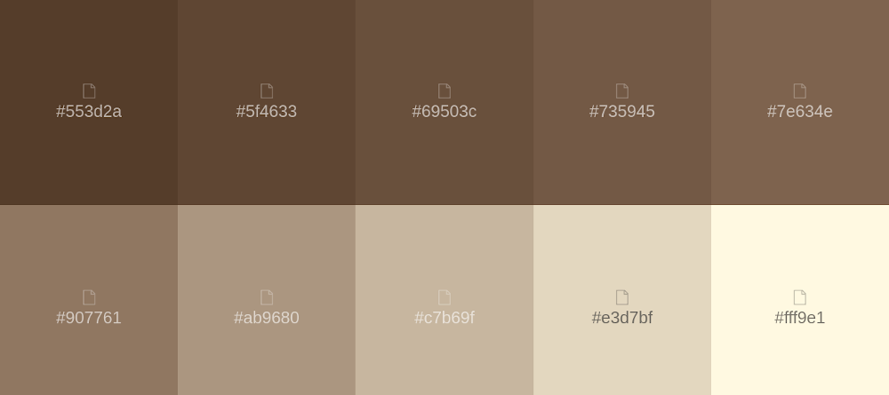
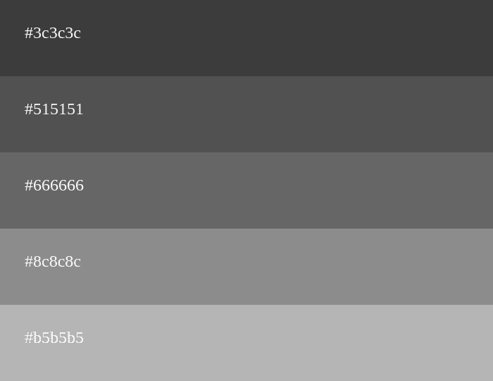

<h2 id="productdesing">CAPÍTULO 4: PRODUCT DESIGN</h2>

<h3 id="styleguidelines">4.1. Style Guidelines</h3>

Este punto abarca los estilos que se usarán para diseñar el sitio web y la aplicación web.

<h4 id="generalstyleguidelines">4.1.1. General Style Guidelines</h4>

<strong>Brand Overview:</strong>

El poco conocimiento y dedicación que tenemos a la hora de gestionar nuestro huerto en nuestro patio se hace cada vez más notorio debido al poco tiempo que tenemos para realizar este tipo de actividades que podrían mejorar el medio ambiente. El apoyo que se le brinda a la persona que desea iniciar un huerto, muchas veces no es suficiente, como consecuencia dejan el proyecto de manera indefinida.

Nuestra solución “GreenCare”, surge a partir de ese poco apoyo que se le brinda a las personas que se sumergen en el mundo de la agricultura doméstica. Nuestro equipo ha diseñado un producto para que la persona consiga su objetivo.

<strong>Brand Name:</strong>

El nombre de nuestra aplicación es GreenCare,”Green” hace referencia a las plantas debido a que es el color característico con el cual todo el mundo las identifica, y “Care” refleja el cuidado que le brindaran las personas a sus cultivos.

A continuación se presenta el logo:

    

<strong>Typography:</strong>

La tipografía ayuda a seccionar los distintos niveles de información que se le brinda al usuario.

La tipografía elegida para el sitio web y la aplicación web es Cocogoose Classic, ya que es legible y amigable para el usuario.

    

<strong>Colors:</strong>

Una buena selección de colores le muestra al usuario lo que se le ofrece. Por ende hemos decidido lo siguiente:

**Color primario Verde:**

    

**Color secundario Marrón:** 

    

Además se usarán colores de estado, los cuales harán que el usuario reconozca que sucede mientras interactúa con la aplicación.

Color estado: **Rojo** (Acción inconclusa o incorrecta)

    

Color estado: **Verde** (Acción exitosa)

    

Color estado: **Amarillo** (Advertencia de una acción)

    

Color Estado: **Gris** (Botón o Acción deshabilitada)

    

**Space**

El espaciado se usa para que haya división entre imágenes, cuadros de textos, botones, etc, para que el usuario vea organizada la aplicación web.

Se usará para cada componente múltiplos de 8 pixeles.

    

**Tono de lenguaje de comunicación y lenguaje aplicado**

El lenguaje tanto de la aplicación web como el sitio web, es formal, serio, confiable y entusiasta. Debido a que se desea potenciar una confianza y tranquilidad al usuario y darle a entender que la aplicación es seria.

<h4 id="webstyleguidelines">4.1.2. Web Style Guidelines</h4>

Se implementa un sitio web responsive, es decir que se puede adaptar a cualquier dispositivo, siendo siempre comprensible y visualmente agradable para el usuario.

En el sitio web se usará el patrón Z, esto hará que el usuario pueda navegar nuestro sitio web  y aplicación web desde el logo, pasando por los opciones que le brindaremos, para luego ver el contenido general.

    

