<h2 id="productdesing">CAPÍTULO 4: PRODUCT DESIGN</h2>

<h3 id="styleguidelines">4.1. Style Guidelines</h3>

Este punto abarca los estilos que se usarán para diseñar el sitio web y la aplicación web.

<h4 id="generalstyleguidelines">4.1.1. General Style Guidelines</h4>

<strong>Brand Overview:</strong>

El poco conocimiento y dedicación que tenemos a la hora de gestionar nuestro huerto en nuestro patio se hace cada vez más notorio debido al poco tiempo que tenemos para realizar este tipo de actividades que podrían mejorar el medio ambiente. El apoyo que se le brinda a la persona que desea iniciar un huerto, muchas veces no es suficiente, como consecuencia dejan el proyecto de manera indefinida.

Nuestra solución “GreenCare”, surge a partir de ese poco apoyo que se le brinda a las personas que se sumergen en el mundo de la agricultura doméstica. Nuestro equipo ha diseñado un producto para que la persona consiga su objetivo.

<strong>Brand Name:</strong>

El nombre de nuestra aplicación es GreenCare,”Green” hace referencia a las plantas debido a que es el color característico con el cual todo el mundo las identifica, y “Care” refleja el cuidado que le brindaran las personas a sus cultivos.

A continuación se presenta el logo:

    

<strong>Typography:</strong>

La tipografía ayuda a seccionar los distintos niveles de información que se le brinda al usuario.

La tipografía elegida para el sitio web y la aplicación web es Cocogoose Classic, ya que es legible y amigable para el usuario.

    

<strong>Colors:</strong>

Una buena selección de colores le muestra al usuario lo que se le ofrece. Por ende hemos decidido lo siguiente:

**Color primario Verde:**

    

**Color secundario Marrón:** 

    

Además se usarán colores de estado, los cuales harán que el usuario reconozca que sucede mientras interactúa con la aplicación.

Color estado: **Rojo** (Acción inconclusa o incorrecta)

    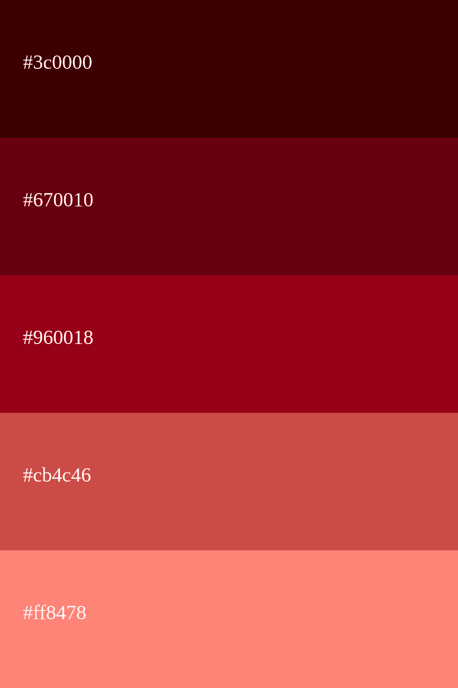

Color estado: **Verde** (Acción exitosa)

    

Color estado: **Amarillo** (Advertencia de una acción)

    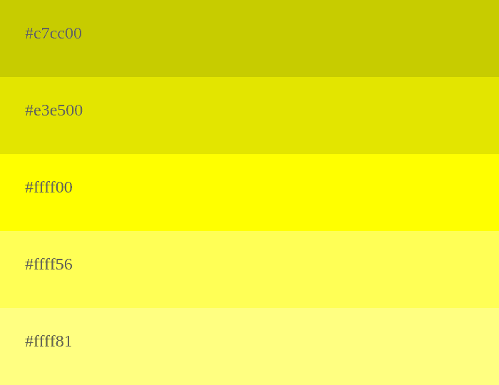

Color Estado: **Gris** (Botón o Acción deshabilitada)

    

**Space**

El espaciado se usa para que haya división entre imágenes, cuadros de textos, botones, etc, para que el usuario vea organizada la aplicación web.

Se usará para cada componente múltiplos de 8 pixeles.

    

**Tono de lenguaje de comunicación y lenguaje aplicado**

El lenguaje tanto de la aplicación web como el sitio web, es formal, serio, confiable y entusiasta. Debido a que se desea potenciar una confianza y tranquilidad al usuario y darle a entender que la aplicación es seria.

<h4 id="webstyleguidelines">4.1.2. Web Style Guidelines</h4>

Se implementa un sitio web responsive, es decir que se puede adaptar a cualquier dispositivo, siendo siempre comprensible y visualmente agradable para el usuario.

En el sitio web se usará el patrón Z, esto hará que el usuario pueda navegar nuestro sitio web  y aplicación web desde el logo, pasando por los opciones que le brindaremos, para luego ver el contenido general.

    

<h3 id="information Architecture">4.2. Information Architecture</h3>

<h4 id="OrganizationSystems">4.2.1. Organization Systems</h4>

Se indica cada estructura visual y tipo de categorización que se usará por cada grupo de información brindada al segmento objetivo.

**Segmento objetivo: Personas que desean gestionar un huerto doméstico.**

**Jerarquia:**

Sitio web: Es el sitio web en donde le venderemos al público objetivo nuestra idea, le mostraremos las funcionalidades de la aplicación y  nos presentaremos como start-up

Listado de plantas: Es el apartado en la aplicación en donde el usuario podrá seleccionar la planta de su preferencia para iniciar un ciclo de vida.

Listado de recomendaciones: Este apartado aunque sea para los usuarios premiums se destaca por contener información que los ayudará para la germinación y cuidado de la planta que seleccionaron.

**Secuencial:**

Seleccionar y programar una planta: Una vez seleccionada la planta de preferencia, el usuario podrá iniciar un ciclo de vida, poniendo un nombre a la planta y a la vez poniendo el tiempo de vida que tendrá.

Finalizar la agricultura: Una vez terminado todo el proceso el usuario podrá finalizar con el ciclo de vida en el apartado “lifecycle”

**Matricial:**

Visualizar el progreso de la planta:  El usuario podrá tener a tiempo real el progreso de la planta y ver como avanza a lo largo de los días desde la aplicación.

<h4 id="OrganizationSystems">4.2.2. Labeling Systems</h4>

En esta sección, se muestra el etiquetado que tendrá el sitio web:

**Inicio/Home:** Sección preseleccionada que mostrará información acerca de la aplicación, en ese mismo apartado el usuario podrá dirigirse a la aplicación web.

**Planes/Plans:** En esta sección el usuario puede visualizar los planes que tiene a su disposición y la diferencia de ambos planes.
**Equipo/Team:** El usuario podrá visualizar información de cada uno de nosotros como equipo y que rol cumplimos en nuestro start-up
**Testimonios/Testimonials:** El usuario visualiza  reseñas/ testimonios de otros usuarios que ya han utilizado nuestra aplicación.
**Galería/ Gallery:** Esta sección el usuario podrá visualizar las diversas plantas que han crecido gracias a la aplicación.
**Contactanos/ Contact us:** En esta sección el cliente podrá visualizar la información del equipo y cómo nos puede contactar.

A continuación se mostrará el etiquetado que tendrá nuestra aplicación web para el segmento objetivo:

**Segmento objetivo: Personas que desean gestionar un huerto doméstico.**

**Home:** Es la página predeterminada en donde comenzarán todos los usuarios que se registren en la aplicación, de manera no tan detallada se mostrará información de otras secciones de la aplicación.
**Garden:** Es el apartado en donde el usuario podrá elegir la planta con la cual desea iniciar el ciclo de vida.
**Lifecycle:** Es el apartado donde el usuario visualiza todos los ciclos de vida registrados y en esos mismo podrá visualizar a detalle qué debe hacer o realizar para que la planta esté en buen estado.
**Plans:** Es el apartado en donde el usuario puede ver y unirse al plan premium de nuestra aplicación.
**Settings:** En este apartado el usuario puede cambiar de nombre o correo.

<h4 id="SEOTagsandMetaTags">4.2.3. SEO Tags and Meta Tags</h4>

Especifica la codificación de caracteres del documento HTML

    

Indica al navegador que utilice la última versión de Internet Explorer (o el modo de emulación Edge) 

    

 Esencial para el diseño web receptivo (responsive design), optimiza la visualización en dispositivos móviles 

    

Especifica palabras clave relacionadas con el contenido del sitio web

    

Proporciona una breve descripción del contenido de la página 

    

Define el título de la página, crucial para el SEO 

    

<h4 id="SEOTagsandMetaTags">4.2.4. Searching Systems</h4>

En este apartado, se muestra cómo el usuario puede buscar información en nuestra aplicación web.

Barra de búsqueda para las plantas: El usuario puede buscar  la planta que desea cultivar.

Filtros para buscar plantas:El usuario puede encontrar de manera más rápida y detallada la planta que desee cultivar.

    

<h4 id="NavigationSystems">4.2.5. Navigation Systems</h4>

En este apartado, se muestra cómo el usuario se moverá a través de la aplicación.
Los tipos de navegación que usaremos son dos:

**Navegación principal:** La cual se basa en las pestaña las cuales el usuario puede usar para dirigirse a cada sección de la aplicación, estas se encuentran dentro de un navbar vertical.

    

**Navegación secundaria:** La cual se basa en la búsqueda mediante palabras dentro de una sección en específico ya sea “Garden” o ”Lifecycle”.

    

<h3 id="LandingPageUIDesign">4.3. Landing Page UI Design</h3>

<h4 id="LandingPageWireframe">4.3.1. Landing Page Wireframe</h4>

En esta sección se mostrará el desarrollo final del Wireframe del landing page, que es una representación de baja fidelidad.

**Versión  web:**

    

**Versión  Movil:**

    

<h4 id="LandingPageMock-up">4.3.2. Landing Page Mock-up</h4>

En esta sección se mostrará el desarrollo final del Mock-up del landing page, que es una representación de alta fidelidad.

**Versión  web:**

    

**Versión  Movil:**

    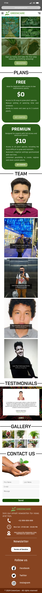

<h3 id=" WebApplicationsUX/UIDesign.">4.4.  Web Applications UX/UI Design</h3>

<h4 id="WebApplicationsWireframes">4.4.1. Web Applications Wireframes</h4>

En esta sección se mostrará el desarrollo final de los Wireframes de la Web Application, que es una representación de baja fidelidad.

**Interfaz para nuevos usuarios y antiguos usuarios**

Estos wireframes muestran las pantallas de inicio de sesión y registro, diseñadas siguiendo las directrices de tipografía y tamaño de fuente establecidas en la documentación.

    

    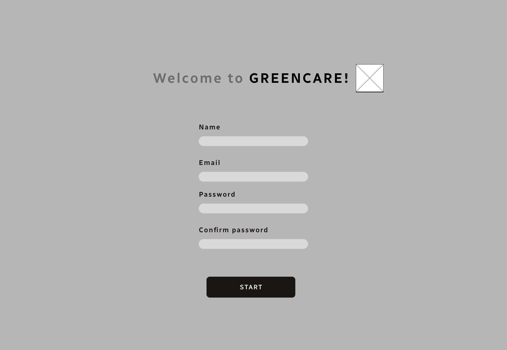

**Interfaz de Personas**

En esta sección se muestra las páginas de en donde el agricultor podrá visualizar y gestionar las distintas plantas que le disponemos.

    

    

    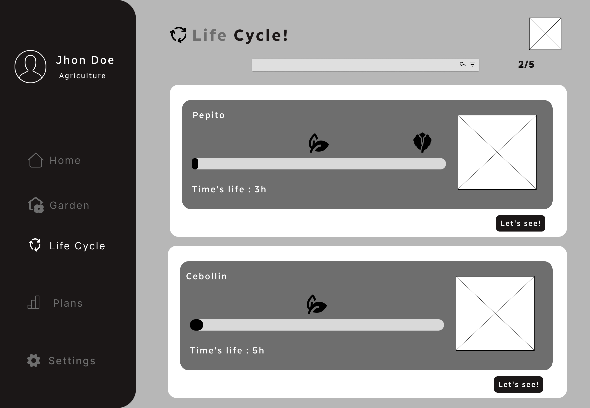

    

**Seleccionar una planta para iniciar el ciclo de vida**

En esta sección se ve como el agricultor registra una planta para iniciar el ciclo de vida.

    

    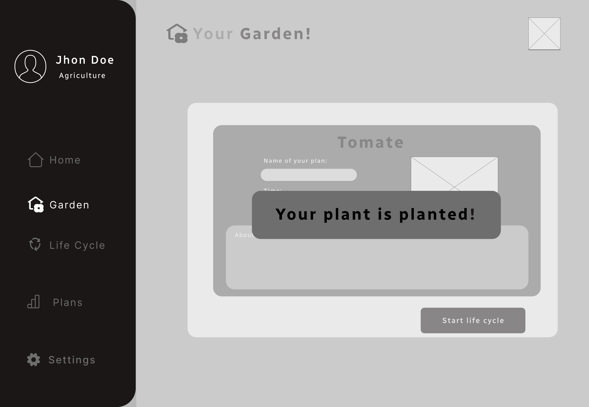

**Visualizar el ciclo de vida de la planta**

En esta sección se ve como las distintas plantas que el agricultor a registrado en el ciclo de vida.

    

    

<h4 id="WebApplicationsWireflowDiagrams">4.4.2. Web Applications Wireflow Diagrams</h4>

**Usuarios:**

**User Goal:** Como usuario deseo registrarse dentro de la aplicación web.

    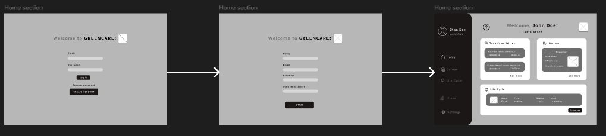

El usuario al adentrarse a la aplicación debe llenar ciertos datos: su nombre, su correo y su contraseña la cual debe validarla escribiendola dos veces.

**User Goal:** Como usuario deseo visualizar todas las plantas disponibles que tengo para germinar.

    

El usuario tiene una sección llamada “Garden” en la cual visualiza todas las plantas las cuales pueden iniciar un ciclo de vida.

**User Goal:** Como usuario deseo visualizar el ciclo de vida de mi planta.

    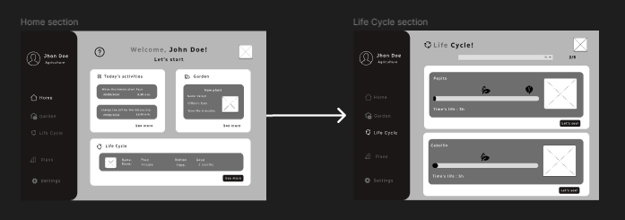

El usuario después de iniciar el ciclo de vida tendrá un apartado donde podrá ver a detalle cada ciclo de vida que haya iniciado previamente, ahí podrá gestionar la planta.

**User Goal:** Como usuario deseo acceder al formato premium de la aplicación.

    

El usuario puede acceder al formato premium luego haberse suscripto al plan el cual se encuentra en el apartado “Plans”

<h4 id="WebApplicationsMock-ups">4.4.3. Web Applications Mock-ups.</h4>

En esta sección se mostrará el desarrollo final de los Mock-ups de la Web Application, que es una representación de alta fidelidad.

**Interfaz para nuevos usuarios y antiguos usuarios**

Estos wireframes muestran las pantallas de inicio de sesión y registro, diseñadas siguiendo las directrices de tipografía y tamaño de fuente establecidas en la documentación.

    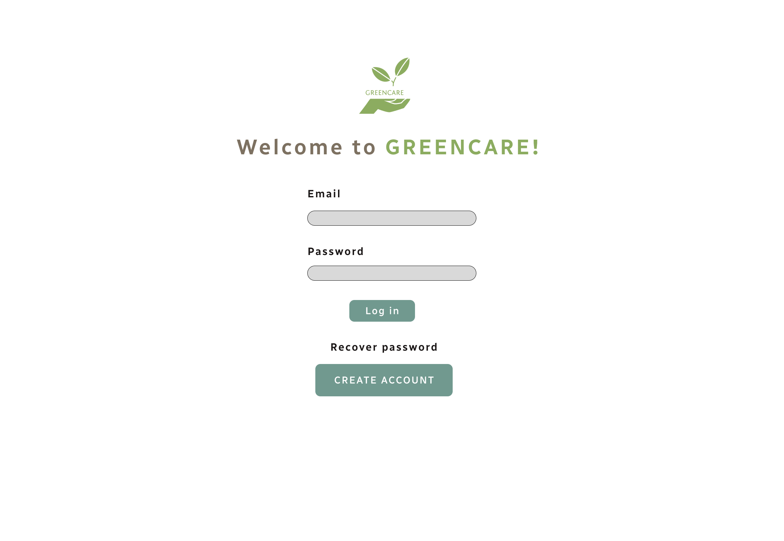

    

**Interfaz de Personas**

En esta sección se muestra las páginas de en donde el agricultor podrá visualizar y gestionar las distintas plantas que le disponemos.

    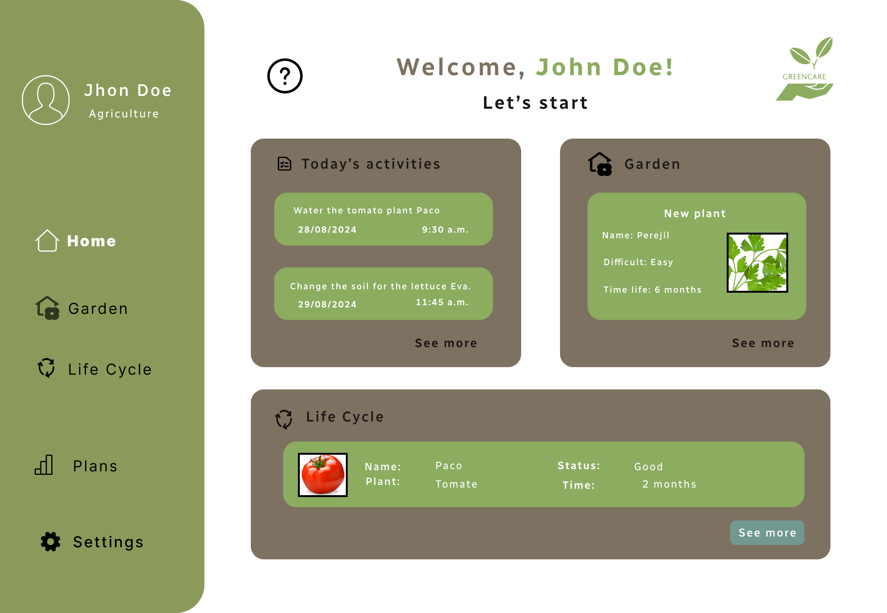

    

    

    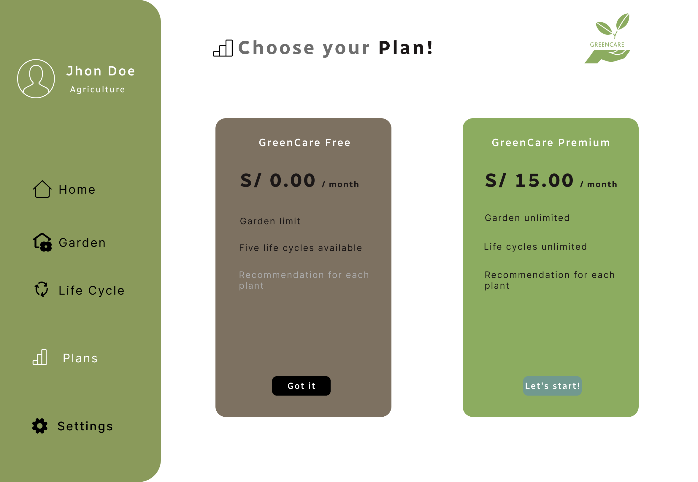

    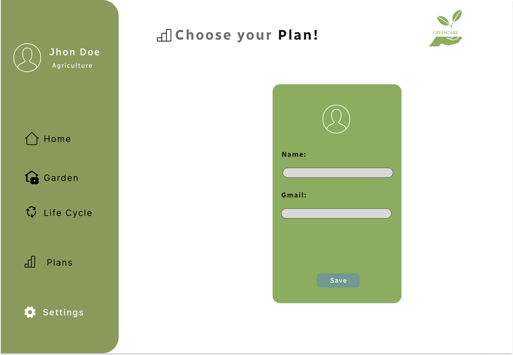

**Seleccionar una planta para iniciar el ciclo de vida**

En esta sección se ve como el agricultor registra una planta para iniciar el ciclo de vida.

    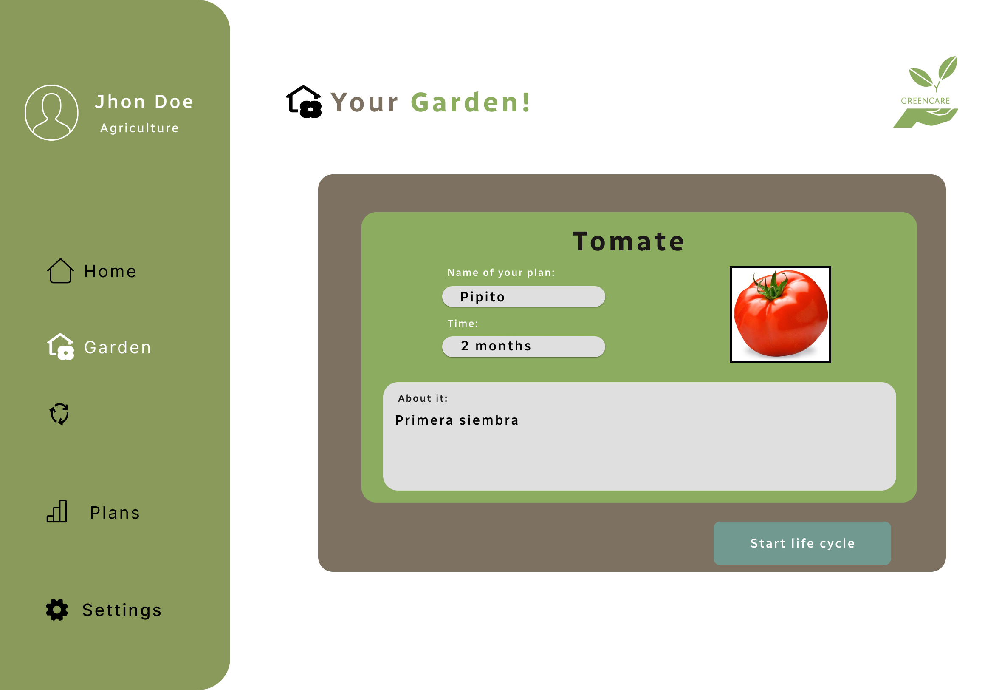

    

**Visualizar el ciclo de vida de la planta**

En esta sección se ve como las distintas plantas que el agricultor a registrado en el ciclo de vida.

    

    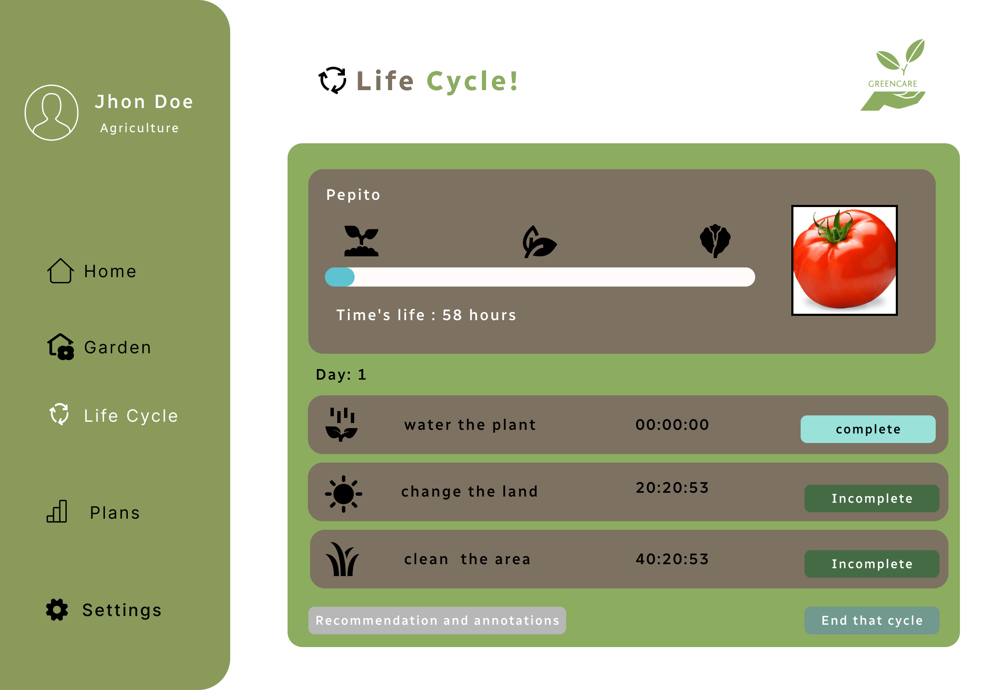

<h4 id="WebApplicationsUserFlowDiagrams">4.4.4. Web Applications User Flow Diagrams</h4>

**Usuarios:**

**User Goal:** Como usuario deseo registrarse dentro de la aplicación web.

    

El usuario al adentrarse a la aplicación debe llenar ciertos datos: su nombre, su correo y su contraseña la cual debe validarla escribiendola dos veces.

**User Goal:** Como usuario deseo visualizar todas las plantas disponibles que tengo para germinar.

    

El usuario tiene una sección llamada “Garden” en la cual visualiza todas las plantas las cuales pueden iniciar un ciclo de vida.

**User Goal:** Como usuario deseo visualizar el ciclo de vida de mi planta.

    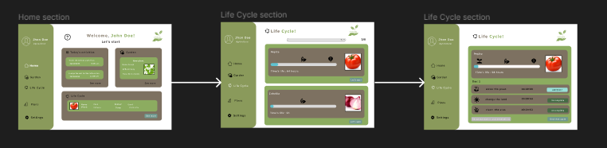

El usuario después de iniciar el ciclo de vida tendrá un apartado donde podrá ver a detalle cada ciclo de vida que haya iniciado previamente, ahí podrá gestionar la planta.

**User Goal:** Como usuario deseo acceder al formato premium de la aplicación.

    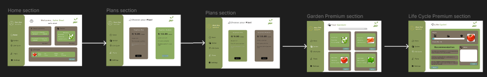

El usuario puede acceder al formato premium luego haberse suscripto al plan el cual se encuentra en el apartado “Plans”.

<h3 id="WebApplicationsPrototyping">4.5. Web Applications Prototyping</h3>

Se mostrará el prototipo de la aplicación web desarrollado en figma siguiendo los estilos establecidos en los anteriores puntos.

[Link: Visualizar Prototipo en Figma](https://www.figma.com/proto/j0sk2ngVIbmvYLJjATBtzu/GreenCare?node-id=134-899&node-type=CANVAS&t=CcWn1LGD767xHAI7-1&scaling=contain&content-scaling=fixed&page-id=1%3A4&starting-point-node-id=134%3A899)

    

<h3 id="DomainDrivenSoftwareArchitectur">4.6. Domain-Driven Software Architecture</h3>

<h4 id="OrganizationSystems">4.6.1. Software Architecture Context Diagrams</h4>

A continuación, presentamos el diagrama de contexto de nuestra arquitectura.

    

<h4 id="OrganizationSystems">4.6.2. Software Architecture Container Diagrams</h4>

En esta sección indicamos los contenedores de nuestro diagrama de contexto.

    

<h4 id="OrganizationSystems">4.6.3. Software Architecture Components Diagrams</h4>

En este apartado se presenta el diagrama de componentes.

**Garden Component Diagram**

    

**Life cycle Component Diagram**

    

**Security Component Diagram**

    

